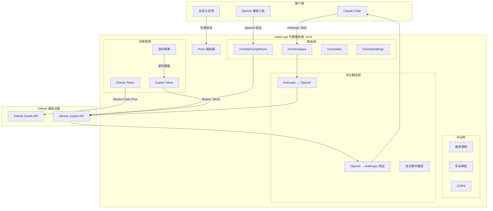
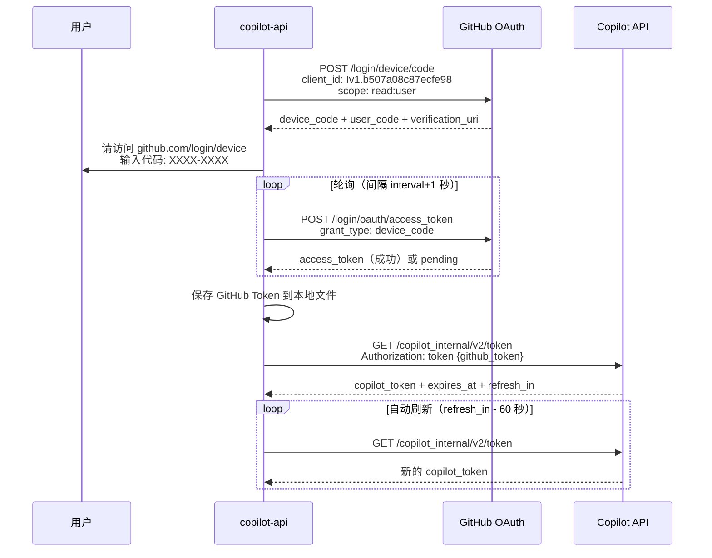
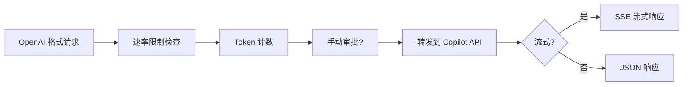
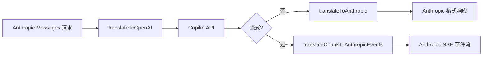

> 你有 GitHub Copilot 订阅，却只能在 VS Code 里用？copilot-api 通过逆向工程把 Copilot 的内部 API 暴露为标准的 OpenAI/Anthropic 兼容接口，让你用它驱动 Claude Code、Cursor、甚至自己写的 AI 应用。这篇文章从源码级别拆解它的实现原理。

---

## 一、项目概览

[copilot-api](https://github.com/ericc-ch/copilot-api) 是一个逆向工程代理服务器，由开发者 Erick Christian 维护（当前版本 v0.7.0）。它的核心功能是：

**将 GitHub Copilot 的内部 API 包装成 OpenAI 和 Anthropic 兼容的标准接口**，让任何支持这两种协议的工具都能使用 Copilot 作为后端模型。

换句话说，只要你有 Copilot 订阅（个人版、商业版或企业版），就可以通过这个代理访问 GPT-4.1、Claude Sonnet 4 等模型——而这些模型本来只能在 VS Code 的 Copilot Chat 里使用。

### 技术栈

| 组件 | 技术 |
|------|------|
| 运行时 | Bun (>= 1.2.x) |
| Web 框架 | Hono |
| HTTP 服务 | srvx |
| CLI 框架 | citty |
| 流式处理 | fetch-event-stream + Hono SSE |
| Token 计数 | gpt-tokenizer |
| 代理支持 | undici ProxyAgent |

## 二、架构全景



整个系统可以分为四层：

1. **CLI 与配置层** — 命令行参数解析、子命令路由
2. **认证与令牌层** — GitHub OAuth 设备码流程 + Copilot 令牌获取与自动刷新
3. **路由与中间件层** — 速率限制、手动审批、CORS
4. **协议翻译层** — Anthropic Messages API ↔ OpenAI Chat Completions API 的双向转换

## 三、认证流程深度解析

这是整个项目最核心的逆向工程成果。copilot-api 模拟了 VS Code 的 Copilot 插件获取 API 访问权限的完整流程。

### 3.1 GitHub OAuth 设备码流程



关键发现：

1. **Client ID 是硬编码的**：`Iv1.b507a08c87ecfe98`——这是 VS Code Copilot 插件注册的 GitHub OAuth App ID。copilot-api 直接复用了这个 ID 来伪装成 VS Code。

2. **两层令牌体系**：
   - **GitHub Token**（持久化到本地文件）：通过 OAuth 设备码流程获取，权限范围仅 `read:user`
   - **Copilot Token**（内存中，自动刷新）：用 GitHub Token 换取，有过期时间，需要定期刷新

3. **Copilot 内部 API 端点**：`https://api.github.com/copilot_internal/v2/token`——这是一个未公开文档的内部 API。

### 3.2 令牌自动刷新机制

```typescript
// src/lib/token.ts 简化版
export const setupCopilotToken = async () => {
  const { token, refresh_in } = await getCopilotToken()
  state.copilotToken = token

  // 提前 60 秒刷新，避免令牌过期
  const refreshInterval = (refresh_in - 60) * 1000
  setInterval(async () => {
    const { token } = await getCopilotToken()
    state.copilotToken = token
  }, refreshInterval)
}
```

这里的设计很实用：`refresh_in` 是 Copilot 服务器告知的建议刷新间隔（通常约 30 分钟），代理提前 60 秒刷新以确保令牌不会在使用过程中过期。

## 四、伪装 VS Code 客户端

copilot-api 必须让 GitHub 服务器相信请求来自真正的 VS Code。这通过精心构造的请求头实现：

```typescript
// src/lib/api-config.ts
const COPILOT_VERSION = "0.26.7"
const EDITOR_PLUGIN_VERSION = `copilot-chat/${COPILOT_VERSION}`
const USER_AGENT = `GitHubCopilotChat/${COPILOT_VERSION}`
const API_VERSION = "2025-04-01"

export const copilotHeaders = (state: State, vision: boolean = false) => ({
  Authorization: `Bearer ${state.copilotToken}`,
  "copilot-integration-id": "vscode-chat",
  "editor-version": `vscode/${state.vsCodeVersion}`,
  "editor-plugin-version": EDITOR_PLUGIN_VERSION,
  "user-agent": USER_AGENT,
  "openai-intent": "conversation-panel",
  "x-github-api-version": API_VERSION,
  "x-request-id": randomUUID(),
  "x-vscode-user-agent-library-version": "electron-fetch",
})
```

几个值得注意的细节：

- **VS Code 版本号是动态获取的**：通过 `cacheVSCodeVersion()` 从 VS Code 的更新 API 获取最新稳定版版本号，而不是硬编码
- **`copilot-integration-id: vscode-chat`**：标识请求来自 Copilot Chat 功能
- **`openai-intent: conversation-panel`**：告诉服务器这是对话面板的请求
- **Vision 支持**：当消息包含图片时，添加 `copilot-vision-request: true` 头

### 账户类型决定 API 端点

```typescript
export const copilotBaseUrl = (state: State) =>
  state.accountType === "individual"
    ? "https://api.githubcopilot.com"
    : `https://api.${state.accountType}.githubcopilot.com`
```

- 个人账户：`api.githubcopilot.com`
- 商业账户：`api.business.githubcopilot.com`
- 企业账户：`api.enterprise.githubcopilot.com`

## 五、协议翻译层——核心设计亮点

copilot-api 最精妙的设计在于它的**双协议兼容层**：对外同时支持 OpenAI 和 Anthropic 两种 API 协议，对内统一转换为 Copilot（OpenAI 格式）API 调用。

### 5.1 OpenAI 兼容路由——直通代理

对于 OpenAI 格式的请求（`/v1/chat/completions`），处理相对简单：



请求格式已经是 OpenAI 兼容的，只需要透传即可。但有一个细节值得注意：

```typescript
// 自动设置 max_tokens
if (isNullish(payload.max_tokens)) {
  payload = {
    ...payload,
    max_tokens: selectedModel?.capabilities.limits.max_output_tokens,
  }
}
```

如果客户端没有指定 `max_tokens`，代理会根据模型的能力自动设置，避免 Copilot API 因缺少该参数而报错。

### 5.2 Anthropic 兼容路由——双向翻译

这是最复杂的部分。Claude Code 使用 Anthropic Messages API 格式，但 Copilot 只接受 OpenAI 格式。copilot-api 需要做**双向实时翻译**：



#### 请求翻译（Anthropic → OpenAI）

两种协议有显著差异，翻译层处理了以下映射：

| Anthropic 概念 | OpenAI 对应 |
|------|------|
| `system` (顶级字段) | `messages[0].role = "system"` |
| `tool_result` content block | `role: "tool"` 消息 |
| `tool_use` content block | `tool_calls` 数组 |
| `thinking` content block | 合并到文本内容 |
| `image` content block | `image_url` content part |
| `tool_choice.type: "any"` | `"required"` |

一个特别巧妙的处理是**模型名称翻译**：

```typescript
function translateModelName(model: string): string {
  // Claude Code 子代理使用带时间戳的模型名如 claude-sonnet-4-20250514
  // Copilot 不支持这种格式，需要简化
  if (model.startsWith("claude-sonnet-4-")) {
    return model.replace(/^claude-sonnet-4-.*/, "claude-sonnet-4")
  } else if (model.startsWith("claude-opus-")) {
    return model.replace(/^claude-opus-4-.*/, "claude-opus-4")
  }
  return model
}
```

#### 流式响应翻译（OpenAI SSE → Anthropic SSE）

流式翻译是最复杂的部分。OpenAI 的 SSE 事件是扁平的 `chat.completion.chunk`，而 Anthropic 需要结构化的事件序列：

```
message_start → content_block_start → content_block_delta... → 
content_block_stop → message_delta → message_stop
```

翻译器维护了一个状态机来追踪当前位置：

```typescript
interface AnthropicStreamState {
  messageStartSent: boolean    // 是否已发送 message_start
  contentBlockIndex: number     // 当前内容块索引
  contentBlockOpen: boolean     // 当前是否有打开的内容块
  toolCalls: Record<number, {   // 追踪正在进行的工具调用
    id: string
    name: string
    anthropicBlockIndex: number
  }>
}
```

这个状态机确保了：
- 第一个 chunk 触发 `message_start` + `content_block_start`
- 后续文本 chunk 转为 `content_block_delta`
- 工具调用被正确映射为 `tool_use` 类型的 content block
- `finish_reason` 被翻译为对应的 Anthropic `stop_reason`

#### 停止原因映射

```typescript
// OpenAI → Anthropic 的停止原因映射
"stop"           → "end_turn"
"length"         → "max_tokens"  
"tool_calls"     → "tool_use"
"content_filter" → "end_turn"
```

## 六、安全与流控机制

### 6.1 速率限制

```typescript
// src/lib/rate-limit.ts
export async function checkRateLimit(state: State) {
  if (state.rateLimitSeconds === undefined) return

  const elapsedSeconds = (Date.now() - state.lastRequestTimestamp) / 1000

  if (elapsedSeconds > state.rateLimitSeconds) {
    state.lastRequestTimestamp = Date.now()
    return // 通过
  }

  if (!state.rateLimitWait) {
    throw new HTTPError("Rate limit exceeded", 
      Response.json({ message: "Rate limit exceeded" }, { status: 429 }))
  }

  // --wait 模式：阻塞等待而非报错
  await sleep(waitTimeMs)
}
```

两种策略：
- **拒绝模式**（默认）：超限直接返回 429
- **等待模式**（`--wait`）：阻塞请求直到限速窗口结束

### 6.2 手动审批

```typescript
// src/lib/approval.ts
export const awaitApproval = async () => {
  const response = await consola.prompt("Accept incoming request?", {
    type: "confirm",
  })
  if (!response)
    throw new HTTPError("Request rejected", 
      Response.json({ message: "Request rejected" }, { status: 403 }))
}
```

启用 `--manual` 后，每个 API 请求都需要在终端确认。这对于控制用量和避免触发 GitHub 的滥用检测非常有用。

## 七、暴露的 API 端点

| 端点 | 方法 | 协议 | 说明 |
|------|------|------|------|
| `/v1/chat/completions` | POST | OpenAI | Chat Completions 接口 |
| `/v1/models` | GET | OpenAI | 列出可用模型 |
| `/v1/embeddings` | POST | OpenAI | 文本向量化 |
| `/v1/messages` | POST | Anthropic | Messages 接口 |
| `/v1/messages/count_tokens` | POST | Anthropic | Token 计数 |
| `/usage` | GET | 自定义 | 使用量仪表板数据 |
| `/token` | GET | 自定义 | 当前 Copilot Token |

## 八、实战：如何使用

### 8.1 安装与启动

**方式一：npx 直接运行（推荐）**
```bash
npx copilot-api@latest start
```

**方式二：Docker**
```bash
docker run -p 4141:4141 \
  -v $(pwd)/copilot-data:/root/.local/share/copilot-api \
  ghcr.io/ericc-ch/copilot-api
```

**方式三：从源码运行**
```bash
git clone https://github.com/ericc-ch/copilot-api.git
cd copilot-api
bun install
bun run dev
```

首次运行会触发 OAuth 设备码认证流程，按提示在浏览器中完成授权即可。Token 会持久化到 `~/.local/share/copilot-api/` 目录。

### 8.2 配合 Claude Code 使用

**交互式配置：**
```bash
npx copilot-api@latest start --claude-code
```

系统会让你选择主模型和快速模型，然后自动生成并复制启动命令到剪贴板。

**手动配置：** 在项目根目录创建 `.claude/settings.json`：

```json
{
  "env": {
    "ANTHROPIC_BASE_URL": "http://localhost:4141",
    "ANTHROPIC_AUTH_TOKEN": "dummy",
    "ANTHROPIC_MODEL": "gpt-4.1",
    "ANTHROPIC_SMALL_FAST_MODEL": "gpt-4.1-mini",
    "DISABLE_NON_ESSENTIAL_MODEL_CALLS": "1",
    "CLAUDE_CODE_DISABLE_NONESSENTIAL_TRAFFIC": "1"
  }
}
```

注意 `ANTHROPIC_AUTH_TOKEN` 设为 `"dummy"` 即可——代理服务器自己管理真正的认证令牌。

### 8.3 作为通用 OpenAI 兼容 API

```bash
# 启动服务器
npx copilot-api@latest start --port 4141

# 使用 curl 调用
curl http://localhost:4141/v1/chat/completions \
  -H "Content-Type: application/json" \
  -d '{
    "model": "gpt-4.1",
    "messages": [{"role": "user", "content": "Hello!"}],
    "stream": false
  }'
```

### 8.4 使用量监控

启动后访问控制台输出的 Usage Viewer URL：
```
https://ericc-ch.github.io/copilot-api?endpoint=http://localhost:4141/usage
```

也可以直接用命令行查看：
```bash
npx copilot-api@latest check-usage
```

### 8.5 常用参数组合

```bash
# 商业版账户 + 限速 30 秒 + 等待模式
npx copilot-api@latest start --account-type business --rate-limit 30 --wait

# CI/CD 环境（直接传入 token）
npx copilot-api@latest start --github-token $GH_TOKEN

# 调试模式（详细日志 + 显示 token）
npx copilot-api@latest start --verbose --show-token

# 通过环境变量配置代理
HTTP_PROXY=http://proxy:8080 npx copilot-api@latest start --proxy-env
```

## 九、设计哲学与取舍

### 为什么选择 Hono + Bun？

Hono 是一个超轻量的 Web 框架，原生支持 SSE streaming，完美匹配代理服务器的需求。Bun 提供了比 Node.js 更快的启动速度和内置的 TypeScript 支持。

### 全局状态 vs 依赖注入

项目使用了一个简单的全局 `state` 对象来管理所有运行时状态（令牌、配置、模型列表）。这在单实例代理服务器中是合理的取舍——避免了依赖注入的复杂性，同时代码保持简洁。

### 协议翻译的局限性

- **GitHub Copilot 不支持 thinking blocks**：Anthropic 的 `thinking` 内容块在翻译时被合并到普通文本中
- **模型名称映射是手动的**：需要跟进 Copilot 实际支持的模型列表
- **缓存令牌未实现**：Copilot 的 `cache_read_input_tokens` 被传递但实际上 Copilot 可能不支持缓存

## 十、风险提示

> ⚠️ **重要警告**：这是一个逆向工程项目。GitHub 可能随时更改内部 API，导致项目失效。过度使用可能触发 GitHub 的滥用检测系统，导致 Copilot 访问权限被临时暂停。

请遵守：
- [GitHub 可接受使用政策](https://docs.github.com/site-policy/acceptable-use-policies/github-acceptable-use-policies)
- [GitHub Copilot 服务条款](https://docs.github.com/site-policy/github-terms/github-terms-for-additional-products-and-features#github-copilot)

建议使用 `--rate-limit` 和 `--wait` 参数控制请求频率。

---

### 参考来源

- [copilot-api GitHub 仓库](https://github.com/ericc-ch/copilot-api)
- [Claude Code 官方文档](https://docs.anthropic.com/en/docs/claude-code/overview)
- [OpenAI Chat Completions API](https://platform.openai.com/docs/api-reference/chat)
- [Anthropic Messages API](https://docs.anthropic.com/en/docs/api-reference/messages)
- [GitHub OAuth 设备流程](https://docs.github.com/en/apps/oauth-apps/building-oauth-apps/authorizing-oauth-apps#device-flow)
