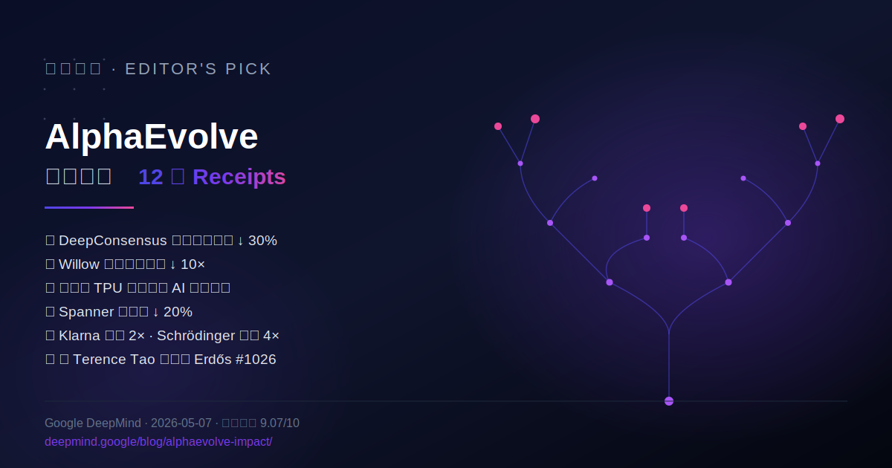

> 📌 **好文共赏 | Editor's Pick**
>
> **原文**：[AlphaEvolve: How our Gemini-powered coding agent is scaling impact across fields](https://deepmind.google/blog/alphaevolve-impact/)
> **配套阅读**：[原始 AlphaEvolve 公告（2025-05-14）](https://deepmind.google/blog/alphaevolve-a-gemini-powered-coding-agent-for-designing-advanced-algorithms/) · [Terence Tao 解 Erdős #1026 全过程](https://terrytao.wordpress.com/2025/12/08/the-story-of-erdos-problem-126/) · [Willow 上的分子模拟论文（arXiv:2510.19550）](https://arxiv.org/abs/2510.19550) · [AlphaEvolve 公开实验 Gallery](https://alphaevolve-examples.web.app/ae/gallery)
> **作者**：AlphaEvolve team（Matej Balog、Alexander Novikov、Ngân Vũ 等十余位 DeepMind 研究员）
> **发布时间**：2026-05-07 | **HN 327 分讨论**：[news.ycombinator.com/item?id=48050278](https://news.ycombinator.com/item?id=48050278)
> **阅读时长**：博客本文 8 分钟 · 连同原始公告 + Tao 长文 + 配套 arXiv 三篇约 90 分钟
> **多模评分**：Opus 9.3 / Sonnet 8.9 / Gemini 9.0（综合 **9.07/10**）
>
> **一句话推荐**：当 AlphaGo 教会世界 \"AI 能下围棋\"、AlphaFold 教会世界 \"AI 能折蛋白\"，**AlphaEvolve 这一年正在教会世界一件更危险的事——AI 能写出比人类更好的算法，并被部署进 Google 自己的 TPU、数据中心和数学家们的笔记本里**。这篇周年回顾的 4 千字博文，配上它链接的十几篇论文，是 2026 上半年想认真理解 \"AI for Science / AI for Systems\" 这条赛道**绕不开的那篇**。



## 一、为什么这篇周年总结值得仔细读

如果你只能在 \"AI for Science\" 这条线选一篇本月必读，应该是它。

理由不止 \"DeepMind 出品\"。真正让这篇文章罕见的，是它**用一页博客的篇幅同时报告了 12 项已经发生、可被独立验证的结果**，每一项都有外部合作方、外部论文或外部产品做 receipts：

1. PacBio 用 AlphaEvolve 把 DeepConsensus 的变异检出错误降低 **30%**——商业测序仪马上吃到了红利；
2. AC 最优潮流（OPF）这个本科电力工程教科书级问题，GNN 求解的可行率从 14% 干到 **88%**；
3. Willow 量子芯片上分子模拟用的电路误差比常规优化基线**低 10 倍**，已发表在 [arXiv:2510.19550](https://arxiv.org/abs/2510.19550)；
4. 与 Terence Tao 合作\"逐个击破\" Erdős 列表，第 1026 号问题已被在线协作 + AlphaEvolve [完整解决](https://terrytao.wordpress.com/2025/12/08/the-story-of-erdos-problem-126/)；
5. **下一代 TPU 的硅级电路里直接长出了 AlphaEvolve 提出的设计**——而且按 Jeff Dean 的话说\"反直觉到令人难以置信\"；
6. Spanner 的 LSM compaction 启发式被改写，写放大降 **20%**；
7. Klarna 把一个主要 Transformer 模型训练速度**翻倍**，质量还更好；
8. Schrödinger 把 MLFF（Machine Learned Force Field）训练和推理都做到了**约 4× 加速**；
9. FM Logistics 把已经被高度优化过的 TSP 路由再压缩 **10.4%**，每年省下 1.5 万公里行驶；
10. 编译器存储优化省下 **9%** 二进制体积；
11. 缓存替换策略上，AlphaEvolve **两天**完成了\"人力数月\"的工作量；
12. AC OPF、Earth AI、新一代神经架构块、可解释神经科学模型、密码学、合成数据、前沿模型安全……还有半页是 \"等等\"。

这串数字最危险的地方是——**它们覆盖的领域结构性地无关**。基因测序、电网、量子、数学、芯片、数据库、广告、物流、化学、合成数据——除了\"算法\"两个字之外，这十几条线几乎不共享任何技术栈。如果一个系统能在如此分散的问题空间稳定产出 SOTA，那么它本身就是一个**通用的算法发现机器**，而不只是某个垂直工具。

这正是 AlphaEvolve 在\"AI 历史时间线\"上的位置：它不是新一代模型，而是**第一个把\"用 LLM 当变异算子 + 自动评估当选择压力\"做成稳定生产力**的系统。一年前我们写 [《2026 年第一季度的前沿模型竞赛》](/post/frontier-ai-models-race-2026-q1/) 时还把它当作 \"看上去很有意思的研究 demo\"——一年后，**它已经被部署在 Google 数据中心、TPU 设计流水线、Cloud 客户产品里**。

这篇文章另一个隐藏价值，是它把 [《antirez 一周写出 DS4》](/post/good-read-antirez-ds4-local-inference/) 那一类\"开发者把 LLM 当结对程序员\"的故事推到了它的逻辑终点：**当评估函数清楚、错误可量化时，LLM 配上 evolutionary loop，能在你睡觉的时候自己进化代码到超越人类**。

## 二、AlphaEvolve 到底是什么：一台\"进化编译器\"，不是新模型

很多人第一次听到 AlphaEvolve 会以为是某个新模型，这是个误解。

它的核心架构，按 [2025-05 原始公告](https://deepmind.google/blog/alphaevolve-a-gemini-powered-coding-agent-for-designing-advanced-algorithms/) 描述，是一个**进化循环**：

```
                ┌───────────────────────────────────────────┐
                │       Programs Database (历代代码)         │
                └───────────────┬───────────────────────────┘
                                │
                                ▼
        ┌──────────────────────────────────────────────────┐
        │  Prompt Sampler                                  │
        │  - 从数据库挑出若干\"母本\"程序                       │
        │  - 拼成 prompt 喂给 LLM ensemble                  │
        └───────────────┬──────────────────────────────────┘
                        │
                        ▼
        ┌──────────────────────────────────────────────────┐
        │  Gemini Flash (广度) + Gemini Pro (深度)         │
        │  - 生成新程序（diff / 整文件）                     │
        └───────────────┬──────────────────────────────────┘
                        │
                        ▼
        ┌──────────────────────────────────────────────────┐
        │  Automated Evaluators                            │
        │  - 编译 / 跑测试 / 跑 benchmark / 跑形式化证明     │
        │  - 输出可量化分数                                  │
        └───────────────┬──────────────────────────────────┘
                        │
                        ▼
                  写回 Database (作为新母本)
```

这里有几个看起来朴素、实则关键的设计选择：

**(1) LLM 当变异算子**。传统 evolutionary programming 用随机或语法引导的变异——AlphaEvolve 直接拿 Gemini 生成的代码 diff 当 mutation。这意味着每一次\"变异\"不再是局部位翻转，而是**带语义的跳跃**。一个 Gemini 一秒钟就可以做完的局部重构，相当于 GP 跑数千代。

**(2) Flash + Pro 双模型分工**。Flash 提供\"广度\"——以 8× 的吞吐量产出大量略有差异的候选；Pro 提供\"深度\"——挑刺、做长链推理、补足 Flash 的盲点。它们之间不是 ensemble 投票，而是\"探索 / 利用\"的角色分工。这点呼应了我们在 [《Needle：把 Gemini 3.1 蒸馏成 26M 参数的工具调用专家》](/post/good-read-needle-simple-attention-networks/) 里讨论过的另一种 Flash/Pro 分工——AI 系统正在自然地长出 \"大模型规划 + 小模型执行\" 的两层结构。

**(3) 评估函数必须自动可计算**。这是 AlphaEvolve 适用范围的\"硬约束\"，也是它今天最被批评的地方。HN 上 maxothex 的评论一针见血：

> **原文（HN 评论）**：
> > "What I'm most curious about is how this translates to messy, real-world codebases without well-defined metrics. Most production software isn't chip design or kernel optimization — it's business logic with unclear success criteria."

但 DeepMind 没有回避这个问题，而是**主动选择只去打能量化的战场**。芯片设计、编译器、量子电路、数学优化、物流路由——这些问题刚好在\"难、有价值、有清晰打分函数\"的交集里。一旦评估函数定了，剩下的事情就是把 GPU 喂饱、把循环跑满。

**(4) Database 维护多样性**。这点是从 MAP-Elites（一个 evolutionary 算法社区的经典框架）继承来的。HN 评论里有人说得很到位：

> **原文（HN 评论 - pilooch）**：
> > "AlphaEvolve couples map-elites with LLMs. It's an key step in machine learning, in the vein of DQN for reinforcement learning. AE brings diversity from the genetic algorithms community to large scale optimized deep learning and RL models."

把 MAP-Elites 的多样性维持机制、加上 LLM 的语义跳跃式 mutation，等于把整个进化算法社区 30 年的积累，直接接到了 2025 后的 frontier model 上。从这个角度看，AlphaEvolve 之所以\"突然能用\"，是**两条曲线在 2024–2025 之交终于相交**：一条是 LLM 的代码能力到了能稳定产出可编译可测试代码；另一条是 evolutionary computation 等了三十年终于等到了一个不蠢的 mutation operator。

## 三、Receipts 一：TPU 的硅里长出了一段 AI 写的电路

把所有数字里挑一个最震撼的，我会选 Jeff Dean 在文中那句几乎被掩盖的引述：

> **原文**：
> > "AlphaEvolve began optimizing the lowest levels of hardware powering our AI stacks. It proposed a circuit design so counterintuitive yet efficient that it was integrated directly into the silicon of our next-generation TPUs. This is the latest example of TPU brains helping design next-generation TPU bodies."
>
> "AlphaEvolve 开始优化驱动我们 AI 栈的最底层硬件。它提出了一个反直觉但极其高效的电路设计，被直接集成到了下一代 TPU 的硅里。这是 \"TPU 大脑帮助设计下一代 TPU 身体\" 的又一个例子。" —— Jeff Dean

这句话的字面意思已经足够耸动，但你必须把它放回**完整的递归循环**里来理解：

1. 第 N 代 TPU 训练出了 Gemini 模型；
2. Gemini 驱动的 AlphaEvolve 提出了第 N+1 代 TPU 的一段电路设计；
3. 第 N+1 代 TPU 又用来训练出更强的 Gemini；
4. 更强的 Gemini 驱动的 AlphaEvolve 再去优化第 N+2 代 TPU；
5. ……

这不是 \"AI 写更快的训练代码\"。这是 **AI 在物理层（电路 / 硅）参与了自己的下一代基础设施的设计**。HN 上的 baq 用了一个简短但精确的词：**\"RSI is here on the hardware level\"**——Recursive Self-Improvement，递归自我提升，已经在硬件层发生了。

当然，对这件事的解读边界很重要，必须冷静拆开看：

- **它\"是\"什么**：第一个公开报告的、由 AI 系统贡献并被流片集成的电路单元。
- **它\"不是\"什么**：它**不是**自己设计整颗 TPU，**不是**自己拍板用什么工艺，**不是**绕开了 Google 内部全部的电路验证流程。Jeff Dean 用的词是 \"a circuit design\"——一个电路设计，不是\"整体设计\"。
- **它的真正信号**：芯片设计这种\"评估函数极硬、人力极贵、迭代周期极慢\"的问题，正好踩在 AlphaEvolve 的甜区中央。**接下来 5 年，所有有自研芯片的厂商都会发现：不上 AI 辅助 RTL 优化，就是把每代 TPU/Trainium/Maia 的能效白白让出去**。

这点和我们之前写的 [《把 Swift 推到 1.1 Tflop/s》](/post/good-read-matt-gallagher-swift-llm-matmul/) 形成有趣的镜像：那篇是一个**人**用 10 种实现把矩阵乘做出 382 倍加速；这里是一个**系统**用进化循环把电路本身重写。两条路最后都殊途同归——计算栈的每一层都在被重新审视、重新生成。

## 四、Receipts 二：写放大降 20% 的 Spanner，与一个数据库人最该读的细节

很多 ML 圈外的人会下意识跳过\"AlphaEvolve 改 Spanner\" 这一行，觉得是工程细节。**这恰恰是这篇文章里最被低估的一段**。

> **原文**：
> > "AlphaEvolve improved the efficiency of Google Spanner by refining its Log-Structured Merge-tree compaction heuristics. This optimization reduced 'write amplification'—the ratio of data written to storage versus the original request—by 20%."

写放大（write amplification）是任何 LSM-tree 数据库（RocksDB、LevelDB、Cassandra、TiKV、Spanner）的核心 KPI。**每降低 1%，全球部署的成本节省都以亿美元计**。20% 是一个让任何 DBA 听了都会停下来反问 \"等等，怎么做到的\" 的数字。

它有意思的地方在于 **compaction 启发式正是过去十年数据库圈\"调参玄学\"的重灾区**——leveled vs tiered、partial vs full、size ratio、L0→L1 trigger……每家厂商都有一篇博客解释\"我们怎么选 magic number\"。在 [《Quack：DuckDB 的 wire 协议》](/post/good-read-duckdb-quack-protocol/) 里我们也提到过类似的现象——**数据库工程的\"个性\"主要不在算法层，而在这些写满经验的启发式里**。

AlphaEvolve 做了什么？把这些启发式当成可执行代码 + 一个明确的评估函数（写放大、查询延迟、CPU 占用的 Pareto 综合），让 evolutionary loop 在真实的 trace 上自动搜索 20% 的提升空间。

这意味着两件事：

1. **过去十年数据库圈\"我调到这就最优了\"的论断需要重新被打开**。这些参数不是 platonic optimum，只是\"人能想到的最好\"。
2. **\"调参\"作为一个工种正在悄然消失**。不只是 hyperparameter tuning（早就被 Optuna / Vizier 自动化了），而是\"高层算法启发式\" 这一层也在被自动化。

这对我们前几天写的 [《Redis 的野心代价》](/post/good-read-redis-cost-of-ambition/) 多了一层冷启示：**Redis 之所以在某些场景输给一个 LSM 数据库，不只是因为 Redis 的设计选择，更可能是因为 LSM 那边的启发式自己在偷偷进化**。当 LSM 引擎背后的代码在被 AI 自动迭代时，纯人力的 Redis fork 们将面临的不再是\"我们也来抄一遍\"，而是\"我们的同行已经不再用人手优化了\"。

## 五、Receipts 三：Terence Tao 与 Erdős #1026——AI 第一次成为\"online seminar\"的合作者

如果你只读一篇配套阅读，建议读 [Tao 写的 \"The story of Erdős problem #1026\"](https://terrytao.wordpress.com/2025/12/08/the-story-of-erdos-problem-126/)。这是 2025 年我读到的最重要的\"AI + 数学\"研究记录之一。

简要回放：

1. **2025-09-12**：Erdős 1975 年的一个老问题被加进 Erdős problems 网站。题面被认为有歧义；Desmond Weisenberg 几小时后给出一个清晰的博弈论翻版——\"Alice 把 \\(N\\) 枚硬币分进 \\(k\\) 堆，Bob 选一段单调子序列拿走\"，求 \\(c_k = \\inf\\text{Bob 能保底的硬币比例}\\)。
2. **当天晚些**：Stijn Cambie 给出一个上界 \\(c_k \\le \\frac{2k}{k^2+1}\\)；Wouter van Doorn 用 Hanani 的老结论给出下界 \\(c_k \\ge \\frac{1}{\\sqrt{k}}\\)。问题：渐近行为 $c_k = \\Theta(?)$ 时是什么？
3. **之后数周**：在线协作者用纸笔证明 \\(c_3, c_4, c_5\\)，但卡在了 \\(k=6\\)。
4. **关键一跳**：研究者把问题写成 AlphaEvolve 能跑的形式——给定 \\(k\\)、给定 Alice 的分法，求 Bob 最优 monotone payoff；AlphaEvolve 进化出**比已知所有构造都紧的下界，并提示出一个精确的 $\\frac{2k}{k^2+1}$ 紧密上界结构**。
5. **2025-12**：完整证明被写出来，Tao 在博客里说："AlphaEvolve 帮我们在很短时间内大量测试反例 / 极值候选，把直觉收敛到了可以严格证明的程度。"

Tao 在 DeepMind 这篇周年文里给出的那一段引用很关键：

> **原文**：
> > "Tools such as AlphaEvolve are giving mathematicians very useful new capabilities. For optimization problems in particular, we can now quickly test potential inequalities for counterexamples, or to confirm our beliefs in what the extremizers are, which greatly improves our intuition about these problems and allows us to find rigorous proofs more readily."

注意 Tao 用的不是\"AI 帮我们证明\"，而是 \"**改善我们的直觉**\"——他没有让出\"证明\"这件事的主导权，但承认 AlphaEvolve 把\"找极值构造 / 找反例\"这一段，从过去\"研究生写半个学期\"压缩到\"一晚上跑出来\"。

这件事的方法论意义远大于具体证明本身。它意味着：**数学研究正在出现一种新的工作流——\"在线 forum 提问 + AI evolutionary 实验 + 人类完成严格证明\"**，三者协同的总速度比任何一者单独都要快。从 [《Gowers 用 ChatGPT 5.5 Pro 做 PhD 章节级研究》](/post/good-read-gowers-chatgpt-phd-math/) 那篇导读里我们已经看到 LLM 帮助资深数学家\"压缩繁琐推理\"；而 AlphaEvolve 进一步把\"机械搜索极值\"这块外包出去——这是 LLM 单独做不到的、需要 evolutionary 搜索框架的工作。

如果说 Gowers 的 17 分钟一章演示的是 **\"会议室里的合作\"**，AlphaEvolve 帮 Tao 做的是 **\"凌晨四点机房里的助手\"**——两种都是真合作。

## 六、Receipts 四：把多种昂贵企业级\"调参\"变成 API

Klarna、Schrödinger、Substrate、FM Logistic、WPP——这些名字摆在一起像 Google Cloud 的销售页面，但它们恰恰是 AlphaEvolve **泛化能力**最有说服力的部分。

把它们逐条拆开：

- **Klarna 训练加速 2×**：金融服务公司之所以会盯上模型训练吞吐，本质上是因为 **每天的客户行为数据足够多到\"再训\"才能跟上漂移**。把 transformer 的 attention/MLP 内核重写一遍，2× 速度意味着多刷 1 倍的实验或者多花 1 倍数据。
- **Schrödinger 的 MLFF 4×**：MLFF（Machine Learned Force Field）是分子动力学领域的\"未来标配\"——用神经网络近似 DFT 的能量曲面。4× 加速直接缩短药物发现 / 催化剂筛选的 R&D 周期。这是 \"AI for Science\" 真正的工业化落地。
- **Substrate 多倍光刻仿真加速**：他们做计算光刻——把更大的物理仿真跑得起来，就能验证更复杂的工艺节点。
- **FM Logistics 10.4% 路由改进**：注意这是\"在已经被高度优化过的解上\"再降 10.4%。这种 \"在专家最优解后还能多压一截\" 的提升，最让人不寒而栗——它告诉你**人类局部最优**和**全局最优**之间还有相当的空间。
- **WPP 10% 准确率提升**：广告平台的 \"准确率\" 直接换算成 GMV。这是最容易被忽视、但单笔商业价值可能最高的应用。

DeepMind 在这里有意识地展示了一个商业架构：**AlphaEvolve 不只是公司内部工具，正在通过 Google Cloud 走向客户**。这件事不是技术新闻，而是商业战略——它把\"算法发现\" 这件本来属于研究院的事情，转化成了**可计费的云服务**。

这也让我重新理解了 HN 评论里那个看似离题的吐槽：

> **原文（HN 评论 - alecco）**：
> > "Are Googlers themselves happy using Gemini coding agent instead of Claude Code or Codex? (no snark, I'm really asking)"

短期看，Gemini Coding Agent 的内部口碑可能不如 Claude Code。但 AlphaEvolve 揭示了 Google 在 AI 工程化上**一条 Anthropic 还在追赶的赛道**：把 LLM 嵌入 evolutionary loop + 自动评估器，做成\"白天交付给客户、晚上自己长好硬件\"的复利系统。**这不是 \"agent IDE\" 这种 UI 层的竞争**。

## 七、批评与边界：AlphaEvolve 不能做什么

吹完，必须把这个系统的边界讲清楚，否则就是 marketing 复述。

**(1) 评估函数硬约束**。AlphaEvolve 适用范围 = {评估函数清晰且廉价可计算的问题}。所以它能做矩阵乘 / 路由 / 编译 / 电路 / 数学不等式 / cache 策略——但**不能做\"业务逻辑\"**，因为业务的 \"对错\" 没有自动化打分。HN 上 maxothex 的质疑是正确的，DeepMind 也没有否认。这意味着大量\"软件工程师工作\" **不会**被 AlphaEvolve 直接替代——它替代的是\"算法师 / 内核工程师 / 编译器优化人员 / 数据库内核 SRE\"这一类**有明确目标函数的窄而深**的角色。

**(2) 透明度问题**。HN 上 brkn 提到：

> **原文（HN 评论 - brkn）**：
> > "I would be interested to see how exactly the agent helped. How was it used, where did it lead to the given improvement and in how far would it have taken a human to come to the same solution."

DeepMind 在每一项 receipts 下都提供了至少一篇 arXiv 链接——CANOS、Ramsey、Erdős 等——但**完整的 \"diff vs 人类基线\"** 一般不公开。这有合理的商业理由（电路设计 / Spanner heuristic 是机密），但也意味着外部研究社区**无法完全独立复现这些 numbers**。OpenEvolve 等开源 clone 项目正在试图重做这件事，但还远没到可以 head-to-head 的程度。

**(3) 算力代价不透明**。每一次\"AlphaEvolve 找到一个 10% 改进\"背后，跑了多少 Gemini Pro / Flash 推理、烧了多少 TPU-hours？文章里完全没有提。这件事在某些应用（电路、TSP）里很可能是\"花掉 100 万美金推理成本省下 1 亿美金生产成本\"——划算；但在其他应用里很可能算账不过来。**社区还没有 AlphaEvolve 应用的 \"FLOPS 投入产出比\" 的可靠估算**。

**(4) RSI 的修辞 vs 工程现实**。HN 上 HarHarVeryFunny 提出了一个很值得记录的辨别：

> **原文（HN 评论 - HarHarVeryFunny）**：
> > "There is an apples and oranges difference between AI improving itself (becoming more capable) and AI optimizing software that happens to be used for AI training or inference. A more efficient transformer just costs less to run."

这一点不该被忽视。AlphaEvolve 优化的是\"运行 AI 的基础设施\"，**而不是 AI 模型架构本身**。是不是 RSI？取决于你怎么定义。如果\"基础设施变快 → 训练更多 → 模型更强 → 重新优化基础设施\"这个循环跑起来，确实是一种自我增强；但它和 \"AI 直接设计下一代 AI 架构\"（如 [DeepMind DiLoCo 后续](/post/deepmind-decoupled-diloco-fault-tolerant-distributed-pretraining-2026/) 在做的方向）不是一回事。

**(5) \"自动化研究\"和\"自动化炒作\"的边界**。Erdős 1026 是漂亮的 case，但 Tao 自己在博客里强调**人类完成了证明**，AlphaEvolve 提供的是\"候选 / 反例\"。把这件事说成\"AI 解决了 Erdős 问题\"是过度简化。dandaka 在 HN 上的吐槽并不全无道理：

> **原文（HN 评论 - dandaka）**：
> > "How many times we have to hear again about Erdös problems? :) It sounds like a great achievement for humanity at first, but after a while they keep coming back!"

Erdős 留下了大量问题，每解决一个都不影响\"AI 数学\"叙事的下次复用。读者要学会区分\"具体技术贡献\"和\"叙事红利\"。

## 八、延伸阅读图谱

### AlphaEvolve 团队 / DeepMind 系列代表作（5 篇必读）

1. **[AlphaEvolve 原始公告（2025-05-14）](https://deepmind.google/blog/alphaevolve-a-gemini-powered-coding-agent-for-designing-advanced-algorithms/)** —— 系统架构最详细的官方解释，配 PDF 白皮书。
2. **[FunSearch（2023）](https://deepmind.google/discover/blog/funsearch-making-new-discoveries-in-mathematical-sciences-using-large-language-models/)** —— AlphaEvolve 的精神前身：第一次用 LLM 在公开数学问题上写出可验证新结果。
3. **[Quantum molecular geometry on Willow（arXiv:2510.19550）](https://arxiv.org/abs/2510.19550)** —— 配套的 quantum + AlphaEvolve 论文，证明这条线在物理实验中真起作用。
4. **[Magellan: Autonomous Discovery of Compiler Optimization Heuristics with AlphaEvolve（arXiv:2601.21096）](https://arxiv.org/abs/2601.21096)** —— 编译器启发式自动发现的完整描述。
5. **[Advancing theoretical computer science with AlphaEvolve（research.google）](https://research.google/blog/ai-as-a-research-partner-advancing-theoretical-computer-science-with-alphaevolve/)** —— TCS 视角的总结，包括 Ramsey 数下界改进。

### 相关论文 / 博客（8 篇对照）

- **[Tao - The story of Erdős problem #1026](https://terrytao.wordpress.com/2025/12/08/the-story-of-erdos-problem-126/)** —— 数学家视角的完整 AlphaEvolve + 人协作记录。
- **[Going Beyond AlphaEvolve in Agent Scientific Discovery (arXiv:2512.13857)](https://arxiv.org/abs/2512.13857)** —— 学术界对 AlphaEvolve 范式的扩展讨论。
- **[Discovering universal technical indicators with AlphaEvolve (SSRN)](https://papers.ssrn.com/sol3/papers.cfm?abstract_id=5791062)** —— 量化交易圈把同一框架搬过去找指标。
- **[Composio: Notes on AlphaEvolve](https://composio.dev/blog/alphaevolve-evolutionary-agent-from-deepmind/)** —— 工程师视角的实现笔记。
- **[OpenEvolve](https://github.com/codelion/openevolve)** —— 一个开源 clone，可以本地跑 LLM × 进化框架。
- **[ToolKami: AlphaEvolve style](https://toolkami.com/alphaevolve-toolkami-style/)** —— 小团队的自实现复盘。
- **[Karpathy autoresearch](https://github.com/karpathy/autoresearch)** —— HN 评论里被提到的"研究自动化"另一条路线，思路不同但方向相同。
- **[Levi: Beating GEPA / OpenEvolve / AlphaEvolve at fraction of cost](https://github.com/ttanv/levi)** —— 一个声称用更小算力达到接近效果的反向研究。

### 反方 / 怀疑视角（3 篇）

- **[Yossi Kreinin - All means are fair except solving the problem](https://yosefk.com/blog/all-means-are-fair-except-solving-the-problem.html)** —— 提醒读者：很多产业层面的 \"问题\" 之所以无法被 AlphaEvolve 解决，是因为它们根本不是优化问题，而是组织问题。
- **[Steve Yegge 关于 Google 内部 coding agent 的吐槽](https://xcancel.com/Steve_Yegge/status/2043747998740689171)** —— Google 自己人吐槽 Gemini coding 在内部不及 Claude Code。意味着 AlphaEvolve 与 \"Gemini agent\" 的成功未必等价。
- **[HardCodedBias / antonvs 的 HN 评论辩论](https://news.ycombinator.com/item?id=48050278)** —— 一线工程师在 \"Gemini vs Claude Code 体感\" 上意见严重分裂的实录。

## 九、编辑延伸思考：AlphaEvolve 给软件工程师的三条 \"职业风险地图\"

我想把这一年读 AlphaEvolve 相关材料的最大感受写出来——不是预测，而是地图。

**第一条：\"启发式工程\"作为一个工种正在被压缩。**

过去 20 年，无论是 LSM compaction、JIT inlining、cache eviction、scheduler 调度、congestion control（参见我们写过的 [《Cloudflare QUIC CUBIC 死亡螺旋》](/post/good-read-cloudflare-quic-cubic-death-spiral/)），核心都是 \"人凭经验在搜索空间里挑一个数 / 一条规则\"。AlphaEvolve 不是让这些岗位消失，而是让\"每代版本之间的优化\"成本骤降。**靠纯经验吃饭的内核优化师 / 数据库 DBA / 编译器 SRE 角色，正面临从\"主动 author\"变成\"评审 PR\" 的转身**。这点和 HN 评论里 AndrewKemendo 那句话呼应：

> **原文（HN 评论 - AndrewKemendo）**：
> > "From the comments it seems that this community (mostly career software people) is starting to move into a new phase of grief about the median software engineer losing their hoped for permanent place in society."

这话很重，但今天的证据正在向他靠。

**第二条：\"评估函数设计\"会成为新的高价值技能。**

如果\"写代码\"被 AlphaEvolve 大量自动化，那么剩下的高杠杆工作是什么？是**把一个模糊的业务目标，翻译成一个 evolutionary loop 能跑的、清晰且不被钻空子的评估函数**。这其实是 reinforcement learning 工程师过去十年在做的事——只不过现在它的应用面从游戏 / 机器人扩张到了\"几乎所有可量化的工程问题\"。Spanner compaction、Klarna 训练加速、FM Logistics 路由，它们的成败 70% 取决于评估函数怎么写——和我们在 [《Teaching Claude Why》](/post/good-read-anthropic-teaching-claude-why/) 里讨论的 \"训练分布设计\" 是同一个问题的不同伪装。

**第三条：基础设施的复利会让先发者拉开很远。**

AlphaEvolve 这种系统的成果**会作为代码沉淀回基础设施**：更快的 TPU、更小的 Spanner 写放大、更便宜的 cache。每一项节省都让下一次实验更便宜，下一次实验又能找到下一项节省。**这是 compounding，不是 linear improvement**。一年前 Google 还在 demo 阶段，今天已经在硅里、在 Spanner 里、在云客户的训练循环里——再过一年，差距很可能不再是\"模型质量\"，而是\"我们家所有底层栈都比你们便宜 30%\"。

这点对中国厂商尤其值得警惕：**等你 catch up 完前沿大模型的能力，对方的基础设施已经被自己的 AI 自动重写了一遍**。这不是模型分差距，是 evolutionary loop 跑了多少年的差距。

## 十、配套资料导览

本篇配套了四份资料，全部放在文章目录下：

- **[cover.svg](./cover.svg)** —— 封面图，深色基底 + 进化树视觉。
- **[mindmap.svg](./mindmap.svg)** —— 思维导图，把 12 项 receipts 和系统组件可视化。
- **[concept-cards.md](./concept-cards.md)** —— 12 张关键概念卡片，覆盖 MAP-Elites、写放大、PAC、Hanani 定理、AC OPF、MLFF 等。
- **[glossary.md](./glossary.md)** —— 英中对照术语表，约 30 条。

## 十一、谁应该读

- **算法 / 系统工程师**：必读。这是\"算法发现自动化\"这条赛道目前最权威的官方记录。
- **数据库 / 编译器 / 内核团队 leader**：建议你的整个团队读，然后讨论一个问题——\"我们的写放大 / 编译选项 / cache 策略，下一年要不要也放进一个 evolutionary loop\"。
- **数学 / 物理 / 化学研究者**：必读，配合 Tao 那篇 Erdős 1026 一起读。这是 \"AI for Science\" 真正落地的形状，不是 demo。
- **AI / ML 从业者**：必读。AlphaEvolve 是\"LLM × evolutionary algorithm × auto eval\" 三件套的范式样板——你下一个产品的架构可能会长得很像它。
- **产品 / 商业战略**：建议读。它会帮你判断 \"Google Cloud 在 2026-2028 之间想卖什么\"——答案是 \"自动算法发现 API\"。
- **怀疑论者 / 媒体读者**：建议读，并且**先读完 Tao 的 Erdős 1026 长文再回头来读**这篇——你会更准确地分辨 \"AI 帮人证明\" 和 \"AI 替人证明\" 的边界。

---

> 编辑后记：写这篇导读的过程，我自己反复在一个矛盾里——一方面，AlphaEvolve 的成果让我兴奋；另一方面，DeepMind 的官方博客必然带有 marketing 滤镜。我尽量把每一项 receipts 都配上独立的 arXiv / 第三方链接，让读者可以自己跳过 DeepMind 的措辞直达原始证据。如果你只信一段，请相信 Terence Tao 那段——一个 Fields 奖得主公开说\"这个工具让我们做研究更快\"是非常高的门槛。

