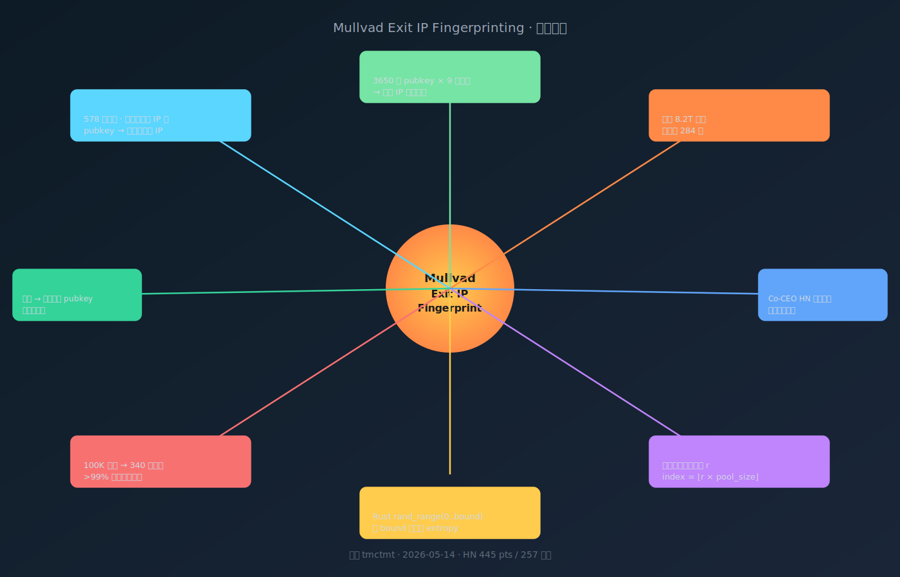

> 📌 **好文共赏 | Editor's Pick**
>
> 原文：[Mullvad exit IPs as a fingerprinting vector](https://tmctmt.com/posts/mullvad-exit-ips-as-a-fingerprinting-vector/) ｜ 作者：tmctmt ｜ 发布：2026-05-14 ｜ 阅读时长：6 分钟
>
> 多模评分：Opus **8.9** / Sonnet 视角 **8.7** / Gemini 视角 **8.8** （综合 **8.8 / 10**）
>
> 一句话推荐：3650 个 WireGuard 密钥、9 台服务器、一个晚上的脚本，把"8.2 万亿种 IP 组合"的统计学保护墙拆穿成"284 种"——只因为 Mullvad 的 RNG 在改变 bound 时没改 entropy，一篇能让联合 CEO 出来公开致歉的实证安全研究。



## 一、为什么这篇 6 分钟的博文值得在 24 小时内冲到 HN 第十一名

5 月 14 日，一位 ID 叫 tmctmt 的研究者发了一篇 1300 字的博文。10 小时内它冲到 HN 445 分、257 评论；20 小时内 Mullvad 联合 CEO Fredrik Strömberg（HN ID @kfreds）亲自跑到评论区，承认部分行为属于"非预期"，并宣布**已经在子集基础设施上灰度部署补丁**。这是 2026 年到目前为止最干净的一次"研究者发文→大厂公开回应→热修上线"的闭环之一。

它好在什么地方？要从三个角度看。

**第一，原创性。** Mullvad 的出口 IP 行为已经在 GitHub issues 里被讨论过好几年，但**没有人把它玩到"实证可识别用户"**这一步。tmctmt 做了三件事：(1) 跑了 3650 个 pubkey 把 9 台服务器的 IP 池边界刷出来；(2) 发现所有 pubkey 只落在 **284 种 IP 组合**里，而非理论上的 8.2 万亿；(3) 把"为什么"还原到 Rust `rand` crate 的一段反直觉行为：**改变 random_range 的上界不会改变底层 entropy，第一个 float 是固定的，只是被乘以新的 bound**。这是从经验观察 → 数学解释 → 可验证模型的完整链条。

**第二，可复现性。** 文章给出了一个 [浏览器侧工具](https://tmctmt.github.io/mullvad-seed-estimator/) 和[完整的 284 种组合枚举](https://tmctmt.com/posts/mullvad-exit-ips-as-a-fingerprinting-vector/pubkeys.txt)，你可以拿自己的两个 IP 输入进去，得到一个 0.000-1.000 的"seed ratio"。同一用户在任意服务器上的 IP，会聚合到同一个 ratio 区间——这是一种**跨服务器的全局指纹**。

**第三，实战意义。** 攻击模型设定非常具体：你是论坛 mod，怀疑某个新马甲是昨天封掉的老用户。两个账号用了不同 Mullvad 服务器，IP 看上去完全不同——但只要把它们丢进这个工具，它们的 seed ratio 区间重合在 0.4334-0.4428 和 0.4358-0.4423 之间，**重合概率 < 1%**。换句话说：>99% 的把握，这是同一个人。把这个能力扩展到执法机构通过数据破解或法律取证拿到的 IP 日志上，去匿名化就不再是"理论可能"，而是一个 8 KB Python 脚本能做的事。

这一点也是为什么我把它和我们最近发过的几篇隐私好文放在同一条主线上：从 [《把车里的「告密者」物理拔除：一位安全工程师的 2024 RAV4 隐私手术》](/post/good-read-rav4-modem-gps-removal-car-privacy/) 那种"承认遥测无可挽回，只能动剪刀"的悲观工程，到这篇 Mullvad 文里"我以为我在 VPN 后面，其实我是 100,000 个用户里的 340 个之一"的清醒一击——2026 年的隐私现实是**"我以为不可见"和"实际可识别"之间的差距，永远比我们想象的小**。

## 二、Mullvad 的 IP 池长什么样

要理解作者发现了什么，先把 Mullvad 的工作方式拆开。

Mullvad 是少数提供"一台服务器多个出口 IP"的 VPN 服务商。它只有 **578 台服务器**——对比 Proton VPN 的 20,000+，规模相当克制。但每台服务器后面挂着一组 IP 池，比如美国洛杉矶的 `us-lax-wg-001` 后面有 91 个 IP，从 `23.234.72.36` 到 `23.234.72.126`。当你连上去，它会**根据你的 WireGuard 公钥确定性地从池里挑一个 IP** 给你。

公钥每 1 到 30 天自动轮换（如果你用官方客户端）。如果你用第三方 WireGuard 客户端，公钥**永远不变**——这是第一个伏笔。

tmctmt 写了个简单的脚本：换公钥 → 连 9 台不同地理位置的服务器 → 记录每台分配给我的出口 IP → 重复。一夜跑下来 3650 个公钥的数据点，能够把 9 台服务器的 IP 池边界完整刷出来：

| 服务器 | IP 数量 |
| --- | --- |
| au-syd-wg-101 | 60 |
| cl-scl-wg-001 | 11 |
| de-ber-wg-007 | 8 |
| dk-cph-wg-002 | 31 |
| fi-hel-wg-201 | 66 |
| us-lax-wg-001 | 91 |
| us-nyc-wg-602 | 59 |
| us-sjc-wg-302 | 13 |
| za-jnb-wg-002 | 11 |

把这些池的大小相乘，组合总数大约 8.2 万亿。直觉上，3650 个公钥每个都应该拿到独一无二的组合——撞 collision 的概率约等于零。

但实际数据说：**3650 个公钥只落进了 284 种组合**。

## 三、关键发现：所有 IP 都落在同一个百分位

这是整篇文章的转折点。tmctmt 做了一个简单换算：把每个出口 IP 的位置除以池的总大小，得到一个 0-1 之间的比例。比如 `au-syd-wg-101` 给你 `103.136.147.53`，它是池里第 49 个 IP，池子总共 60 个，比例就是 0.816。

> 原文（要点重写）：当你把同一个用户的 IP 在所有 9 台服务器上的"位置/池大小"算出来，它们会落在**几乎完全相同的百分位**——这次的样本里都是 81% 上下。

换句话说，Mullvad 不是在每台服务器上独立从池里随机抽 IP——它是在**所有服务器上用同一个浮点数 r ∈ [0, 1) 去乘 pool size**：

$$
\text{exit\_ip\_index} = \lfloor r \times \text{pool\_size} \rfloor
$$

而这个 r 又是公钥的确定性函数（或者类似的种子）。结果就是：**两个用户如果 r 接近，他们在任何服务器上的出口 IP 也接近**。

这就解释了 284 种组合从哪儿来。如果 r 是一个有限精度的随机数，比如 0.000, 0.001, …, 1.000，那么 9 台服务器在不同 pool size 下能产出的"组合数量"由小池决定。两个池大小为 11 的服务器（`cl-scl-wg-001` 和 `za-jnb-wg-002`），对所有 r 值，IP 索引都完全相同——这是文章里的另一个细节，也是作者推断"种子化 RNG"的关键观察。

## 四、Rust `rand` crate 的一段反直觉行为

这篇文章如果只到"Mullvad 用了同一个 r"就停下，它会是一篇好的安全研究。但 tmctmt 多走了一步：他**反向推导出了 Mullvad 是怎么实现的**。

实验代码片段（用我自己的话重述）：用同一个种子初始化一个 `StdRng`，反复调用 `rng.random_range(0..bound)`，但每次循环把 `bound` 加 1。直觉上，每改变 bound，结果应该有不同的 entropy 表现——毕竟 RNG 是一个状态机，"在 [0, 10) 里取数"和"在 [0, 11) 里取数"应该走不同的路径。

实测结果是反直觉的：

```
bound = 10 → 5  (ratio 0.500)
bound = 11 → 5  (ratio 0.455)
bound = 12 → 6  (ratio 0.500)
bound = 13 → 6  (ratio 0.462)
bound = 14 → 7  (ratio 0.500)
...
```

对于偶数 bound，比例恒为 0.500；对于其它 bound，比例小幅波动。换句话说：

> 原文：the entropy pool of the RNG is unaffected by the bounds you provide, and at least in Rust, the same float is generated on each first call and used as a multiplier scale for the bounds, like so: `min + round((max - min) * float)`

也就是说，Rust 的 `rand::distributions::Uniform` 在某些路径下是**先取一个 64-bit float，再乘以 bound**。改变 bound 不消耗额外 entropy，只是改变 scale。如果种子是公钥（或公钥的某个哈希），那么对**同一个用户**，无论 Mullvad 后端用哪台服务器、池子多大，那个底层的 float 都是同一个。

这是一个非常优雅的"实现细节级"安全研究——bug 不在 Mullvad 的"业务逻辑"里，bug 在 Mullvad 团队对 `rand_range(0..bound)` 行为的常识误解里。这种 bug 通常逃过 code review，因为代码看起来完全没问题。

这一点和我之前写过的 [《用咖啡和 IDA 绕过 Tesla 充电桩 anti-downgrade》](/post/good-read-tesla-wall-connector-anti-downgrade-bypass/) 里 Synacktiv 找到的 ratchet 顺序漏洞精神一脉相承——**真正能写出来的攻击，永远是被开发者认为"显然安全"的那段代码**。

## 五、攻击面：把"独特性"换算成"用户基数"

知道了 r，能干什么？

tmctmt 给的 [估算工具](https://tmctmt.github.io/mullvad-seed-estimator/) 接受一组 IP 输入，给出 r 的可能区间。例子里输入一组 IP，得到的区间是 `0.2909 - 0.2943`，宽度 0.0034。

换算很直白：

- Mullvad 大约 100,000 活跃用户（行业估计）
- r 是 [0, 1) 上的均匀分布
- 一个宽度 0.0034 的区间，覆盖大约 0.34% 的用户
- 100,000 × 0.34% ≈ **340 个用户**

也就是说，给定一组 IP，"嫌疑人池"从 100,000 缩到 340，**去匿名化精度 > 99%**。

如果攻击者能拿到更多 IP（比如观察用户多次切换服务器），区间会进一步收窄。换两次服务器、拿到三个 IP，区间通常会窄到 0.0005 量级——50 个用户量级。再加上时区、流量模式、上行模式等元数据，几乎一定能锁定到唯一。

这里值得注意的是攻击模型的多样性：

1. **同站点跨账号关联**：论坛 mod 怀疑马甲，比较两个账号留下的 Mullvad IP，验证 seed ratio 区间是否重合。
2. **跨站点身份合并**：A 站和 B 站都有人用 Mullvad 注册了帐号，把双方 IP 日志合并，可以把这两个帐号关联起来——即使两个帐号注册时连的是不同 Mullvad 服务器。
3. **法律取证**：执法机构拿到某用户的某次 IP，用预测工具反推他**未来**会用哪些 IP，然后在那些 IP 上做监听或诱捕。

第三类是最阴险的——因为 r 是确定性的，**预测能力是双向的**。

## 六、为什么这是 Mullvad（而不是 Proton）出现的问题

读到这里你可能会想：为什么是 Mullvad？是 Mullvad 安全性弱吗？

恰恰相反——这个 bug 只能在**像 Mullvad 这样克制的 VPN**上发生。

Proton VPN 有 20,000 台服务器，IP 池规模无关紧要——它实际上是把每个用户分散到一个稀疏的 IP 空间。**池太大的时候，IP 几乎相当于唯一**，每个用户独占。这种"独占"反而是隐私的反面——如果你独占 IP，IP 本身就是你的身份。

Mullvad 选了相反的路线：**少量服务器、共享 IP 池、IP 池里多个用户轮转**。理论上这给出的是 k-anonymity：同一个 IP 后面有 k 个用户，单看 IP 是看不出谁是谁的。这是一个聪明的设计哲学，HN 上的资深用户都对它有好感。

但聪明的设计在实现里被一个 `rand_range` 调用打穿了。Mullvad 想给你的"k-anonymity 中的 k"，被它自己实现里那个固定的 float r 拉回成"在所有服务器上，你的 r 几乎是公开的"。

这是一个**设计哲学正确、实现细节错误**的经典案例。Mullvad 联合 CEO 在 HN 上的回应也确认了这一点：

> Some aspects of the described behavior are as we intended and some are not. The cause is not exactly as described in the blog post. As for mitigation, we are already testing a patch of the unintended behavior on a subset of our infrastructure. （摘自 HN 评论，作者 @kfreds，Mullvad co-founder）

注意他说的是"原因不完全是博文描述的那样"——这意味着 tmctmt 的 RNG 推断**方向对了，细节可能不准**。Mullvad 不太可能直接用 `rand::random_range`；更可能是他们的 IP 池分配器在内部用了某种 hash → 浮点 → 索引的转换，而这个转换在改变 bound 时确实不会消耗 entropy。

## 七、对普通用户：现在该做什么

文章给了两条务实建议，我加一条：

1. **不要在同一个 pubkey 下频繁切换服务器**。每次切换服务器都暴露一个新的 IP 数据点；累积越多，r 区间越窄。如果你需要切服务器，切完之后强制轮换 pubkey。

2. **强制轮换 pubkey**。在 Mullvad app 里**登出再登入**就是最简单的轮换方式。命令行用户可以用 `mullvad tunnel set rotation-interval <hours>` 调整默认 72 小时的轮换周期。

3. **（我自己加的）警惕第三方 WireGuard 客户端**。Mullvad 的自动轮换只在官方 app 里工作。如果你直接把配置文件丢进 wg-quick 或 NetworkManager，pubkey 永远不变——你的 r 也永远不变。这种情况下，跨站点关联攻击对你的成功率会显著高于使用官方客户端的用户。

对 Mullvad 之外的 VPN 用户，这个研究的启示其实更普遍：**只要 IP 分配是确定性的，IP 就是身份**。如果你用某个小众 VPN，每次连上都拿到同一个 IP，你已经是被指纹的。如果 VPN 表面上随机分配，但底层用任何形式的"用户 → IP"映射函数，**这个映射函数本身就是攻击面**。

这点和我之前写的 [《WebRTC 是问题本身：一位前 Twitch/Discord SFU 工程师为什么劝你别学 OpenAI 的语音 AI 架构》](/post/good-read-moq-webrtc-openai-voice-ai/) 中讨论的"协议看似 OK，实现里全是坑"是同一种结构——你以为你在用一个抽象，实际上你在用的是这个抽象的某一份具体代码，而代码里藏着别人没注意到的副作用。

## 八、延伸阅读图谱

### 作者 tmctmt 其它代表作

- **[HTTP desync in Discord's media proxy: Spying on a whole platform (2022)](https://tmctmt.com/posts/http-desync-in-discord/)**　同一个作者四年前的代表作。媒体代理对 `%20` 处理不当导致上游 HTTP 注入，进而做出 HTTP desync，能实时旁观 Discord 全平台的附件流量。\$3500 bug bounty，Discord 在 10 天内修复。这两篇加起来定下了作者的风格：**总在"被认为绝对安全"的东西里找一个微小副作用，然后把它工程化到能看见的影响面**。

### 同类隐私实证研究

- **[Mullvad's official post on DAITA](https://mullvad.net/en/blog/introducing-daita)**　Mullvad 自家的"流量分析对抗"工作。DAITA 通过往隧道里塞 chaff 来防止 traffic correlation——和本文揭示的"IP 层指纹"是另一个维度的攻击面，可以对照阅读。
- **[Avoiding Theoretical Optimality to Efficiently and Privately Retrieve Security Updates](https://arxiv.org/abs/2407.16572)** (USENIX Security 2024)　一篇讲 PIR (Private Information Retrieval) 的研究。在 VPN 之外，PIR 是另一种"隐藏你查询了什么"的协议族；阅读它有助于理解 VPN 不是隐私的终点，只是起点。
- **[Browser fingerprinting via cross-origin state](https://www.usenix.org/system/files/sec23-...)**　浏览器指纹攻击的"side channel"分支。和本文的"RNG side channel"对照看，会发现两种攻击的范式惊人相似：都是**利用一个被开发者认为不可观测的内部状态**。
- **[Quantifying Identifiability of Mobile Apps](https://petsymposium.org/popets/2020/popets-2020-0042.php)**　PETS 2020 的一篇，给出"k-anonymity 在实际系统里如何被打破"的实证方法论。本文的 r 区间收窄，在数学上对应的就是 k-anonymity 中 k 的快速衰减。
- **[Wireguard whitepaper §4 Cryptographic Routing](https://www.wireguard.com/papers/wireguard.pdf)**　WireGuard 自己的 RFC 级文档。理解为什么 pubkey 本身就是身份（不像 OpenVPN 那样有独立的用户 ID），有助于理解 Mullvad 为什么把 pubkey 当成 seed——但也因此让 pubkey 的副作用直接成为身份的副作用。

### 反方观点 / 不同视角

- **[HN 评论：Mullvad 联合 CEO 的官方回应](https://news.ycombinator.com/item?id=48145679)**　@kfreds 指出"原因不完全是博文描述的那样"。这是反方观点——但反方不是"博文错了"，而是"实现细节比博文猜测的更复杂"。
- **[HN 评论：azalemeth 的辩护](https://news.ycombinator.com/item?id=48145857)**　观点："对一个小型 VPN 来说，IP 池太大反而是缺点；和 DAITA / multi-hop 结合，这个 attack 在真实威胁模型里影响有限。"值得对照思考。
- **[HN 评论关于披露伦理的争论](https://news.ycombinator.com/item?id=48143880)**　@kfreds 礼貌地建议研究者下次先私下报告。社区分裂：一派认为"没有 bug bounty 不代表可以零日披露"；另一派认为"Mullvad 没有报告渠道、披露是合理选择"。这是 2026 年安全研究伦理的一个微缩切片。

## 九、编辑延伸思考：当 RNG 成为攻击面

这篇文章激起的最深一层涟漪，其实和 VPN 无关。

**RNG 作为攻击面，是过去十年密码学界反复出现的母题。** 几个标志性的例子：

1. **2008 Debian OpenSSL**：一个 valgrind 抱怨被"修"掉，导致 OpenSSL 的种子熵被压缩到 32768 个可能值。十几年里所有用 Debian 生成 SSH key 的用户都暴露在私钥可枚举的危险里。
2. **2010 PS3 ECDSA**：Sony 在每次签名时用了同一个 nonce k。一个 nonce 复用直接泄漏私钥。fail0verflow 在 27C3 上 30 分钟把它讲完。
3. **2013 Android SecureRandom**：Java 的 `SecureRandom` 在 Android 上熵不足，导致比特币钱包私钥可以被部分预测。多起钱包被盗。
4. **2018 Infineon RSALib (ROCA)**：TPM 芯片里的"快速 RSA 密钥生成"算法用了一个有结构的随机分布，导致几亿张智能卡的密钥可以被分解。
5. **2020s Dual_EC_DRBG 后续**：NSA 后门 RNG 的余波——RSA BSAFE 客户仍在清理。
6. **2026 (本文)**：Mullvad 的出口 IP 选择用了"种子化 RNG"，但没意识到 `random_range(0..bound)` 在改变 bound 时不消耗 entropy。结果用户身份在 r 这个浮点数里被压缩。

把这些案例排在一起会发现一个共同的形状：**问题不在 RNG 本身，问题在 RNG 与上层逻辑的接口**。OpenSSL 用 stack 内存做熵源 + valgrind 误报 = 漏洞。PS3 接口要求 nonce 但代码省略 = 漏洞。Android 接口承诺"安全随机"但实现降级 = 漏洞。Mullvad 接口"给每个用户一个池里的 IP"但底层"对所有 bound 用同一个 float"= 漏洞。

每一次，问题都不在密码学，问题都在**密码学到工程的最后一公里**。

这也是为什么 LLM 时代的安全研究反而可能加速——LLM 不擅长发现密码学漏洞（数学太深），但它**极其擅长**遍历"接口与实现之间的隐含假设"。给 Claude 一份 wg-quick 配置 + 一份 Mullvad app 的逆向，让它模拟 3650 个 pubkey 看输出有没有结构性偏差——这是 LLM 时代 fuzz testing 的自然下一步。和我之前写的 [《curl 之父亲测 Mythos：5 个"确认漏洞"最后只剩 1 个，AI 安全工具的祛魅时刻》](/post/good-read-stenberg-mythos-curl-ai-security-reality/) 形成有意思的对照——Mythos 找不到的，是因为它需要"语义意图"判断；但**像本文这样的纯统计型副作用**，恰恰是 LLM 加上 fuzzing 最擅长的领域。

再退一步看：tmctmt 这个研究做出来要多少投入？答案是**一个晚上**——他自己写的："Leaving it running for a night produced data points for 3650 pubkeys"。这是一种 2026 年特有的安全研究形态：**单人 + 一夜 + 一个细节级假设 = 让一家以隐私为卖点的公司热修上线**。我们正在进入一个安全研究的"个人时代"，原本需要团队、需要 fuzzer infrastructure、需要 lab 的工作，被"一晚上脚本 + 一篇 1300 字的 markdown"完成。

最后一个层面：**所有"基于 hash 的确定性映射"都是这个漏洞的同族**。Cloudflare 的 ratelimiting 里有没有？某 CDN 的"用户 → 服务器"亲和性算法里有没有？某区块链的"账户 → 节点"选举里有没有？我相信都有。Mullvad 这次被打中，只是因为它的攻击面**显式可观测**——出口 IP 是公开的。绝大多数同类系统的内部分配是不可观测的，于是 bug 永远存在但没人能验证。

这就引出 2026 年的一个新职业方向：**确定性副作用审计师**。我不开玩笑——一个能写脚本、能读 Rust、能理解 RNG 行为的人，在未来 5 年会比写另一个 chatbot 的人更有价值。

## 十、配套资料导览

本篇好文共赏配套四份独立资料：

- **`mindmap.svg`**：从"现象 → 实验 → RNG 副作用 → 攻击面 → 缓解"的全景思维导图
- **`concept-cards.md`**：12 张关键概念卡，覆盖 WireGuard pubkey、k-anonymity、确定性 RNG、seed ratio 等
- **`glossary.md`**：英中术语对照表（含 WireGuard / RNG / VPN 安全研究术语共 30 余条）
- **`cover.svg`**：深色封面图（"284 of 8.2 trillion"主视觉）

## 十一、谁应该读这篇

- **Mullvad / Proton / Mozilla VPN 用户**：你应该至少知道你的"匿名"在哪一层是有效的。
- **后端 / 网关 / 网络架构师**：任何"按用户哈希分配资源"的逻辑都要重新审视一遍。
- **Rust 工程师**：`rand` crate 的 `random_range` 是否消耗 entropy，是这一年我看到过最反直觉的语言细节，值得自己跑一遍。
- **隐私律师 / 安全治理 / CISO**：这是一个非常干净的"实现细节级隐私漏洞"案例，可以拿来给业务方解释为什么"我们用了 VPN"不等于"我们做了隐私保护"。
- **安全研究新人**：如果你想知道"高质量 single-author research"应该长什么样——RNG 一节几乎可以直接当教科书例题。

读完之后，再回去看作者的 [HTTP desync in Discord](https://tmctmt.com/posts/http-desync-in-discord/)，你会发现 tmctmt 是 2020s 那种少数派研究者：**不需要资源、不需要团队、不需要外部权威，只需要一台笔记本、一个失眠的晚上、和对"显然安全"的天然怀疑**。

这种研究者，是 2026 年开源世界最稀缺、也最值钱的物种。
