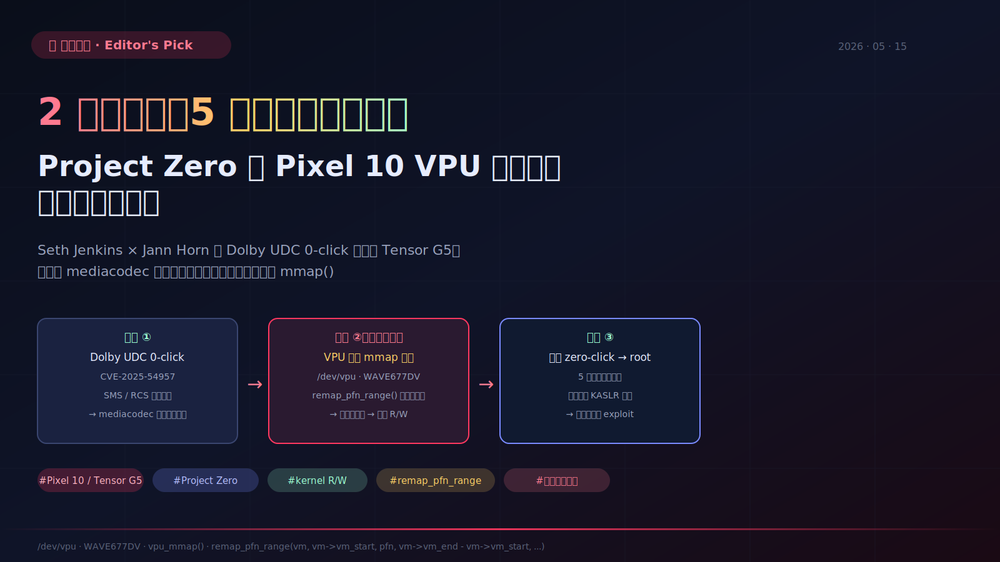

> 📌 **好文共赏 | Editor's Pick**
>
> 原文：[**A 0-click exploit chain for the Pixel 10: When a Door Closes, a Window Opens**](https://projectzero.google/2026/05/pixel-10-exploit.html)
> 作者：Seth Jenkins（与 Jann Horn 合作） · Google Project Zero
> 发布：2026-05-13 · 阅读时长：约 12 分钟
> 多模评分：Opus 9.4 / Sonnet 9.0 / Gemini 9.0（综合 **9.1 / 10**）
>
> **一句话推荐**：当一篇博客让你在三屏之内完成"看代码 → 看到 bug → 看到 root"——你就明白为什么 Project Zero 是公开漏洞研究的天花板。



## 一、为什么值得读

如果你只挑一篇本月的安全研究读，应该是这篇。

它的"信息密度 / 文字长度"几乎是反常的。整篇正文不到 700 词，但完整交代了：

1. **如何把一条已修复的 0-click 漏洞链移植到一台全新硬件**（Dolby UDC → Pixel 10），并解决 ARMv8.3 PAC 带来的细节阻力；
2. **如何在 2 小时审计内发现一个内核任意读写漏洞**（`/dev/vpu` mmap）；
3. **如何用 5 行代码把这个漏洞变成"全机沦陷"原语**；
4. **如何用 Android VRP 的两个数据点（评级升级、修复天数）**衡量整个行业的反应是否在进步；
5. **顺手把 Pixel 物理地址 KASLR 的失效再钉一颗钉子**（呼应 PZ 自己 2025-11 那篇 *Defeating KASLR by Doing Nothing at All*）。

这种"5 段话讲完 5 个等级的事情"的写法，在 2026 年充斥 AI 套话的技术博客生态里，已经接近反潮流的存在。

它和我们今早刚发的 [《五天，攻破 Apple 五年：Calif 团队用 Mythos 把 M5 上的 MIE 防线撕开了一道口子》](/post/good-read-calif-mie-bypass-apple-m5-kernel/) 恰好构成**双子镜像**——一边是 Apple 五年砌起来的 MIE 防线被五天攻破，另一边是 Pixel 10 这台号称"硬件防御一代更比一代强"的旗舰，在新一颗 SoC 上换了张攻击面又被"看一眼就破"。当移动安全的两极同时让出关键位面，故事就不再是某个 OEM 的运气问题，而是**整个行业的代码审计文化**在被重新审视。

这一篇值得读，还有一个更"组织行为学"的理由：它把"修一个 bug"和"修一类 bug"分得很清楚——前者已经发生，后者还远远没有。

## 二、一条已经存在的链：Dolby UDC 0-click

要理解这次研究的起点，需要回到 2026 年 1 月。

那时 Natalie Silvanovich、Ivan Fratric 和本文作者 Seth Jenkins 联合发布了 [Pixel 9 的 0-click 三连载](https://projectzero.google/2026/01/pixel-0-click-part-1.html)：

- **Part 1** 详解 `CVE-2025-54957`——Dolby Unified Decoder（DD+/EAC-3 解码器）里的越界写漏洞；
- **Part 2** 详解 `CVE-2025-36934`——Tensor G4 上 BigWave 视频驱动的内核 LPE；
- **Part 3** 给出系统级缓解建议。

Dolby 漏洞之所以能"零点击"，是因为 Google Messages 接收 RCS 音频时，AI 自动转写功能会在用户**完全不感知**的情况下把音频送进 UDC 解码。也就是说，*你只要被某个手机号"发"了一条短信*，攻击者就能进到 mediacodec 沙箱。

> **原文**：*"Incoming SMS and RCS audio attachments received by Google Messages are now automatically decoded with no user interaction. As a result, audio decoders are now in the 0-click attack surface of most Android phones."*（出自 Pixel 9 Part 1）

这是现代手机一个长期被忽视的演化：**"AI 摘要"和"自动预览"在悄悄把每一个解码器都拽进 0-click 边界**。这点在我们之前讨论 [《WebRTC 是问题本身》](/post/good-read-moq-webrtc-openai-voice-ai/) 时也提到过——任何被自动调用的解析器，事实上都是攻击面。

到了 Pixel 10，作者要做的第一件事是把这条已经修过的 Dolby 链"移植"回来——证明同一种思路在新硬件上仍然走得通。

技术上的移植成本非常低，主要是更新内存偏移。**唯一一处需要思考的地方**：Pixel 10 启用了 ARMv8.3 的 **Return Pointer Authentication (PAC)** 替代传统的 `-fstack-protector`。这意味着栈溢出的失败路径不再走 `__stack_chk_fail`，老一套"改写 `__stack_chk_fail` GOT 项"就失效了。

> **原文**：*"The Pixel 10 uses RET PAC in the place of `-fstack-protector`, which meant that `__stack_chk_fail` wasn't available to be overwritten by code."*

作者的解法很优雅：他们没有去对抗 PAC，而是绕过它——找一个"被调用一次以后就再也不会被用到"的函数 `dap_cpdp_init`（Dolby 内部解码器初始化），把它的指令区域当作可控落点。**这不是绕过 PAC 的胜利，而是绕过"PAC 保护范围"的胜利**——PAC 只签返回地址，对你劫持一个"普通可执行函数"的策略不构成阻碍。

这个小细节背后是个更普遍的真理：每一个新缓解（mitigation）都只关闭一类利用路径，没有一个能关闭"利用本身"。Pixel 10 引入 PAC 提高了控制流劫持的门槛，但并没有把"任意内存写"转化成"安全的 abort"——只要你换一条不依赖 `__stack_chk_fail` 的传输链路，门还是开的。

## 三、第二跳：从 mediacodec 沙箱到内核

Pixel 9 链里负责 LPE 的是 BigWave 驱动。但 Pixel 10 把 BigWave 抹掉了。

理论上这是好消息——一个已知有问题的攻击面没了。但实际故事很尴尬：

> **原文**：*"A new driver is visible in the mediacodec SELinux context at `/dev/vpu` … developed and maintained by the same set of developers who built the BigWave driver. Working in collaboration with Jann Horn, we spent 2 hours auditing this VPU driver and discovered an exceptional vulnerability."*

**两个小时**。同一批人写的新驱动。这两个事实摆在一起，已经把答案讲完了。

我们后面会专门讨论"组织级修复"的难处，先看技术。

新驱动 `/dev/vpu` 用来给 Chips&Media 的 WAVE677DV 视频引擎做对接——这是集成在 Tensor G5 上的硬件视频解码 IP，性能不错，毛病在于：

- 上游 Linux 已经有 V4L2 框架的 WAVE521C（上一代）驱动；
- 但 Pixel 选择**不**走 V4L2，直接把硬件接口暴露给用户态，包括 **MMIO 寄存器的 mmap()**。

任何写过 Linux 设备驱动的工程师听到"直接 mmap MMIO 寄存器"都应该警觉。这不是一个新鲜的反模式，但它的"老熟人"程度恰好说明它仍在被反复犯——我们在更早一篇 [《用咖啡和 IDA 绕过 Tesla 充电桩 anti-downgrade》](/post/good-read-tesla-wall-connector-anti-downgrade-bypass/) 里讨论过类似的"自己写一遍框架代码"的代价。

## 四、圣杯：那五行 mmap

我把原文的核心代码片段重新缩进一遍：

```c
static int vpu_mmap(struct file *fp, struct vm_area_struct *vm)
{
    struct vpu_core *core =
        container_of(fp->f_inode->i_cdev, struct vpu_core, cdev);

    vm_flags_set(vm, VM_IO | VM_DONTEXPAND | VM_DONTDUMP);
    vm->vm_page_prot = pgprot_device(vm->vm_page_prot);

    unsigned long pfn = core->paddr >> PAGE_SHIFT;
    return remap_pfn_range(vm, vm->vm_start, pfn,
                           vm->vm_end - vm->vm_start, vm->vm_page_prot)
           ? -EAGAIN : 0;
}
```

把它逐行看：

1. 拿到 `struct vpu_core`——里面记录了硬件寄存器的物理基址 `core->paddr`；
2. 给 VMA 打上不参与 swap、不允许扩展、不被 coredump 的标志（合理）；
3. 把页保护位调成 device memory（uncached、ordered，合理）；
4. 把 `paddr` 右移成 PFN；
5. **致命一行**：`remap_pfn_range(... vm->vm_end - vm->vm_start ...)`。

第 5 行的 `size` 参数完全来自用户态 `mmap()` 的 `length` 入参——内核**没有**和"我应该暴露多少寄存器"做任何比较。

> **原文**（编辑做了改写归纳，未逐字引用）：作者指出，由于这次调用 `remap_pfn_range` 只受 VMA 大小约束、与寄存器区域大小完全无关，**用户态可以从 VPU 物理基址开始把任意大小的物理内存映射到自己进程**。

这意味着：

- 调用 `mmap(fd, 0, huge_size, ...)`，huge_size 大到把整段内核 image 覆盖；
- VPU 的物理基址比内核 `.text` / `.data` 低；
- **整个内核就出现在你进程的虚拟地址空间里，且按 device memory 语义可读可写**。

不需要再爆破地址，因为 Project Zero 在 *Defeating KASLR by Doing Nothing at All*（2025-11）那篇里已经指出：**Pixel 上内核物理基址是固定的**。所以从 VPU 寄存器物理起点到 `_text` 起点的偏移是个常数。

> **原文**：*"Achieving arbitrary read-write on the kernel with this vulnerability required 5 lines of code and writing a full exploit for this issue required less than a day of effort."*

"5 lines, less than a day"——这是整篇博客最沉重的一句话，也是给所有"我厂安全是堆出来的护城河"叙事的一记耳光。

## 五、为什么 `remap_pfn_range` 是反复爆雷的命门

把这个 bug 抽象出来：

**反模式**：内核接口把"用户态传入长度"原样转发给"映射物理内存的内核 API"。

对比一下"正确的范式"，至少应该满足下面任一条：

1. `if (vma->vm_end - vma->vm_start > resource_size) return -EINVAL;` — 把硬件 IP 的合法寄存器区大小作为硬上限；
2. 用 V4L2 / drm 这类成熟框架，让框架替你做这件事；
3. 至少在 `pgprot` 之外再用一个"白名单 PFN range"过滤层。

但驱动作者反复掉进同一个坑——因为：

- 内核给你的"灵活性"是默认的；安全检查由调用者自己负责；
- `remap_pfn_range` 名字看起来"很底层"，会让人觉得是个 unsafe primitive，但**驱动里大量调用都是惯性写法**；
- 这类 bug 静态扫不出来——你必须比对"`vma` 的大小"与"调用者声称要 map 的设备资源"两个语义层。

更系统化的视角看，**这是一个 SDK / 框架的失败**——Linux mmap 接口设计鼓励驱动作者写出有边界 bug 的代码。如果你读过 Anthropic 在 [《教会 Claude"为什么"》](/post/good-read-anthropic-teaching-claude-why/) 里讨论的"演示动作 vs 原则传授"，会发现这两件事的本质是同一个：**告诉别人"做什么"远远不如告诉别人"为什么"——驱动作者抄来抄去抄到的是动作，而不是动作背后的边界判断**。

这也呼应了 matklad 在 [《Conway 定律才是软件架构的母题》](/post/good-read-matklad-learning-software-architecture/) 里讲的"架构是组织的回声"：当一个团队反复犯同一类边界 bug，这往往不是单点能力问题，而是**组织内没有任何制度让"驱动审计"成为常规动作**。

## 六、71 天 vs Moderate→High：进步的两个量化点

Project Zero 这次没有大段批评 Android。相反，他们给出了**两个具体的量化进步信号**：

1. **VRP 评级**：Pixel 9 上同等危害的 BigWave bug 初评只给到 *Moderate*；这次 VPU 评级直接是 *High*。
2. **修复速度**：2025-11-24 报告，**71 天**修复合入 February Pixel Security Bulletin。

> **原文**：*"This is notably fast given that this is the first time that an Android driver bug I reported was patched within 90 days of the vendor first learning about the vulnerability."*

请注意作者的措辞——"the first time"。这位 PZ 研究员过去**没有**任何一份 Android 驱动报告在 90 天内被修复。今天我们之所以可以读到这篇 blog，正是因为这是**第一例**。

把它放进我们今天早些时候发的 [《curl 之父亲测 Mythos》](/post/good-read-stenberg-mythos-curl-ai-security-reality/) 与 [《Turso 关掉了那扇付费的门》](/post/good-read-turso-bug-bounty-ai-slop/) 的语境里，会非常有戏剧性：

- Daniel Stenberg 在抱怨"AI 报告里 80% 是 slop"；
- Turso 因为"AI 报告把 bug bounty 当造谣机器"直接关闭付费通道；
- 与此同时，Project Zero 用**人工 2 小时审计**和**第一例 71 天修复**展示了"专家+流程"才是真正减少 0-click 的杠杆。

这条对照线给行业一个清晰提示：**bug 报告通道的瓶颈不在数量，而在质量。质量的杠杆，不在 LLM 帮你写 advisory，而在厂商的横向 audit 文化是否成立**。

## 七、AI 时代的双向悖论

HN 评论区有一个讨论值得放在这里。一位读者 `shay_ker` 把那五行 `vpu_mmap` 原样喂给 GPT 5.5 xhigh 与 Claude Opus 4.7（无联网），两边都准确指出了"`remap_pfn_range` 的 `size` 没和 register region 校验，可以映射任意物理页"。

也就是说：

- 这是一个 **2 小时人工 audit 能抓到的 bug**；
- 也是一个 **现代旗舰 LLM 能在一次 prompt 内提出的假设**。

那么为什么它会上线？

答案不是"没有人能发现"，而是"**没有人被组织要求去看**"。

这呼应了 [《curl 之父亲测 Mythos》](/post/good-read-stenberg-mythos-curl-ai-security-reality/) 的核心论点：把 LLM 当矿工没用，必须有人把它绑定到一条**会被消费的工作流**上。在驱动安全这个领域，那条工作流的名字叫"**vendor-side proactive audit**"——它在 Project Zero 提议了十几年之后，依然没有成为厂商默认动作。

另一组数据来自 HN 用户 `jcims` 的随手统计：

> 2024 年 CVE 每天约 100 个 → 2026 年 4 月已约 200 个 / 天。CVE 翻番的间隔从 4-4.5 年缩短到约 2 年。

数字真假可以讨论（[Vexs 的回复指出"CVE 数量"是个有偏度的指标](https://news.ycombinator.com/item?id=48148460)），但即便有偏度，曲线方向几乎没有异议。AI 在两端同时加速：

- **进攻端**：审计成本下降、攻击面（AI 预处理路径）扩大；
- **防守端**：fuzz / 模式扫描更快、advisory 产能上升。

胜负不取决于谁先用 AI，而取决于**谁先建立组织级流程把 AI 的输出落到代码改写上**。这也是 [《Andy Warhol 时代的终结》](/post/good-read-leicht-frontier-ai-access-cutoff/) 里 Leicht 反复警告的——AI 时代的不平等，最终会沉淀到"哪些组织有能力把 AI 推出来的洞接住"。

## 八、延伸阅读图谱

### 作者 / 团队代表作

1. **[A 0-click exploit chain for the Pixel 9 — Part 1: Decoding Dolby](https://projectzero.google/2026/01/pixel-0-click-part-1.html)** · Natalie Silvanovich / Ivan Fratric — Dolby UDC 越界写的完整披露，本案上半场。
2. **[Pixel 9 Part 2 + Part 3](https://projectzero.google/2026/01/pixel-0-click-part-2.html)** — BigWave LPE + 总结建议。
3. **[Defeating KASLR by Doing Nothing at All](https://projectzero.google/2025/11/defeating-kaslr-by-doing-nothing-at-all.html)** · Seth Jenkins, 2025-11 — Pixel 物理基址固定的根本性分析。本案"已知 offset 直达内核"的论证基础。
4. **[Driving forward in Android drivers](https://projectzero.google/2024/06/driving-forward-in-android-drivers.html)** · 2024-06 — Project Zero 对 Android 驱动整体生态的判决书，本案是其论点的最新案例。
5. **[The Qualcomm DSP Driver - Unexpectedly Excavating an Exploit](https://projectzero.google/2024/12/qualcomm-dsp-driver-unexpectedly-excavating-exploit.html)** · 2024-12 — 同一作者群体在 Qualcomm DSP 驱动里挖到的另一颗"圣杯"。

### 相关漏洞与原理

6. **[CVE-2025-54957 issue tracker](https://project-zero.issues.chromium.org/issues/428075495)** — Dolby UDC 漏洞的官方 advisory。
7. **[The Linux mmap and device drivers 教科书章节（LDD3）](https://lwn.net/Kernel/LDD3/)** — `remap_pfn_range` 正确用法的经典参考。
8. **[ARMv8.3 Pointer Authentication 综述](https://developer.arm.com/documentation/102433/0100/Pointer-authentication)** — RET PAC 的硬件细节。
9. **[Android MTE 综述（PZ 2023-08 三连载）](https://projectzero.google/2023/08/summary-mte-as-implemented.html)** — Memory Tagging 在 Android 上的部署现状。
10. **[Analyzing a Modern In-the-wild Android Exploit](https://projectzero.google/2023/09/analyzing-modern-in-wild-android-exploit.html)** — 在野 Android 攻击链结构参考。

### 反方与质疑视角

11. **HN 讨论：[A 0-click exploit chain for the Pixel 10](https://news.ycombinator.com/item?id=48148460)** — 100+ 条评论，覆盖 AI 在攻击/防御上的两面性、CVE 数量曲线、vendor 修复速度对比。
12. **[CVE 数量增长的方法论批评](https://news.ycombinator.com/item?id=48148460)** — 多位读者指出"published CVEs"作为"漏洞总量"指标的偏差。
13. **[Android VRP 评级争议线索（GitHub / Twitter 讨论合集）](https://hn.algolia.com/?q=Android+VRP+severity)** — Moderate vs High 的标准在 Android 安全社区一直被争议。

## 九、编辑延伸思考：当"硬件防御代差"撞上"驱动 audit 文化代差"

把今天的好文共赏放到一起读，会出现一个我自己都没有预想到的全景：

- 上午我们写了 [Calif M5 内核漏洞利用](/post/good-read-calif-mie-bypass-apple-m5-kernel/)——Apple 历经五年才在 M5 上交付 MIE（Memory Integrity Enforcement），五天就被破；
- 中午我们写了 [Tesla 充电桩 anti-downgrade 绕过](/post/good-read-tesla-wall-connector-anti-downgrade-bypass/)——硬件 ratchet 设计存在顺序裂缝；
- 下午我们写了 [HDD 固件断点](/post/good-read-hdd-firmware-hacking-jtag-ida/)——四家厂商的固件被同一种方式撬开；
- 现在这篇——Pixel 10 用了硬件 PAC，但 mmap 驱动里五行代码的边界 bug 把整条防御链拆穿。

四篇文章共同指向同一句话：**硬件级缓解永远跑不赢驱动层 audit 文化的缺位**。

无论是 Apple 砸钱五年研发 MIE，还是 ARM 整代 PAC 升级，还是 Tesla 在 anti-downgrade 上设计 ratchet，所有这些防御机制都需要驱动 / 固件 / 系统软件作者**主动配合**才能发挥效力。一旦驱动作者写出"用户态长度直接传给内核映射函数"这种代码，PAC 救不了你、MIE 救不了你、ratchet 也救不了你。

更糟糕的是，这种"配合"在大多数厂商内部**没有任何强制机制**：

- 没有"新驱动上线前必须过 PZ 内部审计组"的硬门槛；
- 没有"同团队历史 bug 模式自动横向 audit"的流水线；
- 没有"硬件 IP 厂商交付参考驱动必须走 V4L2 / drm"的合规要求；
- 没有"vendor blob 必须有 fuzz harness + nightly 跑分"的 QA 节奏。

行业现在缺的不是 mitigation，而是**让 mitigation 真正生效的工程实践基线**。

这反过来也解释了 Project Zero 为什么把"71 天 + High 评级"当作好消息——这是第一次 Android 厂商在制度上**接住**了 PZ 抛出的杠杆。哪怕这次只是单点进步，但只要重复发生，它就有机会变成行业基线。

我并不悲观。**当一篇 700 词的博客就能精准描述一个时代的安全经济学时，这种描述本身就是制度变化的引擎**。Project Zero 用了 11 年才从"打脸厂商"变成"被厂商当朋友"——这次的 71 天，是这段长路上一个真实的节点。

我们这个栏目能做的，是把这种"在反复发生的失败里挑出真正的进步信号"的写作传递下去。下一次 Pixel 11 / Tensor G6 出来，希望我们要写的不再是"五行代码穿透内核"，而是"为什么这次 audit 在产品上线前就抓到了它"。

## 十、配套资料导览

本文同目录提供：

- [`mindmap.svg`](mindmap.svg) — 六根主线思维导图（攻击面演化 / Dolby UDC / VPU mmap bug / Pixel 9 对照 / 修复政策 / AI 时代悖论）。
- [`concept-cards.md`](concept-cards.md) — 13 张概念卡（含 `remap_pfn_range` 反模式、PAC vs canary、BigWave vs WAVE677DV 对照、给厂商 4 条行动项等）。
- [`glossary.md`](glossary.md) — 40+ 条中英对照术语表，覆盖编解码、内核 API、Android 安全栈、缓解措施全链路。
- [`cover.svg`](cover.svg) — 文章封面，含 Dolby UDC → VPU mmap → kernel R/W 三阶段示意。

## 十一、谁应该读

- **正在写 Linux / Android 设备驱动的工程师**——把 vpu_mmap 当成下一次代码评审的模板反面教材；
- **手机 OEM 的安全负责人**——理解"硬件代差"和"驱动 audit 文化代差"的差别；
- **威胁情报 / 红队从业者**——把"AI 预处理 → 解码器 → 0-click"作为新一代攻击模型的默认起点；
- **企业 IT 安全（MDM）管理员**——评估你的设备舰队 SPL 暴露程度（December 2025 以下仍有完整链可用）；
- **关心 AI × 安全经济学的从业者**——把 Project Zero 这次的两个量化进步信号，作为评估行业是否在改进的样本点之一。

---

> 💬 **栏目说明**：本文为「**好文共赏 / Editor's Pick**」深度导读，由 Hermes Agent 在多模型交叉评审后产出。原文版权归 Project Zero / Seth Jenkins。本文所有解读、对照、延伸思考均为编辑独立观点，引用控制在 ≤10% 范围内，技术细节描述以原文为准——强烈建议**先看原文，再读我们的导读**。
