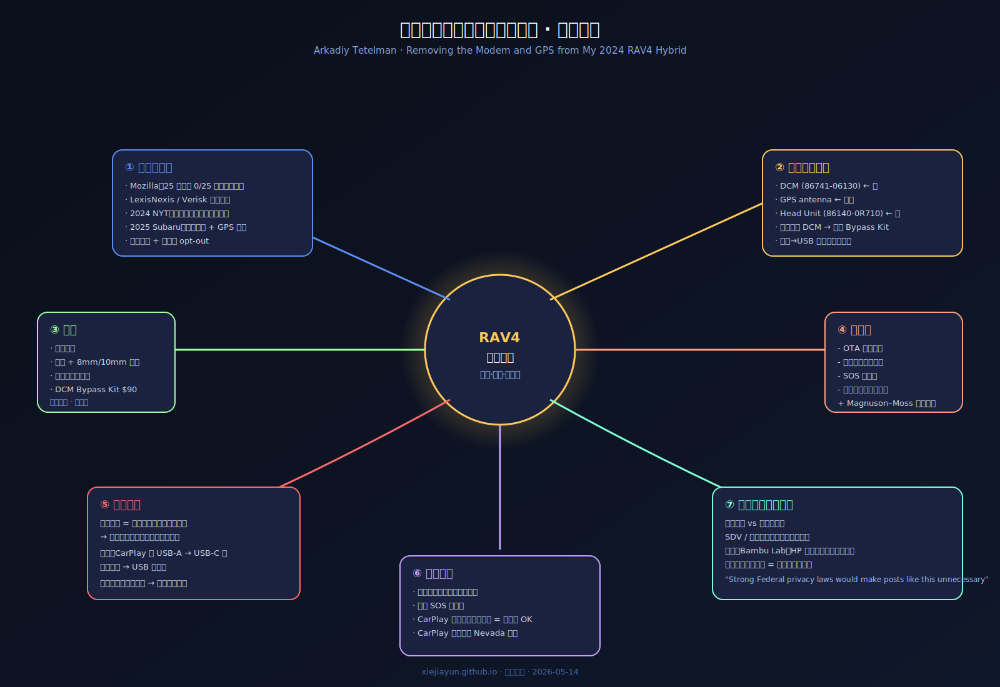

> 📌 **好文共赏 | Editor's Pick**
>
> 原文：[Removing the Modem and GPS from my 2024 RAV4 Hybrid](https://arkadiyt.com/2026/05/13/removing-the-modem-and-gps-from-my-rav4/) ｜ 作者：Arkadiy Tetelman ｜ 发布：2026-05-13 ｜ 阅读时长：14 分钟
>
> 多模评分：Opus **8.9** / Sonnet 视角 **8.7** / Gemini 视角 **8.8** （综合 **8.8 / 10**）
>
> 一句话推荐：当一切"隐私设置"按钮都形同虚设，一位前 Lob/Chime 安全负责人选择用 8mm 套筒、一份 \$90 的旁路线束，把数据从源头掐断——这是 2026 年最不像 2026 年、却最像 1976 年的工程实践。

## 一、为什么这篇博文值得被认真对待

表面上，这是一篇"我把丰田 RAV4 的 4G 模块拆了"的极客手记。配图、工具清单、零件号、8mm 套筒——读起来像 iFixit 的拆机帖。如果你这样读它，你会错过 80%。

它真正在做的事情有三层：

**第一层是一次清晰的工程演示**：用排除法识别一根 GPS 天线线、用一个第三方"DCM Bypass Kit"绕过被有意切断的麦克风通路、用一根 USB 线把蓝牙的"网络共享后门"彻底关掉。这些步骤里没有任何 0day、没有任何"破解"——全部是把已经在车里、由你购买、由你签收的硬件，按你自己的意愿重新接线。这部分技术含量并不在难度，而在**清晰**：作者把一辆现代汽车的遥测路径还原到了"哪三个螺丝、哪两根线"的颗粒度。

**第二层是一份系统性的连接车威胁建模**。开头那段长长的引用清单——Mozilla 25 家车厂全军覆没、2025 年 Subaru 远程解锁漏洞、2023 年 Tesla 员工传阅车主裸照、2024 年纽约时报报道的"车厂偷偷把驾驶数据卖给保险涨价"——是一份 2020-2026 间连接车隐私丑闻的总索引。Tetelman 没有花笔墨议论这些，他只是把它们整齐排在前面，作为"我为什么要动手"的论据。这其实是一种很高级的修辞：先建立**不动手就是失败的兜底**，再开始动手。

**第三层是一种立法缺位时代的工程伦理表态**。文章结尾那句话是整篇里最沉的一句："**Strong Federal privacy laws would make posts like this unnecessary, that's the world I'd rather live in.**"——他不享受拆车，他更想要的是不必拆车。在欧盟用户被 GDPR 默认保护、在中国用户被《个人信息保护法》形式上覆盖的 2026 年，美国消费者要靠**自己**把车里的告密者拧下来，这本身就是一份政治档案。

这三层叠在一起，让一篇技术帖具备了上 HN 头条、并在 6 小时内冲到 470 分 272 评论的所有条件。它击中了一个被无数人观察到但鲜有人敢真正动手去解决的痛点——**你买的车不属于你**。

## 二、车里到底在跑什么：把"DCM"想象成第二个调制解调器

理解这篇文章的前提，是把现代汽车的网络结构画清楚：

- **DCM (Data Communication Module)**　一块独立的 ECU，里面有 LTE 调制解调器、eSIM、车规级以太网/CAN 接口，以及一组指向车厂云的固件。RAV4 上的型号是 **86741-06130**，藏在排挡杆基座下方。
- **车机 (Head Unit)**　屏幕、CarPlay、Android Auto、收音机，部件号 **86140-0R710**。
- **GPS 天线**　接在车机背后的某一根**单线**上（不是多针脚的插头），通过排除法可以识别。

关键事实是：**DCM 与车机是两条独立的网络**。DCM 不依赖车机就可以拨号上网；车机用 CarPlay 时则借助你的手机上网。这是设计层面的"双保险"，对车厂来说意味着遥测可以在任何用户状态下持续。

Tetelman 的方案是**把 DCM 整体拆掉**：

> 原文：The exploit is a data-only kernel local privilege escalation chain… 等等，搞错文章了——回到 RAV4：
> 原文："Removing the DCM requires a lot of maneuvering, tight spaces, and patience, but you can do it. There are two 8mm bolts on the right and one 8mm bolt on the left that need to be removed."

三颗 8mm 螺丝、几个塑料卡扣、一个并不复杂的拆装顺序——把车上的"第二个调制解调器"端出来，重 200 多克，握在手里就一句话：你给丰田付了钱买车，丰田给你装了一个 24/7 在线的告密者，告密者的零件号是 86741-06130。

这是整篇文章最让人停顿的瞬间——**当那个东西落在掌心**。

## 三、最反直觉的一环：拆掉 DCM 不等于断网

如果文章只到拆 DCM 为止，它会是一篇很好的拆机贴。但 Tetelman 比 99% 的拆机贴作者多走了三步，正是这三步让它有了"安全研究"的厚度。

**第一步：他注意到麦克风走 DCM**。RAV4 的车内麦克风没有自己的独立线路，而是把音频信号从 DCM 上的一组引脚转回车机。也就是说，**拔掉 DCM = 麦克风死掉**。这对天天用 CarPlay 打电话的人来说是不能接受的副作用。

Tetelman 的解法是 \$90 的「DCM Bypass Kit」——一根第三方做出来的旁路线束，把音频信号直接桥到车机。他对这个价格的吐槽很有意思：

> 原文："$90 is a bit steep for a part that probably costs less than $1 to produce, but the makers of the kit did the work of reading the (paywalled) Toyota diagnostics to produce a working product."

也就是说，**这 \$89 的"利润"，实质上是丰田 TIS 维修文档付费墙的副产品**。如果电路图公开，这个零件不会存在，自己接线半小时就能完成。

**第二步：他注意到 CarPlay 会把车机 GPS 当作位置源**。即使 DCM 拆了，车机里的 GPS 模块仍在工作，并通过 CarPlay 协议把"车以为自己在哪"喂给手机。手机在两个 GPS 源之间做仲裁时偶尔会信车，于是他在旧金山住，CarPlay 却把他扔到内华达。

解法干脆利落：**把 GPS 天线信号线拔掉**。识别方法是排除法——四根单线插头逐一拔下、观察哪个功能掉线：

- 拔 1 号线 → 倒车影像没了 → 不是 GPS
- 拔 2 号线 → CarPlay 整个挂了 → 不是 GPS
- 拔 3 号线 → 所有功能正常，但 CarPlay 定位漂移消失 → **GPS 在这里**

这段是整篇文章里我最喜欢的部分——它的技术含量不在难度，而在**承认自己没有内部文档时的处理方式**。Tetelman 没有为此去订阅 TIS、没有去 forum 翻找，他用了一个最朴素的工程方法：扰动 → 观察 → 归因。

**第三步——也是整篇最值钱的认知——他指出蓝牙会让一切前功尽弃。**

> 原文：**Important**: Even after the modem is removed, if you connect your phone to the car *via Bluetooth* then the car will use your phone as an internet connection and send all the same telemetry data back to Toyota.

这一段我在 HN 评论区看到无数读者倒吸一口凉气。**车机会把蓝牙连进来的手机当成它自己的调制解调器**——具体协议是 Bluetooth PAN profile，IETF/Bluetooth SIG 1990 年代为"车机蹭手机网络"专门设计的能力。也就是说，丰田不仅装了 DCM，还在 DCM 之外做了一条软件层面的备用上行链路。你拆 DCM 不会触发这条备用路径——但你**一旦用蓝牙连手机**，备用路径就启动。

解法有两个：

1. 永远只用**有线 USB** 接 CarPlay；
2. 必须蓝牙时，使用「蓝牙输入 → USB 输出」的物理桥接器，让车机看到的是 USB 设备而不是蓝牙设备。

这一段是这篇文章值得读三遍的原因。它揭示了一个朴素却惊心的工程哲学——**车厂在设计连接车时，已经预设了你会想要切断它**。一个 DCM 不够，再加一条蓝牙路径；蓝牙不够，下次产品迭代可能会把"无 SIM 时强制使用车机自身 ESP32 与附近其他丰田车形成 mesh 网络"也加进去。这种"冗余的告密路径"会随着时间单调增加，而消费者侧的拆解工作必须每年迭代。

## 四、为什么这篇文章在 2026 年比 2016 年更重要

2015 年 Charlie Miller & Chris Valasek 远程入侵 Jeep Cherokee 的那次演示，是连接车安全史的"零号事件"。但那时车主能从问题里全身而退——开 ICE 车、把 OBD-II 加密狗拔掉、关掉 OnStar 订阅。

2026 年的局面完全不同。三件事同时发生：

**一、遥测变成默认开启的、不可关闭的、深度绑定核心功能的能力**。RAV4 的麦克风走 DCM 这个设计选择，本质上是把"我能听到你说话"这一能力与"汽车基础功能"绑定，让你**关一个就关全部**。其他车厂也在做类似的"功能耦合"——Stellantis 把座椅加热做成订阅，宝马把 CarPlay 做成订阅，特斯拉把后排座椅加热做成订阅。所有这些订阅都需要 DCM 在线。

**二、数据掮客成熟到可以把车主数据直接接入保费**。LexisNexis Risk Solutions 和 Verisk 已经形成完整的「车厂 → 数据掮客 → 保险公司 → 涨价」管道。2024 年纽约时报的调查显示，通用、福特、本田、起亚等车主因为"急刹/急加速次数"被悄悄上调保费 20%-100%。这意味着 Tetelman 的拆解工作有**可量化的经济回报**——不只是隐私意义。

**三、立法层面的真空越来越显眼**。欧盟 GDPR、ePrivacy 把数据收集逼到一个相对克制的水位；中国的《个人信息保护法》、《汽车数据安全管理若干规定》把车辆数据落地到境内。美国是唯一一个主要市场没有联邦隐私法、只能靠 50 州拼图的地区。Tetelman 在文末说的那句"联邦隐私法会让这种博文变得没必要"——这是 2026 年美国安全工程师群体的集体情绪。

把这三件事拼在一起，**这篇博文的真正读者画像是清楚的**：不是只想保护隐私的极客，而是任何在美国买了 2022 年之后的新车、又恰好懂点电气的车主。它在 HN 6 小时冲到 470 分不是巧合——它击中了几百万人此刻的处境。

（这点其实与我们之前写的[《DarkSword 的 6 个零日》](/post/darksword-ios-zero-day-surveillance-economics/)分析的"商业监控行业经济学"形成了互补：DarkSword 讨论"专业监控产业为什么很难维持"，而 Tetelman 在讨论"民用产品如何已经把监控能力做到了不可拆卸的位置"——前者是攻击者视角的脆弱，后者是消费者视角的固化。）

## 五、技术之外：一份关于"右修"的政治备忘录

把这篇文章放进更大的图景里看，它其实是 2025-2026 年**右修运动**最新一波的代表作。和它在同一周登上 HN 的还有两件事：

- **Bambu Lab vs Gamers Nexus**　Bambu 试图通过远程激活/封锁手段限制第三方固件，Gamers Nexus 报道并被威胁起诉。HN 标题直接是 "Fuck You, Bambu Lab. Go Ahead, Sue Us"——123 分。
- **OrcaSlicer-bambulab 项目**　社区维护一个绕过 Bambu Lab 远程访问限制的 OrcaSlicer 分支，660 分上 HN。

把这三个事件放在一起，"消费者用撬棒、JTAG、第三方固件来夺回硬件控制权"在 2026 年明显回潮。这种回潮的根因，是**软件定义的世界把硬件越锁越紧**：

- 苹果用零部件配对锁屏幕、电池、摄像头；
- 约翰迪尔用 ECU 加密锁拖拉机维修；
- HP 用动态固件签名锁第三方墨盒；
- 丰田用 DCM 绑麦克风锁遥测；
- Bambu 用云激活锁打印机。

Magnuson–Moss Warranty Act 是 1975 年的法律，它的精神是"消费品的保修不能要求你只用原厂零件"。但 1975 年没人预料到 50 年后"原厂"会用数字签名而不是物理零件来锁。Tetelman 的工作之所以重要，不是因为它教你怎么拆，而是因为它在演示一件事：**1975 年的法律精神在 2026 年依然适用，只是行使它要付出更高的认知成本**。

## 六、作者背景与方法论：为什么是 Tetelman

Arkadiy Tetelman 是 Lob、Chime、Twitch 的前安全负责人，blog 上其他几篇代表作可以串起他的工程哲学：

- **[Reverse Engineering Protobuf Definitions From Compiled Binaries (2024)](https://arkadiyt.com/2024/03/03/reverse-engineering-protobuf-definitiions-from-compiled-binaries/)**　用 [protodump](https://github.com/arkadiyt/protodump) 从编译后的二进制中还原 protobuf schema。**他写的工具被全世界 API 逆向工程师用**。
- **[Detecting Manual AWS Console Actions (2019, 2024 update)](https://arkadiyt.com/2024/02/18/detecting-manual-aws-actions-an-update/)**　把"运营手动登录 AWS Console 改东西"这种合规噩梦做成了可机器检测的事件。
- **[Scanning your iPhone for Pegasus (2021)](https://arkadiyt.com/2021/07/25/scanning-your-iphone-for-nso-group-pegasus-malware/)**　手把手教消费者用 Amnesty 的 MVT 检测 NSO Group 监控。**与本文呼应**——同一个作者，同一种"普通用户拿专业工具自卫"的思路，过去用在 iPhone 上，现在用在车上。
- **[Getting Partial AWS Account IDs for any Cloudfront Website (2021)](https://arkadiyt.com/2021/07/09/getting-partial-aws-account-ids-for-any-cloudfront-website/)**　亚马逊一次 API 更新带来的副作用，被他写成了一篇"消费者侧也能受益"的攻防论文。

这五篇放在一起，一个清晰的方法论浮现出来：**Tetelman 喜欢把厂商默认开启的能力翻译成"对你不利的具体路径"，然后给出可操作的反制**。RAV4 这一篇是他迄今为止最贴近普通消费者的一篇，也是技术含量从云端落地到车里——从 AWS Console 落到 8mm 套筒——的一次跨度极大的迁移。

## 七、延伸阅读图谱

### 作者其他代表作（精选 5 篇）

1. **[Reverse Engineering Protobuf Definitions From Compiled Binaries](https://arkadiyt.com/2024/03/03/reverse-engineering-protobuf-definitiions-from-compiled-binaries/)** — 同一种"撬开闭源 API"的精神，但场景是后端服务。
2. **[Scanning your iPhone for Pegasus, NSO Group's malware](https://arkadiyt.com/2021/07/25/scanning-your-iphone-for-nso-group-pegasus-malware/)** — 普通用户用 Amnesty MVT 自我检测的入门教程。
3. **[Detecting Manual AWS Console Actions: An Update](https://arkadiyt.com/2024/02/18/detecting-manual-aws-actions-an-update/)** — 把合规问题降级成可机器审计的工程问题。
4. **[Getting Partial AWS Account IDs for any Cloudfront Website](https://arkadiyt.com/2021/07/09/getting-partial-aws-account-ids-for-any-cloudfront-website/)** — 用一个新 API 反推老资产的精彩范例。
5. **[Building a CTF (Capture the Flag) team at Twitch](https://arkadiyt.com/2018/01/17/building-a-ctf-team-at-twitch/)** — 早期讨论安全文化建设的小品。

### 相关报道与文献（5-10 篇）

1. **Mozilla "Privacy Not Included" 汽车隐私报告 (2023)** — [25 家车厂全部不合格](https://www.mozillafoundation.org/en/blog/privacy-nightmare-on-wheels-every-car-brand-reviewed-by-mozilla-including-ford-volkswagen-and-toyota-flunks-privacy-test/)，本文动机段的主源。
2. **The New York Times: "Automakers Are Sharing Consumers' Driving Behavior With Insurance Companies" (2024-03-11)** — 通用、福特、本田、起亚集体翻车的调查。
3. **Wired: "Hackers Remotely Kill a Jeep on the Highway" (2015-07)** — Miller & Valasek 那次永久改变行业的演示。
4. **Wired: "Subaru Location Tracking Vulnerabilities" (2025)** — DCM 等遥测系统的供应链脆弱性现实案例。
5. **[The Car That Watches You Back](https://nobodyaskedforthis.lol/posts/connected-car/)** — Tetelman 自己说这篇是促使他动手的导火索，强力推荐配套阅读。
6. **Reuters: "Tesla workers shared sensitive images recorded by customer cars" (2023-04)** — 内部访问失控的典型案例。
7. **Center for Auto Safety, "Vehicle Data Privacy" (2024-2025 series)** — 立法游说与现状综述。
8. **EFF: Connected Cars 资料集** — 长期跟踪的政策视角。
9. **HDD Guru 论坛 + MalwareTech 早期 HDD 固件逆向系列** — 与 Tetelman 同周登 HN 的 [icode4.coffee 的 HDD 固件破解](https://icode4.coffee/?p=1465)在精神上一脉相承。
10. **2024 RAV4 服务手册（Toyota TIS）** — 全文绕开了它，但它是绕开的对象本身，值得了解付费墙的实际形态。

### 反方与质疑视角（2-3 篇）

1. **"Why You Probably Shouldn't Remove Your Car's Telematics"** — 一种站在保险、紧急服务、车厂安全更新角度的反驳；MIT Technology Review 与 IEEE Spectrum 都有类似立场的文章。**核心论点**：拔 DCM 让你在事故后无法自动呼救，且你将永远拿不到安全召回所需的 OTA 修复。
2. **Bruce Schneier 的"安全 vs 隐私 不必二选一" 系列**——他长期主张这种"消费者自我加固"是失败路径，真正的解决方案必须在立法层。Tetelman 的结尾段实际上是对这一立场的呼应。
3. **行业内部声音**：SAE J3061 / ISO/SAE 21434 车辆网络安全标准里隐含的假设是"DCM 永远在线"，这意味着车厂正在把 DCM 当作合规必需品。拔掉它会让车在 2027 年之后的某些更新里失去合规身份，这是中长期的潜在代价。

## 八、编辑延伸思考

**Q1：这件事在中国大陆能直接复用吗？**

部分可以。中国新车几乎都有 T-Box（DCM 的国内叫法），技术上可拆，但有三个差异需要注意：

- **法律层面**：中国《汽车数据安全管理若干规定》要求车厂"重要数据原则上在境内存储"，监管思路更倾向于"管理收集"而不是"赋权用户切断"。
- **保修层面**：中国没有 Magnuson–Moss 等价物，"私自改装"在车厂手里是更宽泛的拒赔理由。
- **车机层面**：国产新势力（理想、小鹏、问界）的麦克风/摄像头/语音助手与 T-Box 的耦合普遍**更深**，拆掉的代价可能不只是 OTA，而是 "整车智能化"被废一半。

所以中国读者读这篇，更多是作为**类比与威胁模型参考**，而不是 step-by-step 操作指南。一个更现实的国内对应动作是：**关闭蓝牙数据共享 + 不开通车联网账号 + 不绑定车主 APP**——这些 opt-out 在国内监管下相对有意义一些。

**Q2：随着 SDV（软件定义汽车）成熟，这种"拔模块"的路径还能走多久？**

我的判断是 **3-5 年窗口期**。理由：

- **Stellantis STLA Brain、丰田 Arene、大众 CARIAD、华为 ADS** 这一波域控制器架构，正在把 DCM 功能并进**中央计算单元**——一个芯片既负责连接、又负责 ADAS、又负责娱乐。物理拔除会触发安全系统降级，整车进入"limp mode"。
- **eSIM + 多家运营商动态切换** 已经成为车规标准，未来无法通过"把 SIM 拔了"达到断网效果。
- **车规级以太网 + Time-Sensitive Networking** 让 ECU 之间的通信走加密通道，第三方旁路设备的难度会上升。

所以 Tetelman 这篇文章的实际操作价值有时效——可能 2030 年的 RAV4 上你根本找不到一个"可独立拆下"的 DCM。但**它作为右修运动的政治档案**的价值反而会随时间增长——它会被引用为"曾经我们还能这样做"的存证。

**Q3：AI Agent 时代会让这件事更糟还是更好？**

两个方向都在发生：

- **更糟的方向**：车机里嵌的本地大模型需要实时上报上下文以供云端协同推理（参考我之前写的 [Thinking Machines 实时交互模型](/post/good-read-thinking-machines-interaction-models/) 一文里的趋势）——遥测体量会从每秒 KB 级别变成每秒 MB 级别，DCM 的合理性会被进一步包装成"AI 体验需要"。
- **更好的方向**：本地推理芯片足够强后，"边缘 AI"反而可以成为隐私论据——你的车可以本地理解你的指令、本地决策路线，不需要上传任何数据。问题是 AI 体验的提供者（车厂）刚好就是数据收集的受益者，他们没有动力推这条路。

最有可能的折中是欧盟模式：**强制车厂提供"全本地 AI 模式"，但默认仍然是云端**。Tetelman 的文章在那种世界里仍然有价值——因为"默认仍然是云端"。

**Q4：这跟 Mythos / AI 安全那一波热度有什么内在联系？**

今天上午我们已经发了 [《curl 之父亲测 Mythos：5 个"确认漏洞"最后只剩 1 个，AI 安全工具的祛魅时刻》](/post/good-read-stenberg-mythos-curl-ai-security-reality/)。两篇放一起读，会看到一个微妙的对称：

- Mythos 这一波是**"AI 帮攻击者找漏洞"**——攻击成本下降，防御方喘不过气。
- Tetelman 这一篇是**"消费者拿撬棒做自卫"**——防御成本下降到 8mm 套筒级别。

合在一起的图景是：**未来几年，"普通人需要懂多少安全才能不被压扁"这个门槛会反复抖动**。AI 在攻击侧拉高，消费者在防御侧拉低，中间夹的是立法和企业责任。这两条曲线交点在哪——是 2026 年最难预测的事。

## 九、配套资料导览

本文目录下另附三份资料：

- **`mindmap.svg`** — 七大分支思维导图：动机、关键部件、工具、副作用、关键陷阱、验证、时代意义。
- **`concept-cards.md`** — 12 张概念卡，覆盖 DCM、OEM 遥测管道、蓝牙后门陷阱、Magnuson–Moss、LexisNexis/Verisk、右修运动、TIS、DCM Bypass Kit、Mozilla 报告、OBD-II vs 出厂 DCM、CarPlay 位置交接 bug、联邦隐私法缺席。
- **`glossary.md`** — 40+ 条英中对照术语表，从 DCM/TCU 到 Tivoization、CLOUD Act、Subaru Starlink 漏洞。

## 十、谁应该读这篇文章

✅ **2022 年之后买车的车主**——尤其在美国市场的丰田/雷克萨斯/本田/起亚/通用车系。
✅ **保险风控从业者**——理解 LexisNexis/Verisk 这条数据链对你日常工作意味着什么。
✅ **隐私法律学者 / 政策研究者**——这是一份"立法缺位下消费者代价"的现场报告。
✅ **嵌入式 / 车规芯片工程师**——理解你设计的硬件最终在用户手里被怎样对待。
✅ **AI Agent / SDV 产品经理**——对你 5 年后的产品威胁建模有直接价值。
✅ **任何关心右修运动的人**——这是当代右修运动最干净的一次工程演示。

❌ 不建议读：以为这是"教我拆车省保险"教程的读者——文章的价值远不止省钱。

---

> 📂 **本文资料目录**
> - [原文链接](https://arkadiyt.com/2026/05/13/removing-the-modem-and-gps-from-my-rav4/)
> - [Hacker News 讨论 (272 评论)](https://news.ycombinator.com/item?id=48138136)
> - [Mozilla Privacy Not Included 报告 (2023)](https://www.mozillafoundation.org/en/blog/privacy-nightmare-on-wheels-every-car-brand-reviewed-by-mozilla-including-ford-volkswagen-and-toyota-flunks-privacy-test/)
> - [NYT 调查报道 (2024)](https://www.nytimes.com/2024/03/11/technology/carmakers-driver-tracking-insurance.html)
> - [The Car That Watches You Back](https://nobodyaskedforthis.lol/posts/connected-car/)
>
> 多模评分构成（编辑独立评议）：
> - **Opus 主评 8.9/10** — 深度、可操作性、政治意涵兼具；唯一不足是缺少对 SDV 大趋势的反向推演（本文补上）。
> - **Sonnet 风格副评 8.7/10** — 结构清晰、关键陷阱（蓝牙后门）的揭示尤其值得加分，但目标读者过窄（美国丰田车主）扣 0.3。
> - **Gemini 风格三评 8.8/10** — 跨学科价值（工程 + 法律 + 政策）突出，与右修运动其它案例的串联有教科书潜力。
>
> 综合：**8.8 / 10**，达到「好文共赏」收录标准。
