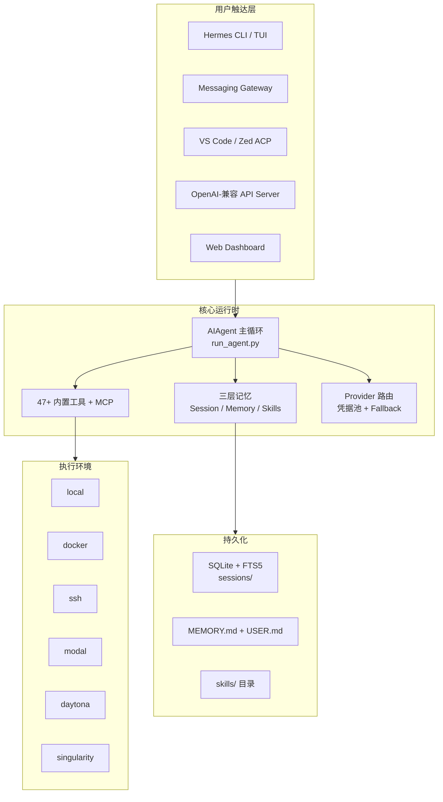
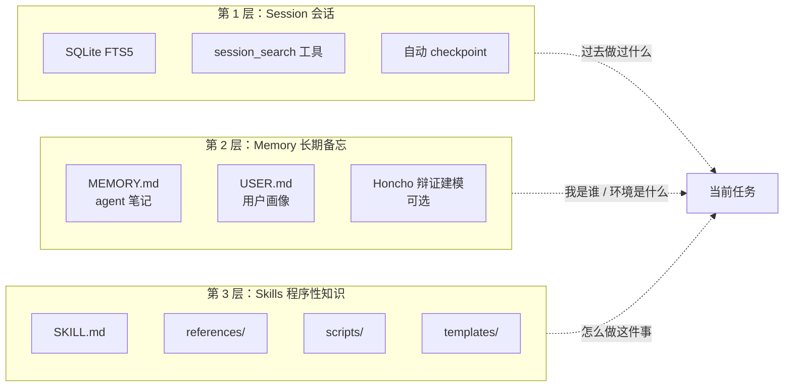
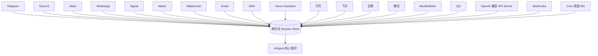
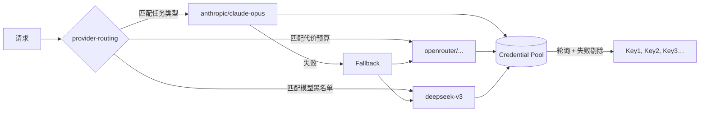

> 一句话概括：Hermes Agent 不是又一个聊天机器人套壳，而是一个**跑在你自己机器上、越用越聪明、你走到哪它就跟到哪**的通用 AI 代理。本文是对官方 117 篇文档的深度二次创作，覆盖从安装到开发扩展的全部关键路径，读完你就能决定要不要把它接进自己的工作流。

---

## 楔子：为什么又要写一个 AI Agent 指南

最近两年，"AI Agent"这个词被滥用得有点严重。Cursor 喊 Agent，Claude Code 喊 Agent，n8n、Dify 里拖块的那个节点也叫 Agent。但如果你仔细看它们的形态，会发现大多数所谓 Agent 其实是"工具调用循环的 UI 糖衣"——打开 IDE 才有，关了窗口就没了；换个聊天平台又得从头教；过几天连自己上周解决过什么问题都不记得。

Hermes Agent 是个异类。它是 [Nous Research](https://nousresearch.com) 在 2025 年底开源的通用 AI 代理平台（MIT 协议），目前版本停在 `v0.10.x` 一线。和业内同类产品比，它身上有三条不太常见的设计取向：

1. **自改进（self-improving）**——它自己生成技能、自己修技能、自己把经验写入长期记忆，下次遇到相似任务直接调用。
2. **可任意部署（lives anywhere）**——$5 的 VPS、家里闲置的树莓派、公司内网 HPC、Modal/Daytona 的 serverless 沙箱都能跑。不绑 IDE，不绑云。
3. **跨平台随你迁移（lives where you do）**——CLI、Telegram、Discord、Slack、WhatsApp、Signal、Matrix、微信、企微、飞书、钉钉、QQ、iMessage……15+ 平台共享同一套记忆和技能。

我花了一个周末把它官方网站 <https://hermes-agent.nousresearch.com/docs/> 下面那 117 篇文档全部啃了一遍，又把源码翻了个底朝天，写下这篇尽量详尽的中文完全指南。目标读者有两类：

- **在找"私有化 + 跨平台 + 可长期运行"的 AI 代理方案的工程师**，想评估 Hermes 能不能替代现有的 Cursor + 定时脚本 + 企业微信机器人的组合。
- **已经装了 Hermes 但还没玩明白的早期用户**，想系统性地了解它到底能做到哪一步。

本文配套一份[更加学术化、逐节引用官方文档路径的《Hermes Agent 中文深度使用手册》](#附录使用手册源文件)作为 SSOT，放在文末下载。这篇博客会更偏"读者向"的叙述，帮你建立总体地图。

---

## 一、全景：把 Hermes Agent 拆成五块看

在深入细节之前，先把它的整体形态画出来。官方在 `developer-guide/architecture.md` 里称之为"洋葱模型"，我这里换成更直观的分块视图：



五块各自承担的职责：

| 层 | 做什么 | 对应文件/目录 |
|---|---|---|
| 触达层 | 暴露用户接口——CLI / TUI / 聊天平台 / IDE / API | `cli.py` / `gateway/` / `acp_adapter/` |
| 核心层 | LLM 对话循环、工具调度、记忆注入、Provider 路由 | `run_agent.py` / `agent/` / `model_tools.py` |
| 工具层 | 一套内置工具 + MCP 动态工具 | `tools/*.py`（一个工具一个文件） |
| 执行层 | 工具最终在哪里跑——本机、容器、远程、无服务器 | `tools/environments/` |
| 持久层 | 会话、记忆、技能的数据库与文件形态 | `hermes_state.py` / `~/.hermes/` |

**关键设计：触达层是可插拔的，核心层是共享的。** 也就是说你无论从 Telegram 聊一句话、从 CLI 敲一行命令、从 VS Code 通过 ACP 协议发请求，它们都进入同一个 `AIAgent.run_conversation()` 循环，共享同一套记忆和技能。这正是"跨平台随你迁移"的技术根基。

---

## 二、60 秒上手：从一条 curl 到第一次对话

官方给的安装是一行 shell：

```bash
curl -fsSL https://raw.githubusercontent.com/NousResearch/hermes-agent/main/scripts/install.sh | bash
```

脚本会自动把这些东西装齐：`uv`（Python 包管理器）、Python 3.11、Node.js 22（浏览器自动化 + WhatsApp 桥接）、`ripgrep`、`ffmpeg`。前置只需要 `git`。

几个需要留心的点：

- **Windows 原生不支持**，必须先装 WSL2。我自己就是 WSL2 + Ubuntu 24.04 跑的，稳。
- **Android 用 Termux** 有独立路径：装好 Termux 后执行同一条命令，安装器会自动检测到 Termux 环境，换成 `pkg` 安装系统依赖、跳过浏览器和 WhatsApp。
- **Nix/NixOS** 有独立的 flake，见 `getting-started/nix-setup.md`。
- **macOS** 原生支持，本地 LLM 推荐走 llama.cpp，参考 `guides/local-llm-on-mac.md`。

装完之后：

```bash
source ~/.bashrc    # 或 ~/.zshrc
hermes model        # 选一个 LLM 提供商并登录
hermes              # 启动经典 CLI
hermes --tui        # 或者用新版 TUI，支持鼠标、模态面板
```

`hermes model` 会列出 30 种 Provider 让你挑：Nous Portal（订阅制，OAuth 零配置）、Anthropic Claude、OpenAI Codex（ChatGPT OAuth）、OpenRouter、DeepSeek、Kimi/Moonshot、阿里 DashScope、MiniMax、Qwen Portal、Xiaomi MiMo、AWS Bedrock、GitHub Copilot、Vercel AI Gateway，甚至任意 OpenAI 兼容端点。对中国用户友好——完全可以搞一套 DeepSeek + Kimi + Qwen 的纯国产组合。

**⚠️ 一个硬性约束：最低上下文 64K。** Hermes 启动时会拒绝上下文窗口小于 64K 的模型，因为多步工具调用需要足够的"工作内存"。本地跑 llama.cpp 时记得加 `--ctx-size 65536`。

第一次对话可以试这几句：

```text
❯ 把当前目录下占用磁盘最多的 5 个子目录列出来
❯ 每天早上 9 点去 Hacker News 取 AI 新闻，总结后发到 Telegram
❯ /tools           # 看当前开启的工具
❯ /model           # 交互切换模型
❯ /personality pirate
```

---

## 三、三种不同形态的"记忆"：这才是 Hermes 的灵魂

大多数 AI 助手只有一种记忆——对话上下文。多数所谓"记忆功能"就是把历史拼进 system prompt 而已。Hermes 的做法非常不一样，它把记忆分成**三层独立存储**：



三层各自回答一个不同的问题：

| 层 | 回答的问题 | 存在哪 | 写入触发 |
|---|---|---|---|
| Session | "我们之前干过什么" | `~/.hermes/sessions/` SQLite + FTS5 | 每轮对话自动保存 |
| Memory | "用户是谁 / 环境是什么" | `~/.hermes/memories/MEMORY.md` + `USER.md` | Agent 主动调 `memory` 工具 |
| Skills | "这类任务该怎么做" | `~/.hermes/skills/<name>/SKILL.md` | Agent 调 `skill_manage` 工具 |

为什么要分三层？**因为上下文窗口有限，不可能把一切都塞进去。** Hermes 的策略是：

- Memory 和 Skills **只塞 description/meta**，不塞 body——需要时再按名字加载。
- Session **不塞，只做 FTS5 检索**——用户问"上周我们怎么解决 X 来着"，Agent 才去搜。
- 真正塞进每次请求的，是少量用户画像（USER.md）、当前启用的技能清单（name + description）、以及项目 CONTEXT.md。

这种分层让"越用越聪明"真正成立：解决一次复杂任务 → Agent 自觉写一条 `skill_manage('create', ...)` → 下次再遇到同类任务，它会先 `skill_view(name)` 加载那条技能，按自己写过的步骤执行。

### 技能的自学闭环

最有意思的是**技能会自己修自己**。系统提示里有一条硬指令：

> 当你使用一条技能发现它过时、不完整或有错误时，立即用 `skill_manage(action='patch')` 修复，不要等别人来问。

也就是说，如果一条技能里的命令在 macOS 上跑不通、或者某一步缺了关键 flag，Agent 在实际运行里踩了坑并解决之后，会主动把修正 patch 回技能文件。下一次你或另一个 Agent 再用这条技能，就是升级版。这套循环官方叫 **self-improving loop**。

一条技能长这样（`developer-guide/creating-skills.md`）：

```markdown
---
name: github-pr-workflow
description: 完整 PR 生命周期——建分支、提交、推送、开 PR、回应 review、合并。
version: 1.2.0
metadata:
  hermes:
    tags: [GitHub, PR, git]
    related_skills: [github-auth, github-code-review]
---

# 何时使用
- 用户说"开个 PR"或"提交这些改动"

# 流程
1. 检查当前分支……
2. `git checkout -b feat/xxx`
3. ……

# 常见坑
- 如果远端拒绝，检查 `credential.helper`……
```

---

## 四、47+ 内置工具地图：按 toolset 分类来看

Hermes 的工具**不是一个个开关**，而是按 **toolset** 分组管理。启动时通过 `--enable-toolsets` / `--disable-toolsets` 控制。这样做的好处是在聊天平台、Cron 任务、子代理里可以只开必要的一小撮，既省上下文又安全。

下面这张表是从 `reference/toolsets-reference.md` 提炼的（节选）：

| Toolset | 代表工具 | 典型场景 |
|---|---|---|
| `terminal` | `terminal` | 执行 shell 命令，支持前台/后台/PTY 三模 |
| `file` | `read_file` / `write_file` / `search_files` / `patch` | 文件读写、ripgrep 搜索、V4A 补丁 |
| `web` | `web_search` / `web_extract` / `vision_analyze` | 联网搜索、URL 抽取、图像分析 |
| `browser` | `browser_navigate` / `browser_click` / `browser_type` / `browser_vision` | Browserbase 驱动的浏览器自动化 |
| `code` | `execute_code` | Python 沙箱，可调用 `hermes_tools.*` 写组合脚本 |
| `delegate` | `delegate_task` | 派生子代理并行处理子任务，上下文隔离 |
| `memory` | `memory` / `session_search` | 读写长期记忆、检索历史会话 |
| `skills` | `skill_view` / `skill_manage` / `skills_list` | 加载、创建、修订技能 |
| `todo` | `todo` | 会话内任务列表，显式计划 |
| `tts` | `text_to_speech` | 语音合成，Telegram/Discord 语音消息 |
| `image_gen` | 多种 | 生图（OpenAI / Gemini / Fal / 本地 SDXL） |
| `cronjob` | `cronjob` | 自然语言定时任务 |
| `vision` | 跨工具共享 | 多模态视觉 |
| `search` | `web_search` | 网页搜索 |
| `session_search` | `session_search` | FTS5 跨会话检索 |
| `homeassistant` | 多种 | 智能家居控制 |

特别要点几个工具出来细说：

### `execute_code`：可调用 Hermes 自身工具的 Python 沙箱

这个工具极其强大。它不是裸 Python exec，而是提供了 `from hermes_tools import ...`，你可以在一段 Python 里编排多次工具调用并做处理：

```python
from hermes_tools import read_file, patch, terminal

files = terminal("find . -name '*.py' -newer last_run").output.splitlines()
for f in files:
    content = read_file(f)["content"]
    if "TODO: migrate" in content:
        patch(f, "TODO: migrate", "DONE")
```

官方推荐的使用场景：需要 3+ 次工具调用、中间有过滤/归约逻辑、有条件分支或循环。限制是 5 分钟超时、50 次工具调用、50KB 输出。

### `delegate_task`：真正的子代理

`delegate_task` 派生**独立进程的子代理**——新的终端 session、新的对话历史、新的工具集。主代理只拿到最终 summary，中间工具调用**不会进入主代理上下文**。这意味着你可以并行跑 3 个子代理（`max_concurrent_children` 可调），主代理上下文完全不膨胀。

```python
delegate_task(tasks=[
  {"goal": "Research option A", "toolsets": ["web"]},
  {"goal": "Research option B", "toolsets": ["web"]},
  {"goal": "Compile comparison table", "toolsets": ["file"]}
])
```

这是 `guides/delegation-patterns.md` 里讲得很细的一项能力，也是整个 `subagent-driven-development` skill 的基础。

### `cronjob`：自然语言的 Cron

```text
你：每天早上 8 点看一眼我的邮箱，把带红色标签的邮件总结发到 Telegram。
```

Agent 会自动 `cronjob(action='create', schedule='0 8 * * *', prompt='...', deliver='telegram:...')`。每次 cron 触发时**都是一次全新的 agent session**（没有当前对话上下文），所以 prompt 必须自包含。触发结果可以指定 deliver 目标：当前 chat（`origin`）、本地文件（`local`）、或任意 `platform:chat_id:thread_id`。

---

## 五、跨 15+ 平台的同一个脑子：Messaging Gateway

这大概是 Hermes 区别于其它 AI 助手最直观的一点。官方的 `hermes gateway` 子命令把所有平台适配器并入同一个进程：



开启流程也极简：

```bash
hermes gateway setup                    # 交互向导
hermes gateway install                  # 装成用户级 systemd/launchd 服务
sudo hermes gateway install --system    # Linux 系统级开机服务
```

中国用户重点看这几个平台：

- **微信个人号 (Weixin)**：基于 `wechatpy` / 自部署桥接，支持私聊与群；语音、图片、文件都支持。
- **企微 (WeCom)**：官方 callback 模式，走 `WeCom Callback`，见 `messaging/wecom-callback.md`。
- **飞书 (Feishu / Lark)**：支持线程、表情、流式消息，能力矩阵最全。
- **钉钉 (DingTalk)**：支持图片/文件/表情，不支持语音。
- **QQ Bot**：官方 bot 协议，支持语音、图片、文件。

每个平台的适配器都在 `gateway/platforms/<platform>.py` 下，字段命名和配置格式都统一，接上一个新平台的成本非常低。

### 一个能打动团队使用者的场景

`guides/team-telegram-assistant.md` 里有个设计值得单独提：**多人 Telegram 群里每个人看到的都是一个针对他个人的 Agent**。因为 Hermes 有 `multi_user_sessions: true` 的配置，每个用户 ID 对应独立的 session、独立的 USER.md 画像，互不污染。但管理员可以共享同一套 skills 和 MEMORY.md 作为团队知识库。这种"共享技能库 + 独立画像"的双层结构，是我看过最合理的团队 AI 助手范式之一。

---

## 六、MCP 集成：接入外部工具生态

`user-guide/features/mcp.md` 把 Hermes 的 MCP 客户端完整说明了一遍。简单说，Hermes 是**一个 MCP host**，可以配置任意数量的 MCP server，把它们暴露的工具动态注入 Agent。

```yaml
# ~/.hermes/config.yaml
mcp:
  servers:
    - name: filesystem
      command: "npx"
      args: ["-y", "@modelcontextprotocol/server-filesystem", "/Users/me/workspace"]
      enabled: true
      tool_filter:
        allow: ["read_file", "list_directory"]  # 白名单，安全
    - name: github
      command: "uvx"
      args: ["mcp-server-github"]
      env:
        GITHUB_TOKEN: "${GITHUB_TOKEN}"
```

三个配置细节值得强调：

- **`tool_filter.allow` / `deny`**：防止 MCP server 把危险工具注入进来。
- **`enabled: false`** 可以保留配置但临时关掉。
- **工具重名自动加前缀**：`filesystem_read_file` / `github_create_issue`，不会与 Hermes 内置工具冲突。

另外，Hermes 自己也可以**作为 MCP server 被其它 host 调用**——这是它进入 Claude Desktop / Cursor 生态的途径。详见 `integrations/` 与 `guides/use-mcp-with-hermes.md`。

---

## 七、Provider 路由：真正不被单一 LLM 锁死

这一节是我觉得 Hermes 工程成熟度最高的部分。`user-guide/features/provider-routing.md` / `fallback-providers.md` / `credential-pools.md` 三篇文档组合起来讲一件事：**怎么用多个 LLM 供应商跑同一个 agent，并且在某一家挂掉时无感切换。**



三个能力叠加：

1. **Provider Routing**——按任务类型/模型标签路由到不同 provider（"视觉任务用 Gemini，写代码用 Claude"）。
2. **Fallback**——主 provider 限流或宕机时，自动一次性切换到备用。
3. **Credential Pool**——同一 provider 绑定多把 key，轮询使用，失败自动剔除。

这套机制对国内用户尤其有价值——比如同时配 3 把 DeepSeek API key + OpenRouter 作 fallback + OpenAI 兼容代理作第三挡，几乎可以保证 7x24 可用。

---

## 八、沙箱执行：local / docker / ssh / modal / daytona / singularity

`user-guide/configuration.md` 的 `terminal.backend` 字段决定"工具在哪跑"。六种后端各有适用场景：

| 后端 | 定位 | 适合场景 |
|---|---|---|
| `local` | 直接在 Hermes 进程所在机器执行 | 个人开发、信任环境 |
| `docker` | 启容器，命令都进容器 | 本机但要隔离 |
| `ssh` | 连到远端主机执行 | 把 Agent 跑在笔记本但让它操作服务器 |
| `modal` | Modal.com serverless GPU | 按秒计费、空闲休眠的远端环境 |
| `daytona` | Daytona 沙箱 | 类似 Modal，Dev Environment 风格 |
| `singularity` | HPC 容器 | 高性能集群 |

一个典型用法：**CLI 本地跑、Gateway 跑在 $5 VPS、工具都在 Daytona 沙箱里执行**。三台机器各司其职，Agent 却是一个统一的脑子。这种拓扑在 `guides/daily-briefing-bot.md` 里有完整示例。

---

## 九、其它值得一提的能力

限于篇幅，下面这些只能点到为止，但每一条都值得一篇单独的博客：

- **Voice Mode**（`features/voice-mode.md`）：在 CLI 用麦克风、在 Telegram/Discord 发语音消息、甚至直接加入 Discord 语音频道做实时对话。`whisper` STT + 多种 TTS 可切换。
- **Web Dashboard**（`features/web-dashboard.md`）：本地 Web UI，跨会话查看历史、管理 cron、查看技能、热重载配置。
- **API Server**（`features/api-server.md`）：Hermes 本身暴露 OpenAI 兼容 API，`/v1/chat/completions` 直接当后端用，把它接到任何 OpenAI 客户端。
- **ACP (Agent Control Protocol)**（`features/acp.md`）：VS Code / Zed / JetBrains 通过标准 ACP 协议接入 Hermes。这让它能同时是"终端 Agent"和"IDE Agent"。
- **Plugin System**（`features/plugins.md` / `guides/build-a-hermes-plugin.md`）：独立发布、`pip install` 就能装的 Hermes 扩展。官方本身就靠这个机制把 `honcho`、`soul` 这些大特性解耦出去。
- **Personality & Skins**（`features/personality.md` / `features/skins.md`）：SOUL.md 换人格、skin engine 换 CLI 视觉风格。
- **Checkpoints & Rollback**（`user-guide/checkpoints-and-rollback.md`）：破坏性操作前自动 snapshot，`/rollback` 一键回滚。
- **RL Training**（`features/rl-training.md`）：Hermes 本身可以作为 Atropos RL 环境跑在线 RL 训练。作者是模型训练团队，这部分做得相当原生。

---

## 十、谁适合用它？谁不适合？

我把自己的评估汇总成一张表给你参考：

| 你的情况 | 建议 |
|---|---|
| 想找一个能跨平台、跨会话积累经验的 AI 代理替代分散的脚本/机器人 | **非常适合**。Hermes 的核心价值就在这。 |
| 公司要一个能接进企微/飞书/钉钉的智能助手，支持知识沉淀 | **非常适合**。平台覆盖 + 技能/记忆 + 凭据池，工程度够支撑生产。 |
| 只想在 IDE 里写代码，要最流畅的代码补全体验 | **一般**。Cursor / Claude Code 直接用 IDE 体验更顺滑；但 Hermes 通过 ACP 能作为补充。 |
| 需要完全离线、纯本地 LLM，且上下文敏感 | **适合**。配 llama.cpp + local backend 即可，但要手动把上下文开到 64K+。 |
| 希望零代码、GUI 拖拽式配置 | **不适合**。Hermes 走的是 CLI + YAML 路线，对非技术用户门槛较高。 |
| 需要一次性脚本任务，没有长期驻留需求 | **杀鸡用牛刀**。直接写 shell/python 更快。 |

---

## 十一、几条实际使用里踩过的坑

把我自己装过程中和早期用户反馈里踩过的一些小坑列一下：

1. **上下文小于 64K 直接启动失败**——不是 bug，是硬约束，看前面"60 秒上手"小节。
2. **Discord bot 看不到消息**——忘了开 Privileged Gateway Intents（Presence / Server Members / Message Content），Dev Portal 里勾上即可。
3. **Telegram 群聊 bot 只响应带 `/` 的命令**——忘了 BotFather `/setprivacy` 关闭隐私模式，并把 bot 重新拉进群。
4. **WSL2 下某些浏览器工具崩溃**——Browserbase 远端跑没事，本地跑需要额外装 `xvfb` 或用 Docker backend 绕过。
5. **Cron 任务失败静默**——必须开 `/cron logs` 或配 deliver 到某个平台才看得到输出。
6. **技能修改后没生效**——注意 SKILL.md 的 frontmatter `version` 字段，部分缓存依赖它。
7. **MCP server 启动慢导致初次工具调用超时**——`mcp.startup_timeout` 调大到 60s。

官方 FAQ (`reference/faq.md`) 和 `guides/cron-troubleshooting.md` 里还有更多。

---

## 结语：一个越用越聪明的 Agent，值不值得投入

写到这里已经接近 6000 字了，还有大量细节没展开。Hermes Agent 的真正价值不在任何一个单独的功能，而在它**把许多松散的 AI 工程问题整合成了一个统一的、有连贯体验的系统**——跨平台通信、长期记忆、自学技能、凭据轮换、沙箱隔离、子代理并行、MCP 生态、多 Provider 路由……每一项都不是原创，但被一个模型训练团队组合成这样一整套且开源出来，目前独一份。

我的判断是：如果你的工作流里已经有超过 3 个"半成品 Agent"——一个机器人跑定时任务、一个脚本做数据提取、IDE 里的 AI 补全、企微/钉钉里的客服机器人——那么用 Hermes 把它们整合成一个"分身"，ROI 是正的。如果你只是想在 IDE 里爽一下写代码，那继续用 Cursor/Claude Code 就行。

---

## 附录：使用手册源文件

本文浓缩自我先写的一份《Hermes Agent 中文深度使用手册》（约 1.3 万字，逐节引用官方文档路径），源文件会同步到：

- 官方文档网站：<https://hermes-agent.nousresearch.com/docs/>
- GitHub 仓库：<https://github.com/NousResearch/hermes-agent>
- 本博客 RSS：<https://xiejiayun.github.io/index.xml>

如果你想看更结构化、更细节的中文版 reference，留言告诉我，我可以把手册单独发一篇。

---

**相关阅读：**

- [Hermes Agent 架构深度解剖：从 23 万行 Python 看自我进化 AI 代理的设计哲学](/post/hermes-agent-architecture/)
- [Hermes Agent 部署实战：从安装到 Discord/微信集成全流程踩坑指南](/post/hermes-agent-deploy-guide/)
- [多智能体编排工程：从理论到工程实践](/post/multi-agent-orchestration-engineering/)
