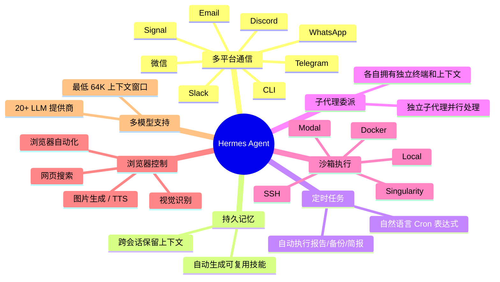
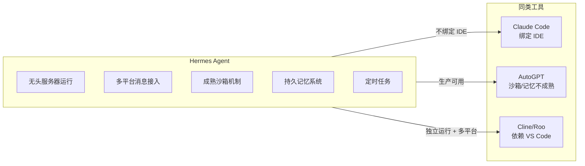
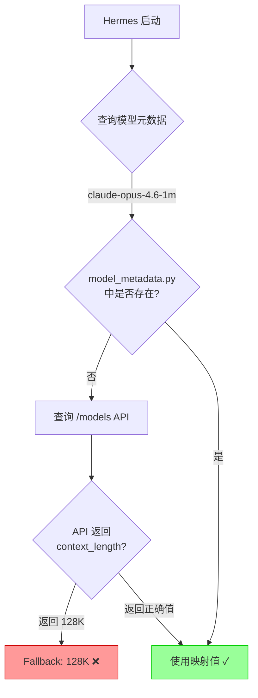
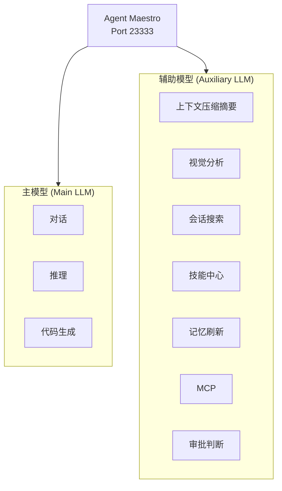
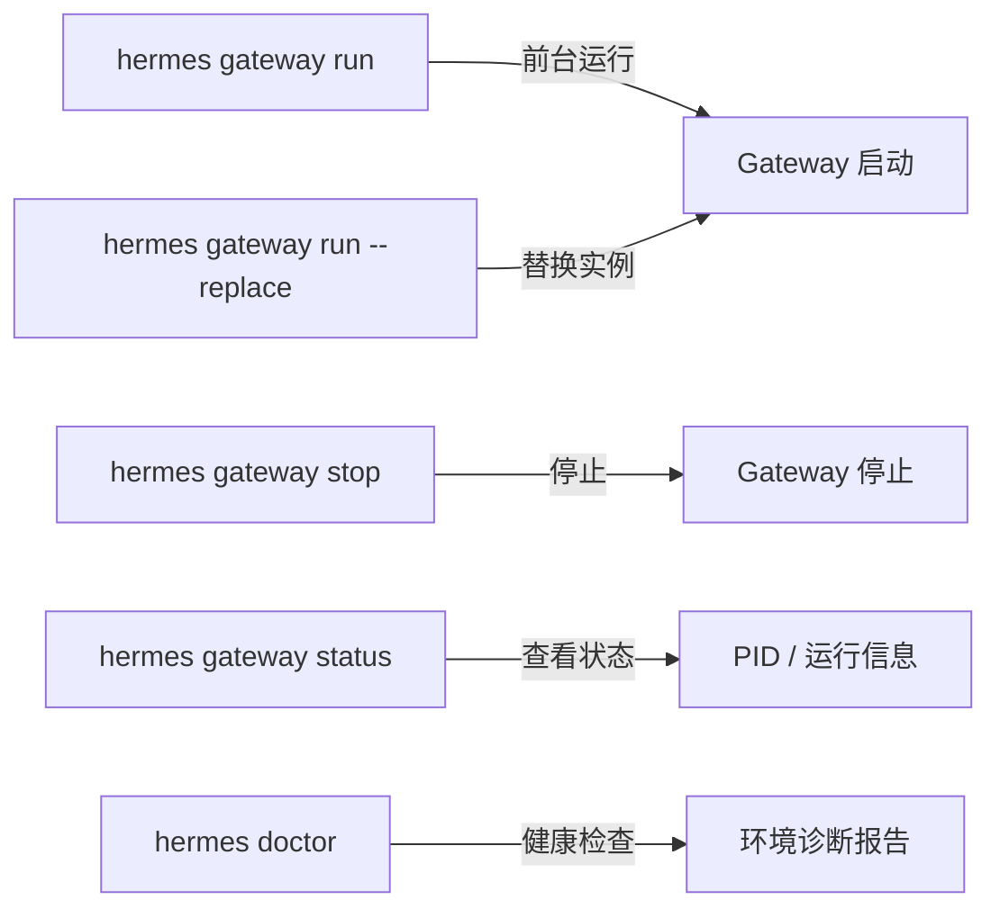
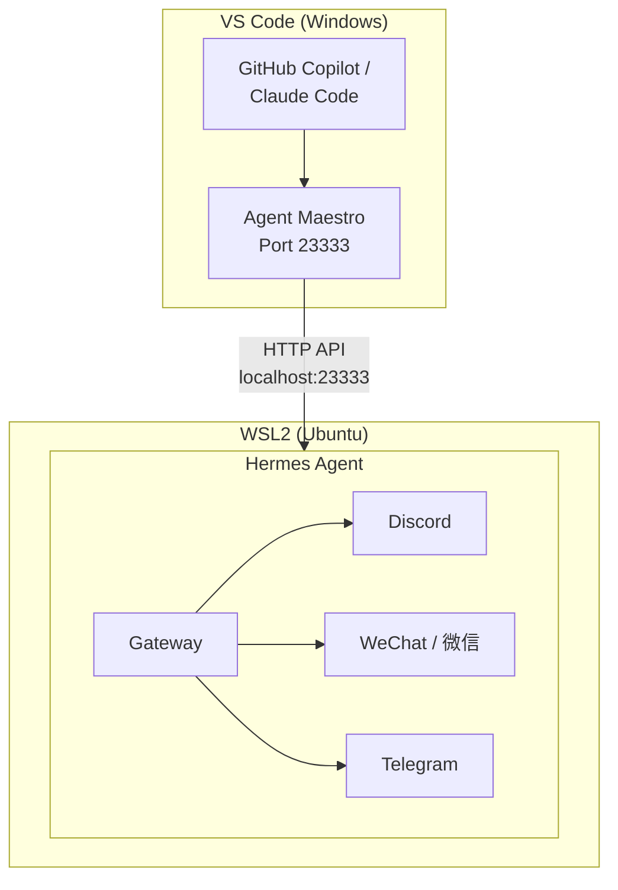

> 本文基于 Hermes Agent v0.10.0 实际部署经验撰写，覆盖安装、模型配置、Discord/微信集成全流程，含踩坑记录与解决方案。

---

## 一、Hermes Agent 是什么

Hermes Agent 是 [Nous Research](https://nousresearch.com/) 开源（MIT 协议）的自主 AI Agent 框架。与传统 IDE 插件或聊天机器人不同，它的核心定位是：**一个部署在你自己服务器上、具备持久记忆、能跨平台通信的自主代理。**

### 核心能力



### 与同类工具的差异



---

## 二、WSL2 环境准备

### 2.1 确认 WSL2 已安装

```powershell
# PowerShell（管理员）
wsl --version
```

如未安装：

```powershell
wsl --install
```

重启后进入 WSL：

```bash
wsl
```

### 2.2 安装 Hermes Agent

```bash
curl -fsSL https://raw.githubusercontent.com/NousResearch/hermes-agent/main/scripts/install.sh | bash
```

安装完成后重载 shell：

```bash
source ~/.bashrc
```

验证安装：

```bash
hermes --version
# 输出示例：Hermes Agent v0.10.0 (2026.4.16)
```

### 2.3 运行健康检查

```bash
hermes doctor
```

确认以下项目为 ✓：
- Python 环境
- 必要依赖包（OpenAI SDK、Rich、PyYAML、HTTPX 等）
- 配置文件（`~/.hermes/config.yaml`、`~/.hermes/.env`）
- 虚拟环境

---

## 三、配置 Claude 模型（通过 Agent Maestro）

本节介绍通过 VS Code 的 Agent Maestro 扩展代理 Claude API 的方案。此方案无需直接使用 Anthropic API Key，由 Agent Maestro 统一管理模型调用。

### 3.1 安装 Agent Maestro

在 VS Code 扩展商店搜索 **Agent Maestro** 并安装。安装后自动启动 API 服务，默认端口 `23333`。

### 3.2 配置 Hermes 模型

运行交互式配置：

```bash
hermes model
```

选择 **Custom endpoint**，填入：

- **Base URL**：`http://localhost:23333/api/anthropic`
- **Model**：`claude-opus-4.6-1m`
- **Context length**：`1000000`（1M）

### 3.3 配置环境变量

编辑 `~/.hermes/.env`，添加：

```bash
ANTHROPIC_BASE_URL=http://localhost:23333/api/anthropic
ANTHROPIC_API_KEY=Powered by Agent Maestro
ANTHROPIC_MODEL=claude-opus-4.6-1m
```

同时在 `~/.bashrc` 中添加：

```bash
export ANTHROPIC_API_KEY="Powered by Agent Maestro"
```

执行 `source ~/.bashrc` 生效。

### 3.4 踩坑记录

#### 问题 1：Hermes 使用 OpenAI SDK，API 路径不匹配

**现象**：配置 Anthropic 端点后报 HTTP 404。

**原因**：Hermes 底层使用 OpenAI SDK 发送请求。如果 provider 设为 `custom`，它会以 OpenAI 格式调用 Anthropic 端点，路径不匹配。

**解决**：将 `config.yaml` 中 provider 设为 `anthropic`（而非 `custom`），Hermes 会使用正确的 Anthropic 协议：

```yaml
model:
  default: claude-opus-4.6-1m
  provider: anthropic
  base_url: http://localhost:23333/api/anthropic
```

#### 问题 2：Context window 显示 128K 而非 1M

**现象**：状态栏显示 `128K` context。

**原因**：Hermes 的模型元数据表中没有 `claude-opus-4.6-1m` 这个变体名（只有 `claude-opus-4.6`），匹配不到就 fallback 到 128K。同时 Agent Maestro 的 `/models` 端点返回的 context 信息也是 128K。



**解决方案一**：在 `~/.hermes/hermes-agent/agent/model_metadata.py` 的 context 映射表中添加：

```python
"claude-opus-4-6-1m": 1000000,
"claude-opus-4.6-1m": 1000000,
```

**解决方案二**：写入持久缓存文件 `~/.hermes/context_length_cache.yaml`：

```yaml
context_lengths:
  claude-opus-4-6-1m@http://localhost:23333/api/anthropic: 1000000
  claude-opus-4.6-1m@http://localhost:23333/api/anthropic: 1000000
```

**解决方案三**（最简单）：在 `config.yaml` 中直接设置 `context_length`：

```yaml
model:
  default: claude-opus-4.6-1m
  provider: anthropic
  base_url: http://localhost:23333/api/anthropic
  context_length: 1000000
```

> 注：方案三依赖 Hermes 是否读取该字段传入 `get_model_context_length()`，建议方案一 + 方案二 双保险。

#### 问题 3：No Anthropic credentials found

**现象**：`Set ANTHROPIC_TOKEN or ANTHROPIC_API_KEY`

**原因**：`.env` 文件中只有 `ANTHROPIC_AUTH_TOKEN`，Hermes 实际检查的是 `ANTHROPIC_API_KEY`。

**解决**：确保 `~/.hermes/.env` 中包含：

```bash
ANTHROPIC_API_KEY=Powered by Agent Maestro
```

### 3.5 配置辅助模型（Auxiliary LLM）

Hermes 有两套模型体系：



如果不配置辅助模型，对话变长时 Hermes 只能粗暴地丢弃中间轮次（drop middle turns），无法智能压缩摘要。启动时会出现以下警告：

```
⚠ No auxiliary LLM provider configured — context compression will drop middle turns without a summary.
```

**解决方案**：将辅助模型也指向 Agent Maestro。编辑 `~/.hermes/config.yaml`，修改 `auxiliary` 部分：

```yaml
auxiliary:
  vision:
    provider: anthropic
    model: claude-opus-4.6-1m
    base_url: http://localhost:23333/api/anthropic
    api_key: Powered by Agent Maestro
    timeout: 120
    download_timeout: 30
  web_extract:
    provider: anthropic
    model: claude-opus-4.6-1m
    base_url: http://localhost:23333/api/anthropic
    api_key: Powered by Agent Maestro
    timeout: 360
  compression:
    provider: anthropic
    model: claude-opus-4.6-1m
    base_url: http://localhost:23333/api/anthropic
    api_key: Powered by Agent Maestro
    timeout: 120
  session_search:
    provider: anthropic
    model: claude-opus-4.6-1m
    base_url: http://localhost:23333/api/anthropic
    api_key: Powered by Agent Maestro
    timeout: 30
  skills_hub:
    provider: anthropic
    model: claude-opus-4.6-1m
    base_url: http://localhost:23333/api/anthropic
    api_key: Powered by Agent Maestro
    timeout: 30
  approval:
    provider: anthropic
    model: claude-opus-4.6-1m
    base_url: http://localhost:23333/api/anthropic
    api_key: Powered by Agent Maestro
    timeout: 30
  mcp:
    provider: anthropic
    model: claude-opus-4.6-1m
    base_url: http://localhost:23333/api/anthropic
    api_key: Powered by Agent Maestro
    timeout: 30
  flush_memories:
    provider: anthropic
    model: claude-opus-4.6-1m
    base_url: http://localhost:23333/api/anthropic
    api_key: Powered by Agent Maestro
    timeout: 30
```

> 提示：如果你有 OpenRouter API Key，也可以用更便宜的模型（如 `claude-haiku-4`）来处理辅助任务，降低调用成本。

---

## 四、Discord 集成

### 4.1 创建 Discord Bot

1. 打开 [Discord Developer Portal](https://discord.com/developers/applications)
2. 点击 **New Application** → 输入名称
3. 左侧 **Bot** → **Add Bot**
4. 开启 **Privileged Gateway Intents**：
   - ✅ Message Content Intent（**必须**，否则 Bot 收不到消息内容）
   - ✅ Server Members Intent
5. 点击 **Reset Token** → 复制 Bot Token（仅显示一次）

### 4.2 生成邀请链接

左侧 **OAuth2** → **URL Generator**：

- Scopes：`bot` + `applications.commands`
- Bot Permissions 整数：`274878286912`

该权限整数包含：Send Messages、Send Messages in Threads、Create Public Threads、Embed Links、Attach Files、Read Message History、Add Reactions、Use Slash Commands、View Channels。

复制生成的 URL，在浏览器打开，选择服务器并授权。

### 4.3 获取 Discord User ID

1. Discord 设置 → 高级 → 开启 **开发者模式**
2. 右键自己的头像 → **复制用户 ID**

### 4.4 配置 Hermes

编辑 `~/.hermes/.env`，添加：

```bash
DISCORD_BOT_TOKEN=你的Bot_Token
DISCORD_ALLOWED_USERS=你的用户ID
```

### 4.5 启动 Gateway

```bash
hermes gateway run
```

验证状态：

```bash
hermes gateway status
# 输出：✓ Gateway is running (PID: xxxx)
```

### 4.6 使用方式

- **服务器频道**：`@Bot名称 你的消息`（需要 @mention）
- **私聊 DM**：直接发送消息

### 4.7 踩坑记录

#### Slash command sync 警告

**现象**：`Command exceeds maximum size (8000)`

**影响**：不影响基本聊天功能，仅 slash 命令不可用。这是 Hermes 注册的 skill 命令超过 Discord 的 8000 字符限制。

---

## 五、微信集成

### 5.1 安装依赖

在 Hermes 虚拟环境中安装：

```bash
uv pip install --python ~/.hermes/hermes-agent/venv/bin/python aiohttp cryptography
```

> 注：Hermes 使用 `uv` 管理 Python 环境，直接 `pip install` 可能找不到命令。

### 5.2 运行配置向导

```bash
hermes gateway setup
```

选择 **Weixin**，终端会显示二维码，用微信扫码确认登录。凭证自动保存到 `~/.hermes/weixin/accounts/`。

### 5.3 配置写入

扫码成功后，`~/.hermes/.env` 中会自动生成以下配置：

```bash
WEIXIN_ACCOUNT_ID=xxxx@im.bot
WEIXIN_TOKEN=xxxx@im.bot:xxxxxxxxxxxx
WEIXIN_BASE_URL=https://ilinkai.weixin.qq.com
WEIXIN_CDN_BASE_URL=https://novac2c.cdn.weixin.qq.com/c2c
WEIXIN_DM_POLICY=open
WEIXIN_ALLOW_ALL_USERS=true
WEIXIN_HOME_CHANNEL=你的微信ID@im.wechat
```

### 5.4 添加 platform_toolsets

编辑 `~/.hermes/config.yaml`，在 `platform_toolsets` 下添加：

```yaml
platform_toolsets:
  weixin:
  - hermes-weixin
```

### 5.5 重启 Gateway

```bash
hermes gateway stop
hermes gateway run --replace
```

### 5.6 踩坑记录

#### 问题 1：Gateway 只加载 1 个平台（Discord），微信未加载

**原因**：`config.yaml` 中 `platform_toolsets` 缺少 `weixin` 条目。

**解决**：手动添加 `weixin: [hermes-weixin]` 到 `platform_toolsets`。

#### 问题 2：Unauthorized user

**现象**：日志显示 `Unauthorized user: xxxx@im.wechat on weixin`

**原因**：`WEIXIN_DM_POLICY` 默认为 `pairing`（需要配对码），且 `WEIXIN_ALLOW_ALL_USERS=false`。

**解决**：

```bash
# ~/.hermes/.env
WEIXIN_DM_POLICY=open
WEIXIN_ALLOW_ALL_USERS=true
```

或使用 pairing 模式，在收到配对码后执行：

```bash
hermes pairing approve weixin <配对码>
```

#### 问题 3：Session 过期

**现象**：`errcode=-14`

**解决**：重新运行 `hermes gateway setup` 扫码登录。

---

## 六、Gateway 运维

### 6.1 常用命令



### 6.2 WSL 中持久运行

WSL 中 gateway 是前台进程，关闭终端会停止。使用 `tmux` 保持：

```bash
# 安装 tmux
sudo apt install tmux

# 创建会话
tmux new -s hermes

# 在 tmux 中启动
hermes gateway run

# 分离会话：Ctrl+B，然后按 D
# 重新接入：tmux attach -t hermes
```

### 6.3 日志位置

- Agent 日志：`~/.hermes/logs/agent.log`
- 错误日志：`~/.hermes/logs/errors.log`
- 会话记录：`~/.hermes/sessions/`

---

## 七、完整配置参考

### ~/.hermes/config.yaml（关键部分）

```yaml
model:
  default: claude-opus-4.6-1m
  provider: anthropic
  base_url: http://localhost:23333/api/anthropic
  context_length: 1000000

auxiliary:
  compression:
    provider: anthropic
    model: claude-opus-4.6-1m
    base_url: http://localhost:23333/api/anthropic
    api_key: Powered by Agent Maestro
    timeout: 120
  # vision / web_extract / session_search / skills_hub / approval / mcp / flush_memories
  # 格式相同，均指向 Agent Maestro

discord:
  require_mention: true
  auto_thread: true
  reactions: true

platform_toolsets:
  discord:
  - hermes-discord
  weixin:
  - hermes-weixin
```

### ~/.hermes/.env（关键部分）

```bash
# Anthropic / Agent Maestro
ANTHROPIC_BASE_URL=http://localhost:23333/api/anthropic
ANTHROPIC_API_KEY=Powered by Agent Maestro
ANTHROPIC_MODEL=claude-opus-4.6-1m

# Discord
DISCORD_BOT_TOKEN=你的Token
DISCORD_ALLOWED_USERS=你的用户ID

# WeChat
WEIXIN_ACCOUNT_ID=xxxx@im.bot
WEIXIN_TOKEN=xxxx@im.bot:xxxxxxxxxxxx
WEIXIN_DM_POLICY=open
WEIXIN_ALLOW_ALL_USERS=true
```

---

## 八、架构总览



---

*本文基于 Hermes Agent v0.10.0、Agent Maestro、Windows 11 + WSL2 (Ubuntu) 环境实测。*
*撰写日期：2026-04-17*
