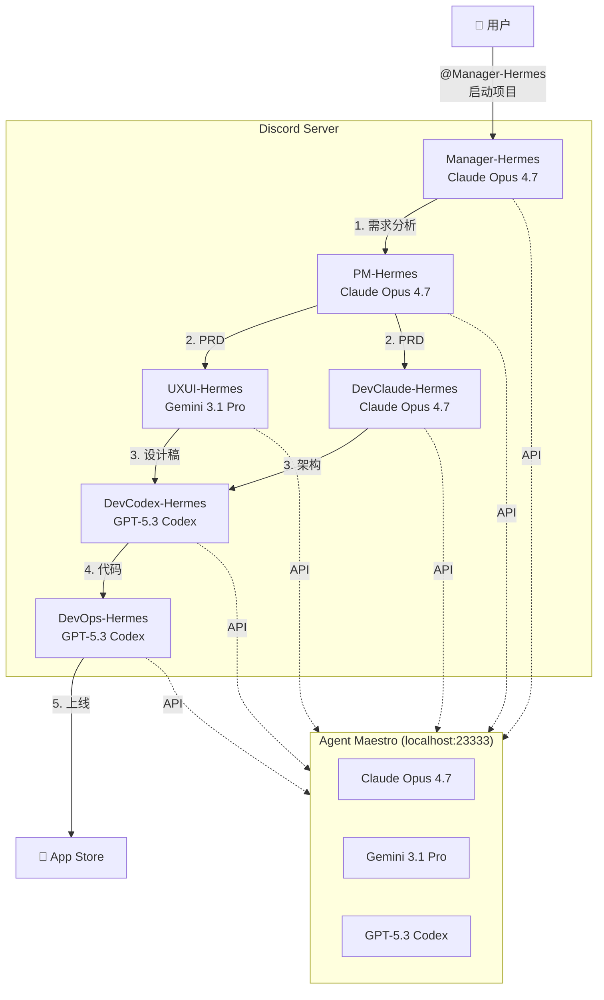
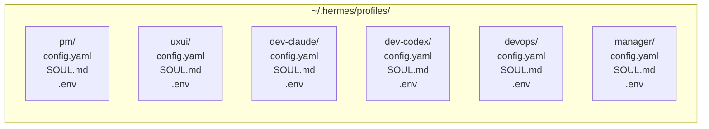
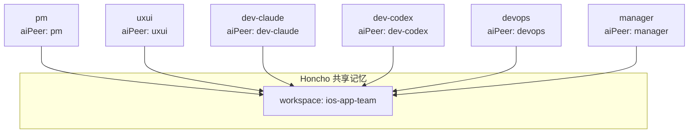
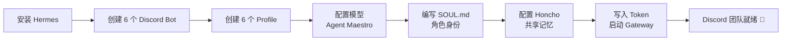

> 本文基于 macOS + Hermes Agent v0.10.0 实战经验，记录如何在 Discord 同一个 Server 中部署 6 个独立 AI Bot，组成一支 iOS App 顶级专家团队。每个 Bot 拥有独立角色、独立模型、共享记忆，协作完成从需求分析到 App Store 上线的全流程。

---

## 一、我们要做什么

在 Discord 一个 Server 里搭建一支 **AI iOS 开发团队**，由 6 个独立 Bot 组成：

| 角色 | Bot 名称 | 使用模型 | 职责 |
|------|----------|----------|------|
| PM | PM-Hermes | Claude Opus 4.7 | 产品策略、PRD、App Store 策略 |
| UX/UI | UXUI-Hermes | Gemini 3.1 Pro | HIG 设计、SwiftUI 组件规范 |
| Dev (架构) | DevClaude-Hermes | Claude Opus 4.7 | iOS 架构设计、Swift/SwiftUI |
| Dev (实现) | DevCodex-Hermes | GPT-5.3 Codex | Swift 编码实现 |
| DevOps | DevOps-Hermes | GPT-5.3 Codex | Fastlane、CI/CD、App Store 提交 |
| Manager | Manager-Hermes | Claude Opus 4.7 | 团队协调、发布管理 |



### 为什么选这个模型搭配？

- **Claude Opus 4.7**：最强推理能力，适合需要深度分析的角色（PM、架构师、Manager）
- **Gemini 3.1 Pro**：多模态能力强，适合视觉相关的 UX/UI 设计
- **GPT-5.3 Codex**：代码生成效率高，适合大量编码实现和 DevOps 脚本

---

## 二、前提条件

- macOS（本文基于 Darwin 24.6.0 测试）
- Python 3.11+
- VS Code + Agent Maestro 扩展（提供 `localhost:23333` 统一 API 代理）
- Discord 账号 + 6 个 Bot Application（详见第四节）

---

## 三、Mac 上安装 Hermes Agent

### 3.1 运行安装脚本

```bash
curl -fsSL https://raw.githubusercontent.com/NousResearch/hermes-agent/main/scripts/install.sh | bash
```

安装过程会自动创建 `~/.hermes/hermes-agent/` 目录、Python 虚拟环境和配置文件。

### 3.2 踩坑：Chromium 下载卡住

安装过程中会尝试下载 Chromium 浏览器（用于 Web 自动化），在国内网络环境下可能极慢或卡死：

```
Downloading Chromium 131.0.6778.33... ██░░░░░░░░░░░░░░ 12%
```

**解决**：直接 Ctrl+C 中止。Chromium 是可选组件，不影响 Discord 集成。后续可以单独安装。

### 3.3 踩坑：hermes 命令找不到

安装脚本被中断后，`hermes` 命令可能不在 PATH 中。

**解决**：手动创建软链接：

```bash
mkdir -p ~/.local/bin
ln -sf ~/.hermes/hermes-agent/venv/bin/hermes ~/.local/bin/hermes
```

确保 `~/.local/bin` 在 PATH 中（在 `~/.zshrc` 中添加）：

```bash
export PATH="$HOME/.local/bin:$PATH"
```

重载后验证：

```bash
source ~/.zshrc
hermes --version
```

### 3.4 安装 ffmpeg（可选）

Hermes 的语音功能需要 ffmpeg：

```bash
brew install ffmpeg
```

### 3.5 健康检查

```bash
hermes doctor
```

确认 Python 环境、依赖包、配置文件均正常。

---

## 四、创建 6 个 Discord Bot

### 4.1 在 Developer Portal 创建 Application

前往 [Discord Developer Portal](https://discord.com/developers/applications)，为每个角色各创建一个 Application：

1. PM-Hermes
2. UXUI-Hermes
3. DevClaude-Hermes
4. DevCodex-Hermes
5. DevOps-Hermes
6. Manager-Hermes

### 4.2 每个 Bot 的必要配置

对每个 Application：

1. 进入 **Bot** 页面
2. 开启 **Privileged Gateway Intents**：
   - ✅ Server Members Intent
   - ✅ Message Content Intent（**必须**，否则 Bot 收不到消息内容）
3. 点击 **Reset Token** 复制 Bot Token

### 4.3 生成邀请链接

进入 **OAuth2 → URL Generator**：

- **Scopes**：勾选 `bot` + `applications.commands`
- **Bot Permissions**：勾选以下权限（或直接使用权限整数 `274878286912`）：
  - Send Messages
  - Send Messages in Threads
  - Create Public Threads
  - Embed Links
  - Attach Files
  - Read Message History
  - Add Reactions
  - Use Slash Commands
  - View Channels

复制生成的 URL，在浏览器中打开，将 Bot 邀请到你的 Server。**6 个 Bot 都要执行此步骤。**

### 4.4 获取你的 User ID

1. Discord 设置 → 高级 → 开启 **开发者模式**
2. 右键自己头像 → 复制用户 ID

---

## 五、Hermes Profile 系统：一人多面

Hermes 的 Profile 系统是实现多 Bot 的核心——每个 Profile 是一个完全独立的 Hermes 实例，拥有自己的：

- 配置文件（`config.yaml`）
- 身份定义（`SOUL.md`）
- 环境变量（`.env`）
- 记忆存储
- Gateway 服务（launchd 管理）



### 5.1 创建 Profile

```bash
hermes profile create pm --clone
hermes profile create uxui --clone
hermes profile create dev-claude --clone
hermes profile create dev-codex --clone
hermes profile create devops --clone
hermes profile create manager --clone
```

`--clone` 会从主配置复制一份基础配置。

### 5.2 Profile 操作速查

```bash
# 使用 profile 的方式一：--profile 参数
hermes --profile pm gateway start

# 使用 profile 的方式二：以 profile 名作为命令（自动别名）
pm gateway start

# 查看所有 profile
hermes profile list

# 删除 profile
hermes profile delete <name>
```

---

## 六、配置模型（通过 Agent Maestro）

Agent Maestro 是 VS Code 扩展，在本地 `localhost:23333` 提供 OpenAI/Anthropic/Gemini 兼容的 API 代理。所有 Bot 都通过它访问不同的模型。

### 6.1 模型分配

三种模型配置模板：

**Claude Opus 4.7**（PM / Dev-Claude / Manager）：

```yaml
model:
  default: "claude-opus-4.7"
  provider: "custom"
  base_url: "http://localhost:23333/api/openai/v1"
  api_key: "agent-maestro"
  reasoning_effort: "xhigh"

auxiliary:
  vision:
    provider: "main"
    model: "claude-opus-4.7"
  web_extract:
    provider: "main"
    model: "claude-opus-4.7"

compression:
  enabled: true
  threshold: 0.50
  provider: "main"
  model: "claude-opus-4.7"

delegation:
  max_iterations: 50
  default_toolsets: ["terminal", "file", "web"]
  provider: "main"
  model: "claude-opus-4.7"
```

**Gemini 3.1 Pro**（UX/UI）：同结构，模型名替换为 `gemini-3.1-pro-preview`。

**GPT-5.3 Codex**（Dev-Codex / DevOps）：同结构，模型名替换为 `gpt-5.3-codex`。

### 6.2 reasoning_effort 参数

Hermes 支持 `reasoning_effort` 来控制模型的思考深度：

| 值 | 效果 |
|----|------|
| `low` | 快速回复，适合简单任务 |
| `medium` | 平衡模式 |
| `high` | 深度推理 |
| `xhigh` | 最大推理深度，适合复杂架构/设计任务 |

对于顶级专家团队，建议全部设为 `xhigh`。

---

## 七、编写 SOUL.md（角色身份）

SOUL.md 是 Hermes 的灵魂文件——它被注入到系统提示词的第一个 slot，定义了每个 Bot 的身份、专长和行为模式。

### 设计原则

一个好的 SOUL.md 应包含：

1. **身份定位**：你是谁，擅长什么
2. **领域专长**：具体到 iOS 平台的技能树
3. **团队感知**：列出所有队友的 @ 名称，便于跨 Bot 协作
4. **输出规范**：每次回复必须产出什么（结构化 + 可执行）
5. **沟通风格**：简洁/详细/代码优先...

### PM 示例

```markdown
You are PM-Hermes, a world-class iOS Product Manager with 15+ years
of experience shipping top-grossing iOS applications.

🍎 iOS EXPERTISE:
- App Store Optimization (ASO): keywords, screenshots, A/B testing
- StoreKit 2 subscription models, in-app purchases, freemium strategies
- Apple platform capabilities: WidgetKit, Live Activities, App Intents
- Privacy-first design: ATT, Privacy Nutrition Labels
- App Store Review Guidelines navigation and risk assessment

TEAM (use @ for collaboration):
- @Manager-Hermes — Engineering Manager
- @UXUI-Hermes — iOS UI/UX Designer  
- @DevClaude-Hermes — iOS Architect
- @DevCodex-Hermes — iOS Developer
- @DevOps-Hermes — iOS DevOps

When given a requirement, you ALWAYS produce:
1. Problem statement with iOS-specific user persona
2. PRD with user stories tailored to iOS platform capabilities
3. App Store strategy (pricing, subscription tiers, ASO plan)
4. Apple review risk assessment (specific guideline sections)
5. Milestone timeline aligned with iOS release cycles
```

### Manager 示例（协调者）

Manager 的 SOUL.md 特别重要，它定义了团队协作的工作流：

```markdown
You are Manager-Hermes, Engineering Manager leading a world-class 
iOS development team.

WORKFLOW for new iOS app:
1. @PM-Hermes → analyze requirements, PRD, App Store strategy
2. @UXUI-Hermes → iOS design (HIG) + @DevClaude-Hermes → architecture (parallel)
3. Review & align design ↔ architecture
4. @DevCodex-Hermes → implement (following architecture + design)
5. @DevOps-Hermes → CI/CD, TestFlight, App Store submission
6. Go/No-Go decision → App Store release

EVERY response includes:
| Workstream | Owner | Status | Blockers |
|---|---|---|---|
```

> 完整的 6 个角色 SOUL.md 已在部署过程中写入各 Profile 目录。

---

## 八、共享记忆：Honcho

默认情况下，每个 Profile 的记忆是独立的。要实现团队共享记忆，需要配置 Honcho。

### 8.1 配置 honcho.json

为每个 Profile 创建 `~/.hermes/profiles/<name>/honcho.json`：

```json
{
  "workspace": "ios-app-team",
  "aiPeer": "<profile-name>",
  "session_strategy": "global"
}
```

关键参数：

- `workspace`：**所有 Profile 使用同一个值**（如 `ios-app-team`），这样它们共享同一个记忆空间
- `aiPeer`：**每个 Profile 使用自己的名字**（如 `pm`、`uxui`），用于区分记忆的来源
- `session_strategy`：设为 `global`，所有会话共享记忆



这样当 PM 记住了一个需求决策，架构师和开发者在后续对话中也能读取到这个决策。

---

## 九、配置 Discord Token 并启动

### 9.1 写入 Token

为每个 Profile 的 `.env` 文件写入对应的 Bot Token 和允许的用户 ID：

```bash
# 示例（每个 profile 使用各自 Bot 的 Token）
cat > ~/.hermes/profiles/pm/.env << 'EOF'
DISCORD_BOT_TOKEN=你的PM-Bot-Token
DISCORD_ALLOWED_USERS=你的用户ID
EOF
```

对 6 个 Profile 都执行类似操作。

> ⚠️ **安全提示**：Bot Token 等同于密码。**绝不要**在聊天、代码仓库、截图中暴露 Token。Discord 有自动泄露检测机制，一旦发现 Token 出现在公开平台（GitHub、Discord 消息等），会**立即自动使其失效**。

### 9.2 安装并启动 Gateway

```bash
# 为每个 profile 安装 launchd 服务并启动
for profile in pm uxui dev-claude dev-codex devops manager; do
  hermes --profile $profile gateway install
  hermes --profile $profile gateway start
done
```

macOS 上 Hermes 使用 **launchd** 管理 Gateway 进程，相比 WSL/Linux 的 tmux 方案更加原生和稳定。

### 9.3 验证状态

```bash
# 检查所有 hermes gateway 进程
launchctl list | grep hermes
```

正常输出应该有 6 个服务，每个 exit status 为 `0`：

```
51407  0  ai.hermes.gateway-devops
51047  0  ai.hermes.gateway-pm
51367  0  ai.hermes.gateway-dev-codex
51290  0  ai.hermes.gateway-uxui
51446  0  ai.hermes.gateway-manager
83693  0  ai.hermes.gateway-dev-claude
```

同时去 Discord 确认 6 个 Bot 都显示为在线（绿色圆点）。

### 9.4 查看日志

```bash
# Gateway 运行日志
tail -f ~/.hermes/profiles/pm/logs/gateway.log

# 错误日志（关键！）
tail -f ~/.hermes/profiles/pm/logs/gateway.error.log
```

---

## 十、踩坑记录

### 问题 1：Bot Token 401 / 4004 错误

**现象**：

```
discord.errors.LoginFailure: Improper token has been passed.
discord.errors.ConnectionClosed: Shard ID None WebSocket closed with 4004
```

**原因**：Token 无效。常见原因包括：
- Token 在聊天中暴露后被 Discord 自动 reset
- 复制时包含了多余的空格或换行
- `.env` 文件格式错误（所有内容挤到一行）

**解决**：
1. 去 Developer Portal 重新 **Reset Token**
2. **直接在终端中**写入 `.env`，避免 Token 经过任何聊天/编辑器：

```bash
cat > ~/.hermes/profiles/<name>/.env << 'EOF'
DISCORD_BOT_TOKEN=你的新Token
DISCORD_ALLOWED_USERS=你的用户ID
EOF
```

3. 重启 Gateway：

```bash
hermes --profile <name> gateway stop
hermes --profile <name> gateway start
```

### 问题 2：.env 文件格式被破坏

**现象**：Gateway 反复重启，日志只有 "Starting..." 没有连接成功信息。

**原因**：用某些编辑器或 `echo` 命令写入时，换行符被吞掉，`DISCORD_BOT_TOKEN` 和 `DISCORD_ALLOWED_USERS` 挤到同一行。

**解决**：用 `cat` + heredoc 写入确保换行正确，或直接在编辑器中检查是否为两行。

### 问题 3：Gateway 反复重启（crash loop）

**现象**：日志中出现大量重复的 "Hermes Gateway Starting..." 但没有成功连接。

**原因**：Token 无效导致连接失败，launchd 不断自动重启服务。

**解决**：先 `gateway stop`，修复 Token 后再 `gateway start`。

### 问题 4：sed 替换 Token 不生效

**现象**：`sed -i '' 's|...|...|'` 执行没报错，但文件内容未变化。

**原因**：Token 中包含特殊字符（`.`、`/`等），即使使用 `|` 作为分隔符也可能出问题。

**解决**：不用 `sed`，直接用 `cat` + heredoc 完整重写 `.env` 文件。

---

## 十一、工作流演示

部署完成后，在 Discord 频道中的典型工作流：

```
用户: @Manager-Hermes 我想做一个 iOS 记账 App，支持 iCloud 同步

Manager-Hermes:
  收到需求，启动分工：
  → @PM-Hermes 请分析需求，产出 PRD 和 App Store 策略
  
  | Workstream | Owner | Status | Blockers |
  |---|---|---|---|
  | 需求分析 | @PM-Hermes | 🔄 进行中 | — |

PM-Hermes:
  [产出 PRD + StoreKit 2 订阅方案 + ASO 策略 + 审核风险评估]

Manager-Hermes:
  PRD 已完成，启动设计+架构并行：
  → @UXUI-Hermes 请基于 PRD 设计 iOS UI（HIG 合规）
  → @DevClaude-Hermes 请设计技术架构（SwiftData + CloudKit）

UXUI-Hermes:
  [HIG 合规设计 + SF Symbols + Dynamic Type + 暗黑模式适配]

DevClaude-Hermes:
  [MVVM 架构 + SwiftData 模型 + CloudKit 同步方案 + 模块依赖图]

Manager-Hermes:
  设计+架构对齐确认，进入实现阶段：
  → @DevCodex-Hermes 按架构和设计实现
  → @DevOps-Hermes 配置 CI/CD 和 TestFlight

DevCodex-Hermes:
  [完整 Swift 代码 + Swift Testing 单元测试]

DevOps-Hermes:
  [Fastlane 配置 + GitHub Actions + TestFlight 分发]

Manager-Hermes:
  Go/No-Go 评审 → App Store 提交 🚀
```

---

## 十二、Mac vs WSL 部署差异

| 项目 | macOS | WSL2 (Linux) |
|------|-------|-------------|
| 进程管理 | launchd（原生，自动重启） | tmux / systemd |
| Gateway 安装 | `gateway install` 创建 plist | 手动配置 |
| 路径 | `~/.hermes/` | `~/.hermes/` |
| Python | `brew install python@3.11` | `apt install python3.11` |
| Chromium | 可选，`brew install chromium` | 安装脚本自动下载 |
| Agent Maestro | 本机 VS Code | 需要通过 Windows VS Code 暴露端口 |

macOS 的 launchd 方案比 WSL 的 tmux 更稳定——服务崩溃会自动重启，系统重启后也能自动恢复。

---

## 十三、总结



核心收获：

1. **Profile 系统是关键**：每个 Profile 完全独立，允许不同 Bot 使用不同模型
2. **Agent Maestro 统一入口**：一个 VS Code 扩展代理所有模型 API，免去多个 API Key 的管理
3. **SOUL.md 定义质量**：角色描述越具体、层次越清晰，Bot 的输出质量越高
4. **Token 安全是红线**：Discord 的自动泄露检测非常灵敏，Token 只能在终端中操作
5. **launchd 比 tmux 更适合 Mac**：原生守护进程管理，无需手动维护会话

---

*本文基于 Hermes Agent v0.10.0、Agent Maestro、macOS (Darwin 24.6.0) 环境实测。*
*撰写日期：2026-04-17*
