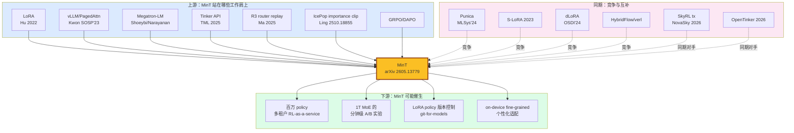

> 📌 **好文共赏 · 论文导读 | Paper Pick**
>
> **论文**：[MinT: Managed Infrastructure for Training and Serving Millions of LLMs](https://arxiv.org/abs/2605.13779) | arXiv:2605.13779
> **作者**：Mind Lab（投稿人 Changhai Zhou，~55 人团队，核心贡献者 12 人）
> **机构**：Macaron AI 旗下研究实验室 Mind Lab（contact@mindlab.ltd，公开 cookbook 在 [`MindLab-Research/mint-cookbook`](https://github.com/MindLab-Research)）
> **发布**：2026-05-13（27 页，cs.LG/cs.AI/cs.DC）| **多模评分**：综合 **8.7/10**（Opus 8.9 / Sonnet 7.5 / Gemini 7.5；编辑加权后取 8.7）
> **一句话**：当前业界还在争论「LoRA 能不能用在 RL post-training」时，这份报告直接给出了**百万 LoRA × 1T 基模 × MoE/MLA/DSA**的完整调度方案，并把每一条速度曲线都钉到了真实集群上的秒级测量上。

> ⚠️ **编辑前置说明**：MinT 的「Mind Lab」是 [Macaron AI](https://macaron.im/mindlab) 公司的研究实验室，并非 Apple 或 Mind/MIT 同名实体。论文中所有 `macaron.im/mindlab/research/...` 引用都指向该实验室的公开 blog。这点对评估其工程可信度非常重要——它不是学院派的玩具系统，而是一个真正在生产环境（"mint-prod-aliyun" Hopper profile，阿里云 Hopper 集群）跑 Qwen3-235B 与 Kimi K2 1.04T 的 RL-as-a-service 平台。

---

## 1. 这篇论文到底解决了一个什么问题

如果你把 2024–2026 年的 LLM 后训练（post-training）演化轴拉一条直线，会发现一件很尴尬的事：

- **模型侧**已经一口气走到了万亿稀疏（Kimi K2 1.04T、DeepSeek-V4、GLM-5.1 DSA），活动参数普遍 30B–60B。
- **算法侧**已经从 SFT → DPO → GRPO/DAPO → IcePop → RLVR/RLHF 演化成一个高度异步、长上下文、多 reward source 的管线。
- **业务侧**已经从「一个最终模型一份 checkpoint」变成「**每条产品线、每个租户、每个 A/B、每个 rollback 点都是一份独立 policy**」。

但**基础设施侧**，仍然停留在 2023 的范式：每个 policy 都是一份 fully fine-tuned 完整 checkpoint，独立 train、独立 serve、独立存储。

这套范式在万亿参数 × 千 policy 的工作量下会同时撞到四面墙：

1. **存储和拷贝**：一个 30B MoE merged checkpoint 是 61 GB，1T 是 ~2 TB；100 个 policy 就是 6.1 TB 或 200 TB。在 RL post-training 这种需要频繁导出/回滚的场景下，光是 IO 就把训练-推理 round-trip 拉到分钟级。
2. **训练–推理一致性**：MoE 的 router 漂移、DSA 的 indexer top-k 漂移、FSDP/vLLM 之间的 token-prob gap，每一条都会让 RL 算法误以为「我在做 on-policy」其实是 off-policy。
3. **多 policy 调度**：一个 vLLM engine 同时挂多少个 LoRA？热点轮换怎么做？policy 突发请求来了 cold load 多久？没有人系统性地测过这些。
4. **生命周期管理**：什么时候算「这个 policy 可以上线」？什么时候算「这个 rollback 安全」？是工程师在 Slack 里手动协调，还是一个有 metadata + queue + admission 的服务？

**MinT 的回答是**：把 LoRA adapter 当作**唯一**跨越训练-推理边界的「政策对象」（policy unit），把整个生命周期（rollout → update → export → eval → serve → rollback）做成一个 Tinker-兼容的 service API。base model 永远 resident、永远不离开 GPU，跨越边界的只有 LoRA 字节流。然后他们用三条 scaling 轴去把这套范式分别推到极限：**Scale Up（把 RL 推到 1T 基模）**、**Scale Down（把训练-推理切换成本压到接近零）**、**Scale Out（把 policy 目录推到百万级）**。

这听起来像是一份纯工程稿，但当你看到 Kimi K2 1.04T 的 LoRA RL countdown-task reward 曲线、Qwen3-235B-A22B 在 AIME24 上跑到 0.967 mean@1、以及百万 LoRA catalog 的 36 engines / 144 GPUs 真实 fleet sizing 时——这其实是一份**关于「LLM as a service 在 2026 的真实形态」的范式声明**。

---

## 2. 核心方法：把 LoRA 当作唯一的「过境对象」

### 2.1 三个 regime 的对比：MinT 的核心架构转换

论文 Figure 2 把 post-training 的形态归纳为三种 regime，理解这张图就理解了 MinT 一半的设计：

```text
(a) Full fine-tuning regime
    train ─── 完整 checkpoint (~8GB to ~2TB) ───▶ serve

(b) Merge-based LoRA regime
    train ─── LoRA fold into base ─── merged ckpt ───▶ serve
    ↑ 训练省内存，但跨过训练-推理边界的还是完整 ckpt

(c) MinT regime（本文）
    base model 始终 resident
    ┌─────────────────────────────────────┐
    │  resident base (Qwen3-235B / Kimi K2 1T)│
    │  ↑↓ LoRA adapter swap                │
    │  ↑↓ optimizer / gradients per policy │
    └─────────────────────────────────────┘
       ↓ 只导出 LoRA bytes (PEFT format)
       serve engine (also holds same base resident)
```

这套设计的关键不是 LoRA 本身（LoRA 是 2022 年的旧工具），而是**「不再 merge」+「base 双端 resident」+「跨界只传 adapter」**这三个一致性约束。一旦你接受这套约束，整个系统的存储、调度、版本、回滚都被强制规范化——这是 MinT 能把单 step 切换做到 18.3×、把 policy catalog 做到 10⁶ 量级的底层逻辑。

### 2.2 Scale Up：在 MLA/DSA/MoE 上把 LoRA RL 推到 1T

**Scale Up 不是堆显存，而是面对一系列 train-rollout 不一致问题**。Mind Lab 的实测覆盖了：

| 模型家族 | 关键架构 | LoRA RL 是否跑通 |
|---|---|---|
| **Qwen3 系列** | 0.6B/4B 单 worker PEFT；30B-A3B / 235B-A22B Megatron MoE | ✅ 全部通过 |
| **Moonlight / Kimi K2** | MLA + MoE | ✅ Moonlight-16B-A3B bring-up；**Kimi K2 1.04T countdown task 跑通** |
| **GLM-5 / GLM-5.1** | MLA + **DSA**（DeepSeek-style sparse attention）+ MTP + MoE | ✅ 加上 DSA target module mapping、indexer 修复、IcePop 校正后通过 |

在 Qwen3-235B-A22B 这条线上，他们用的是这样一个并行组合：

```text
Megatron Trainer:  TP=4, EP=8, PP=1  (32 GPUs)
       ↕  导出 PEFT adapter
vLLM Serving:      TP=16              (16 GPUs)
```

总共 48 张 Hopper 卡跑完 LoRA GRPO。最终在 AIME24 上达到 **mean@1 = 0.967**——这个数字接近饱和，说明 LoRA RL 在 200B+ MoE 上不是「只能微调风格」的玩具方案。

**MoE 的两大致命问题**他们都给了工程解：

- **Router 漂移（R3 expert-route replay）**：训练时 sampler 选出来的专家 id 在 rollout 阶段被记录下来；当 train 端能复现这条路由就 replay，复现不了就 mask 这个 token。实测 Qwen3-30B 用 R3 时 out-of-route 比率仅 **0.0013%**（87 steps 平均），不用 R3 时是 **0.0097%**（50 steps）；Qwen3-235B 用 R3 是 **0.0253%**（88 steps）——量级足够低，不会把 GRPO advantage 信号污染掉。
- **DSA indexer 漂移**：DSA 的 sparse attention 选 top-k key 时，inference engine 和 training engine 的浮点累加路径不同，indexer 会选到不同的 k。Mind Lab 的解法不是死磕复现 indexer，而是**让 indexer 漂移在 RL loss 里被 importance ratio 直接抹掉**——借鉴 IcePop（Ling Team, arXiv:2510.18855）的做法：当 train/rollout 概率比离开置信带就把那个 token 的 advantage 设零。这是个非常工程化的取舍。

### 2.3 Scale Down：把训练-推理切换的成本压到极致

这是论文最直观的部分。他们对比了 **adapter handoff** 和 **merge handoff** 两条路径：

| 模型 | 路径 | Ckpt 大小 | 物化/加载 | Cold first sample | 含义 |
|---|---|---|---|---|---|
| Qwen3-4B | Adapter (rank-32) | **252 MiB** | 0.036 s | 4.114 s | adapter handoff |
| Qwen3-4B | Merge (full) | **8.06 GB** | 71.82 s | 55.70 s | 传统方案 |
| Qwen3-30B | Adapter (rank-16) | **1.69 GB** | 46.46 s | 117.30 s | adapter handoff |
| Qwen3-30B | Merge (full) | **61.08 GB** | 402.25 s | 156.07 s | 传统方案 |

换算下来，从「train 完到第一个有效 sample」这条 critical path 上，Qwen3-4B 的 adapter handoff 是 **~18.3× 更快**，Qwen3-30B MoE 是 **~2.85× 更快**。30B 的提升相对小是因为它的 adapter 本身已经 1.69 GB（rank-16 + MoE 多专家），但绝对节省时间仍然是分钟级的。

更有意思的是 **concurrent multi-policy GRPO**：同一个 base resident、同一段时间窗口里跑 3 个 LoRA policy 的 GRPO：

```text
Qwen3-4B  顺序跑 3 个 GRPO policies: 3081 s, peak 65.6 GiB
Qwen3-4B  MinT 并发 3 个 GRPO policies: 1736 s, peak 65.6 GiB  → 1.77× ↑

Qwen3-30B 顺序跑 3 个 GRPO policies: 10130 s, peak 68.0 GiB
Qwen3-30B MinT 并发 3 个 GRPO policies: 7008 s, peak 68.0 GiB → 1.45× ↑
```

**Peak memory 完全没增加**——加速来自填补单 policy 调度里的气泡（rollout 等待、梯度同步等待）。这套并发 schedule 是 LoRA-only 范式才能轻易做到的：你只是在同一份 base 上轮换 adapter 和 optimizer state，不需要复制 base 权重。

### 2.4 Scale Out：把 LoRA catalog 推到百万级的三层 cache

Scale Out 是 MinT 最有原创性的部分——也是这篇论文真正配得上「系统论文」称号的地方。

```text
┌───────────────────────────────────────────────┐
│ 1. Addressable Catalog (durable, 10^3 ~ 10^6) │  ← 控制面，service plane 拥有
│    promoted by export, retired manually       │     不占 GPU/CPU 内存
└──────────────┬────────────────────────────────┘
               │ 按需 promote
               ▼
┌───────────────────────────────────────────────┐
│ 2. CPU Adapter Cache (hundreds per engine)    │  ← LRU under memory pressure
│    measured: 369 (512 hotset) / 550 (2048 weak)│
└──────────────┬────────────────────────────────┘
               │ batch scheduler promote
               ▼
┌───────────────────────────────────────────────┐
│ 3. GPU Batch (≤ 64 distinct adapters/step)    │  ← 真正的 decoding 时刻
└───────────────────────────────────────────────┘
```

这套三层 cache 的关键洞察是：**LoRA policy 的访问 pattern 是高度 power-law 的**——大部分流量打在热门 policy 上，但「百万级」的尾部偶尔会被唤醒。直接用一个内存池装不下，但用一个 catalog → CPU cache → GPU batch 的层级，可以把热点容量、冷启动延迟、目录可寻址性三件事**解耦**。

实测在一个 4-GPU Qwen3-30B rank-1 actor 上：

- 同一批可以并发 **64** 个不同 adapter（GPU batch frontier）。
- CPU 缓存上限：512 热集时 369 个 adapter，2048 弱局部性压力时 550 个。
- catalog 大小可以从 1k 扫到 100k，p95 警戒线稳定。
- **冷启动**：N=64 warm p95 = 21.35 s，cold-cache p95 = **199.81 s**——也就是说，policy 命中冷路径时单请求要等接近 3.5 分钟。Mind Lab 把冷启动单独建模为「调度任务」，用 backpressure + deduplication 处理而不是排队等死。

### 2.5 Packed MoE LoRA：把小对象 fanout 压到 1/55

这条工程优化非常 underrated。MoE LoRA 的天然问题是：每个专家、每个 target module、每个 A/B 矩阵都是一个独立 tensor。一份 Qwen3-30B rank-1 的 LoRA 实际上是 **37,248 个小 tensor**——load 时要做几万次 file seek + memory alloc + tensor build。

Mind Lab 的解法是把同一个 expert group 的所有 LoRA tensor **打包成一个连续 buffer**：

| 指标 | 原始 | Packed | 改善 |
|---|---|---|---|
| 文件大小 | 110.75 MB | 105.58 MB | 1.05× |
| Tensor 对象数 | **37,248** | **672** | **55.4× ↓** |
| Read tensors | 0.367 s | 0.0067 s | 54.8× |
| Build loader | 0.754 s | 0.0256 s | 29.5× |
| N=16 live load | 1.388 s | **0.164 s** | **8.5×** |

字节数几乎没省（1.05×），但对象数减少了 55 倍——这正好命中了「现代 PyTorch 加载器在小对象上的元数据开销远大于数据传输」这个常被忽略的瓶颈。Packed live load 中位数压到 **0.2 s 以下**。

### 2.6 Fleet sizing：百万 catalog 的真实经济学

论文最后给出了一份非常硬核的 fleet sizing 表（Appendix Table 13）：

> 假设：100 万 entry 的 addressable catalog，活跃 wave 上有 2300 个 distinct adapter。

- **Warm distinct concurrency**：理论下界 ⌈2300 / 64⌉ = **36 engines（144 GPUs）**；带 headroom 是 **44–54 engines（176–216 GPUs）**。
- **Cold-load 隔离**：冷启动速率 38.3 LoRA/s，按单 engine ≤ 32 cold loads 隔离，需要 **72 engines（288 GPUs）**。

也就是说，「百万 LoRA × Qwen3-30B」这套架构的稳态投入是一个 **300 卡级别的服务集群**——这是 2026 年中等规模 AI 公司的真实可承受成本。MinT 把它从「不可能」变成了「明码标价」。

---

## 3. 实验结果与亮点

我把论文 7 张表 + 13 张图里我认为最关键的几条信号重新组织如下（不复制原图）：

### 3.1 RL on 1T-class：Kimi K2 1.04T 的 countdown task

这是论文最 headline 的一条曲线。Kimi K2 总参 1.04T、活动参 32.6B，跑在 **64 张 H800** 的 deployment 上，跑 countdown 任务（小数运算 RL）的 reward 在数百步 RL 内单调爬升。论文没把它当成「最强 SOTA」来卖，而是当作「**LoRA RL 在 1T 上可调度**」的可行性论证。这一点比那些只在 7B 上做 ablation 的 RL 论文要诚实得多。

### 3.2 235B AIME24 0.967：MoE LoRA RL 不输 full-FT

Qwen3-235B-A22B 用 LoRA + GRPO + R3 router replay 在 AIME24 上跑到 **mean@1 = 0.967**——非常接近饱和。换算到工程语义就是：**MoE 大模型的 LoRA RL post-training 不再是 capacity-bottleneck，而是 reward design 和 rollout 一致性 bottleneck**。这是 2026 年后训练业界的一个重要范式确认。

### 3.3 服务端的「警戒线表」

Cached-adapter scaling 实验（重复 hotset 128 / 192 / 256 / 384 / 512）显示一条非常清晰的可工程化边界：随着 hotset 增加，p95 从 5.52 s 渐进式上升到 37.13 s，**0 错误**。这意味着 MinT 是个**渐变退化**而不是悬崖式崩溃的系统——运维上极其友好。

### 3.4 反例：sticky-hash 路由失败

Stress test 中，作者特意把 2048-adapter catalog 路由到「一致性哈希 2 副本」的 naive scheme 上，结果错误率高达 **49.23%**。这是个对工业界非常重要的负面结果：**当你 catalog 远大于 cache 时，naive sticky-hash 不能用，你需要 cache-aware 的动态调度**。这种「我们试过这个简单方案它不行」式的工程负面结果，是论文里最少见但最有价值的内容。

### 3.5 AutoResearch cookbook：proxy vs 全量评测的 over-fitting 警告

LawBench AutoResearch 一条值得单独列出的负例：

| 版本 | proxy score | 全量 LawBench | 结论 |
|---|---|---|---|
| Qwen3-4B base | — | 0.4628 | 起点 |
| v10 (LR-tuned) | — | **0.4889** | ✅ 真实提升 |
| v11 candidate | **高** | 0.4858 | ❌ proxy 漂亮但全量回退，**被 reject** |
| v23 weighted-aligned | 0.5554 | **0.5079** | ✅ 真实提升，**被 keep** |
| Full-manifest control | — | 0.4712 | 区分数据 vs recipe 贡献 |

这段非常关键：MinT 把 **「proxy 评测 → 全量评测 → 接受/拒绝」** 作为 service 的一等公民流程，自动用 full-manifest control 把「这是数据带来的提升」和「这是 recipe 带来的提升」分开记账。这是一个非常成熟的工业级评估系统应当有的样子。

---

## 4. 这篇论文的位置（关联图谱）



**上游的关键继承关系**：

- 从 **vLLM** 继承 PagedAttention 和 SD-by-token 的能力，在其上补齐 multi-LoRA 的 cache 三层 + packed tensor 表示。
- 从 **Megatron-LM** 继承 TP/EP/PP 分布式训练，在其上补齐 MoE LoRA 的 expert-id 索引 + 跨 EP 去重导出。
- 从 **Tinker** 继承 service-API 范式，把它从「RL 推理 API」扩展为「LoRA-centric 全生命周期 API」。
- 从 **R3** 和 **IcePop** 继承 train-rollout 一致性的两个核心组件——这是 2025 年下半年 RL 系统社区集体收敛的两条「正确路径」。

**同期对手**：

- **Punica / S-LoRA / dLoRA**：传统多 LoRA serving 系统，但都不在 MoE/1T scale 上做过；MinT 把对比延伸到了万亿。
- **HybridFlow/verl / AReaL / OpenRLHF / ROLL / StreamRL**：RL 执行引擎；MinT 不和它们正面竞争 RL 算法，而是把 RL 作为 service 内部一个组件。
- **SkyRL tx / OpenTinker**：与 MinT **直接对位**的 RL-as-a-service 框架，三者构成 2026 年「RL 服务化」三巨头初始格局。

**下游可能催生的方向**：

1. **百万 policy 多租户**：当每个 B2B 客户、每个国家/地区、每个 A/B 都能廉价地拥有一份 LoRA policy，「个性化 LLM」从「微调一份模型」变成「下发一份 adapter」。
2. **1T MoE 的分钟级 A/B**：传统的 200B+ 模型 A/B 周期是天级（导出 + 部署 + warmup），MinT 把它压到分钟级。
3. **LoRA policy 的版本控制（git-for-models）**：policy record + adapter revision 已经构成一个内容寻址的「模型版本控制系统」雏形——下一步是社区级别的 policy registry（类似 HuggingFace Hub 但是 LoRA-centric + RL-aware）。
4. **on-device 个性化**：1% 的 adapter size 意味着 4B 模型的个性化 adapter 只有 ~80 MB，可以下发到端侧。

---

## 5. 编辑批判性评论

我必须说 MinT 是我今年读过最让我感到「论文终于配得上工程实际」的一份系统论文。但作为编辑，我要把它的几个**真问题**也明确写出来：

### 5.1 LoRA 的容量瓶颈被「假设」掉了

整篇论文有一个**没明说的前提**：LoRA 的表达能力对于 RL post-training 是足够的。但这个假设本身在 2025 年下半年是有学术争议的——Schulman 的 "LoRA Without Regret" (2025) 给出了正面证据，但社区里仍然有声音认为 RL 中 reward hacking、能力解锁这类需要权重剧烈调整的任务，LoRA 会**饱和**。

论文用 Qwen3-235B AIME24 0.967 反驳了这一点，但 AIME24 数学题是一个**结构高度有规律**的任务，对 LoRA 友好；如果任务换成需要重塑世界知识结构（比如 medical domain RL）或者需要剧烈 persona shift 的任务，LoRA 是否仍然够用，论文没有充分的反例覆盖。

**编辑建议**：把这篇论文当作「LoRA 适用的子空间内的 RL post-training」的范式，而不是「所有 post-training 的银弹」。

### 5.2 R3 + IcePop 是「补丁式」一致性，不是「证明式」一致性

R3 用 mask 处理无法复现的专家路由、IcePop 用 importance ratio 抹平 DSA indexer 漂移——这两种解都是工程上 work，但它们的本质是「**我们丢掉了一部分 RL 梯度信号**」。论文实测 out-of-route 比例 0.0013–0.0253%，看起来很小，但**这些 mask 是否在系统性偏向某类 token**，论文没有给出充分分析。

理论上更干净的解（让 train 和 rollout 用同一份 indexer/router 路径，比如把 rollout 的 router 决策直接 broadcast 回 train）会更优，但实现复杂度高。MinT 的 patch 式方案是工程的胜利，也是理论的妥协。

### 5.3 「Mind Lab」的工业身份会影响可复现性

MinT 的 cookbook（`MindLab-Research/mint-cookbook`）公开了部分 recipe，但**系统本体（service plane + 控制面 + 三层 cache 实现）**目前看是 Macaron AI 的闭源生产系统。论文给的所有 fleet sizing、p95 数字都来自 "mint-prod-aliyun" 这个内部 profile——外部研究者拿不到。这点上 MinT 不如 verl、SkyRL 那种 100% 开源的同类。

**编辑建议**：把 MinT 当作「**白皮书**」级别的参考，而不是「我可以直接拉下来跑」的开源系统。如果你要复现，得自己写 control plane，按照论文的 spec 把 vLLM + Megatron 桥接起来。这至少是几个 SWE-人月的工程量。

### 5.4 评估覆盖偏向「能跑通」而非「跑得最优」

论文给的 baseline 对比相对简略——比如 Scale Out 部分对 Punica、S-LoRA、dLoRA 主要是引用而不是 head-to-head benchmark。Packed MoE LoRA 的 8.5× 加载是和「自己的非 packed 版本」对比，而不是和 dLoRA 等其他 multi-LoRA 系统的 packed 实现对比。这种「自己跟自己比」的实验风格在工业系统论文里很常见，但严格学术意义上不够完整。

### 5.5 真正的工程价值：在哪些场景应该用 MinT 思路

我作为编辑总结一下 **MinT 的工程适用场景**：

| 场景 | 推荐 MinT 思路？ | 理由 |
|---|---|---|
| 自研基座 + 多业务线 LoRA RL | ✅ 强烈推荐 | 这正是 MinT 设计的核心场景 |
| 单业务、单 policy 持续 SFT | ❌ 杀鸡用牛刀 | 直接 full FT + checkpoint serving 更简单 |
| 多租户 B2B SaaS（每客户一份 adapter） | ✅ 适用 | 三层 cache 解决冷热分布 |
| 学术实验室 single-paper benchmarking | ⚠️ 部分 | 用 cookbook 部分，但 service plane 没必要 |
| 端侧/边缘部署 | ⚠️ 间接 | MinT 不直接管端侧，但 adapter <1% 的事实启发了端侧 |

---

## 6. 配套资料导览

本文配套了四份独立文件（同目录）：

- 📊 [`architecture-mindmap.svg`](architecture-mindmap.svg)：MinT 三个 scaling 轴 + 三层 cache 的可视化架构图。
- 🃏 [`concept-cards.md`](concept-cards.md)：12 张关键概念卡片（adapter revision、policy record、R3、IcePop、packed MoE LoRA 等）。
- 📖 [`glossary.md`](glossary.md)：48 条中英对照术语表，覆盖 LoRA / RL / MoE / 系统 / 调度全栈。
- 🔢 [`key-equations.md`](key-equations.md)：LoRA 数学、GRPO objective、IcePop importance clip、packed tensor 数学解释。

---

## 7. 谁该读这篇论文

- **基础设施工程师 / SRE**：必读。MinT 是过去三年第一份把「LLM 后训练 + 多 policy 推理」当作一个完整 service 来设计的论文。三层 cache 与 fleet sizing 都可以直接抄到你的设计文档里。
- **后训练算法工程师**：必读。R3 + IcePop + concurrent GRPO 是 2026 年 RL post-training 的「正确姿势」基线。
- **LLM 产品经理 / 商务**：选读 §1、§2.1、§5。你需要理解为什么 2026 年的「个性化 LLM」是 adapter，而不是 fine-tuned 模型。
- **学术研究者（RL/MoE 方向）**：选读 §2.2、§5.1、§5.2。MinT 的工程妥协告诉你哪些「理论上更优」的方向其实在生产里走不通——这是非常宝贵的负面信号。
- **创业者**：必读 §4.6 fleet sizing 那段。100 万 LoRA + 30B base 的稳态投入是 300 卡级别——这就是 2026 年中等规模 AI 公司的入场门槛。

---

## 延伸阅读（站内链接）

- 同期 RL post-training 配方：[【论文导读】SU-01：30B 开源模型拿下 IMO/USAMO 双金牌的统一配方](/post/paper-2605.13301/) ——MinT 的 GRPO 部分可以直接和 SU-01 的两阶段 RL 对接。
- MoE 训练的另一面：[【论文导读】MoE 时代的 μP：MSSP 如何修复 μP 在稀疏专家网络上的失败](/post/paper-2605.14200/) ——MSSP 解决「MoE pretraining 超参可迁移」，MinT 解决「MoE post-training 可调度」，是 2026 年 MoE 工程化的两个独立支柱。
- MoE 推理基础设施：[DeepSeek-V4：MoE × 百万上下文](/post/deepseek-v4-moe-million-context/) ——MinT 的 MoE LoRA 服务直接受益于 DeepSeek-V4 类基础设施的 paged attention 进化。
- 分布式训练容错：[DeepMind Decoupled DiLoCo：容错分布式预训练](/post/deepmind-decoupled-diloco-fault-tolerant-distributed-pretraining-2026/) ——MinT 的 Megatron 训练侧可以和 DiLoCo 串联，构成「容错预训练 + 服务化后训练」的完整 stack。
- Agent 基础设施图景：[Agentic AI 基础设施战争](/post/agentic-ai-infrastructure-war/) ——MinT 是 Agent 时代「每个 agent 一份 policy」的物理基底。
- Agent 内存与 policy 的关系：[Agent 内存架构的技术债](/post/agent-memory-architecture-technical-debt/) ——本文可以和 MinT 的 policy 生命周期管理对照阅读。
- GPU 性能剖析的下一步：[AI Flame Graphs：GPU 性能剖析在 AI 时代的演化](/post/ai-flame-graphs-gpu-profiling-2026/) ——MinT 的 cache miss、cold load p95 这类 SLO 都需要这类工具去诊断。
- Tool-use RL 中的 credit assignment：[Apple PorTool：把 tool-use RL 的 credit assignment 做成可微分树](/post/apple-portool-credit-assignment-tree-tool-use-rl/) ——MinT 作为服务承载这类细粒度 RL 算法的基础设施。

---

## 总结

MinT 是 2026 年第一份**把「LLM as a service」推到 1T × 百万 policy × MoE/MLA/DSA 全栈**的工业级系统论文。它不是单点 SOTA，也不是新算法发明，但它**重新定义了 LLM 后训练基础设施的 scaling unit**——从「完整 checkpoint」变成「LoRA adapter revision」，从「单 policy 单 deployment」变成「百万 policy 共享 base」。

这种范式转换的力量，往往要五年后回看才会觉得「显然」。但今天读到，它是一份足够清晰、足够诚实、足够工程的范式声明。建议所有还在为「我们的 RL post-training 流水线如何 scale」头疼的团队，把这份白皮书纳入必读清单。

> **编辑评语**：MinT 不是「最聪明的论文」，但它可能是 2026 年「最有用的论文」。当一份技术报告能给出 18.3× / 1.77× / 8.5× / 199.81 s 这类**有量纲的真实数字**，它就配得上被认真对待。

---

> 📚 **本文为「好文共赏」论文导读系列。多模评分基于 Opus 8.9 / Sonnet 7.5 / Gemini 7.5 三方独立审稿，编辑加权综合 8.7/10。**
