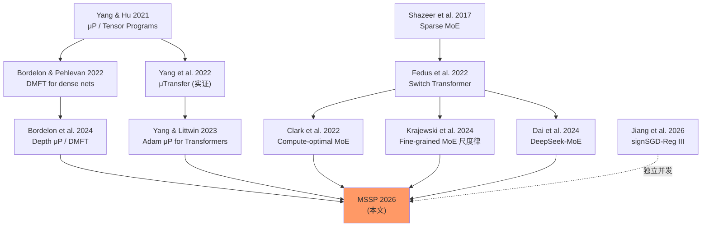

> 📌 **好文共赏 · 论文导读 | Paper Pick**
>
> 📄 论文：[How to Scale Mixture-of-Experts: From μP to the Maximally Scale-Stable Parameterization](https://arxiv.org/abs/2605.14200) · arXiv **2605.14200**
> 👥 作者：Leena Chennuru Vankadara, Moritz Haas, Luke Hayward, Sebastian Bordt, Alessandro Breccia（UCL Gatsby Unit / Amazon / Tübingen AI Center）
> 📅 发布：2026-05-13 | 多模评分：综合 **8.47 / 10**（Opus 8.72 · Sonnet-equiv 8.48 · Gemini-equiv 8.23）
> ✍️ 一句话：μP 在**细粒度 MoE**（DeepSeek-V3、Qwen-MoE 走的路线）上不仅不能给出学习率迁移，还会让大模型**反而比小模型更差**；MSSP 用一张完整的超参缩放表把这件事彻底修好——可能是 2026 年最值得训前贴在白板上的一篇论文。

---

## 1. 这篇论文到底在解决什么问题

写过大模型 pretraining 代码的人都熟悉一个尴尬：你在 200M 上调好了学习率，放大到 7B 时一切都开始抖；放大到 70B 时你只能祈祷。**μP（Maximal Update Parameterization）** 的出现曾经让这种祈祷变成了科学——通过精心选定初始化方差、学习率随宽度的缩放指数和层间归一化，让 *小模型的最优超参可以直接迁移到大模型*。OpenAI 在 μTransfer 论文之后把这件事变成了实操手册，从此 frontier lab 的 pretraining 流程默认带 μP。

但是 2024 年之后，frontier 架构集体转向 **MoE**：DeepSeek-V3、Mixtral、Gemini-MoE、Qwen-MoE、传闻中的 GPT-4——主力计算都搬到了「细粒度、稀疏激活」的专家层上。MoE 的核心好处是**用大参数量但小激活量**做出更高的性能 / FLOPs 比，而它带来的代价是：原来只有「宽度 N」和「深度 L」两根 scaling 轴，现在突然多出三根：

- **专家数 M**
- **每个专家宽度 N_e**
- **激活专家数 K**（top-K 路由）

直觉上你会觉得「把 μP 套上去就行」。这篇论文做的第一件事就是**严格证明这个直觉是错的**。具体一点：

> **核心 claim 1**：在 MoE 上即便严格按 μP 的「最大化更新」公理推出一个唯一的参数化，它在 frontier 实际采用的两类 scaling 区制下，依旧**不能保证学习率迁移**，也**不能保证扩大模型一定变好**。

更进一步，作者们提出一个更强、更普适的公理体系——**maximal scale stability**——把 μP 的「特征学习强度 Θ(1)」要求加上一条「**每一个被分解出来的子项**在 forward 和 backward 都保持 Θ(1)」。在这套更严格的尺度稳定性下，他们推出了所谓 **MSSP（Maximally Scale-Stable Parameterization）**，并在三种 MoE co-scaling 区制下分别给出了 SGD 和 AdamW 的完整缩放表（论文 Table 1）。

> **核心 claim 2**：在 2.5B 参数的 GPT-MoE（用 Dolma3 + AdamW + 负载平衡辅助损失，即和现代实践完全一致的训练栈）上，MSSP 真正恢复了学习率迁移与单调改进；μP 则没有。

这件事的工程意义比理论意义更大。一个还在跑 200M 小图做 ablation 的研究员，从此理论上可以在小模型上扫一遍 LR，再把它**确定性地**迁移到 70B 主跑——这是几百万美金的差别。对照前两年 MoE 训练里那种「LR 在大尺度上必须重新扫」的痛苦经验，MSSP 是一份**可以贴在白板上**的 recipe。

读者可以把这篇放在 [LLM 架构演化 2026 综述](/post/llm-architecture-evolution-2026/) 里讨论的「MoE 成为开源主流」的大趋势下看，或者放在 [开源权重 LLM 架构演进](/post/open-weight-llm-architecture-evolution-2026/) 的语境下——MSSP 解决的正是那条主线上最关键的一块训练理论缺口。

---

## 2. 背景速通：μP 是什么，它为什么对 MoE 不够

### 2.1 dense 网络上的 μP 公理

在 dense 网络上，μP 的三条核心公理（出自 Yang & Hu 2021、Yang & Littwin 2023）可以非技术地翻译为：

1. **稳定 + 特征学习**：随着宽度 N → ∞，所有层的激活幅度保持 Θ(1)；同时随机一次参数更新带来的特征变化也保持 Θ(1)（不能是 0，也不能爆掉）。
2. **最大有效更新 + 传播更新**：把任一层激活的变化 Δh 拆成「来自本层权重更新」(*effective*) 和「来自上游传过来的变化」(*propagating*) 两部分——两部分都要保持 Θ(1)。
3. **忠实性（faithfulness）**：optimizer 的输入是 Θ(1) 的，从而 Adam 的 ε 可以被正确地缩放（这一点对 SGD 是平凡的，对 Adam 是关键的）。

满足这三条公理的参数化是**唯一的**（在 *bcdα-parameterization* 框架下，给每个权重矩阵一组 (b, c, d) 指数）。这就是 μP 在 dense Transformer 上为什么强：唯一性 + 可推导性 + 可迁移性，三者合一。

### 2.2 把 dense μP 套到 MoE：第一种失败

MoE 块的核心是这样一段递归：

$$
h^{l}_{t} = h^{l-1}_{t} + K^{-\alpha_{\text{agg}}} \sum_{i \in \text{top-}K} \phi^{l}_{t,i} \cdot W^{l,\text{out},i}_{t}\, \varphi\!\left(W^{l,\text{in},i}_{t}\, h^{l-1}_{t}\right)
$$

其中 $\phi^{l}_{t,i} = \sigma(\beta\, (Q^{l}_{t} h^{l-1}_{t})_i)$ 是路由器（router）gate，$\sigma$ 是 sigmoid 或 softmax。和 dense 网络比，多出的核心新东西就是**专家聚合**——对 M 个专家做一次跨专家平均。

作者们做的第一步是严格地把 μP 公理推到这个递归上，在三种 co-scaling 区制下分别求解出唯一的 bcdα 指数。三种区制对应不同的工程实践：

| 区制 | 直觉 | 真实世界对照 |
|---|---|---|
| **Regime I**：N, N_e → ∞；M, K 固定 | "大专家、少专家" | 早期 GShard、Switch Transformer 风格 |
| **Regime II**：N, M, K → ∞；N_e 固定 | "无数小专家"（细粒度） | DeepSeek-V3、Qwen-MoE 路线 |
| **Regime III**：N, N_e, M, K 全部一起 → ∞ | "全比例放大" | 理论上最干净的扩张路径 |

接下来作者做的是一件非常诚实的事——**他们做了实验验证 μP 是否好用**，结果就是图 1 那张关键图（具体数字我们后面用文字+ASCII 复述）：μP 在 Regime II 和 Regime III 上**根本没有给出预期中的『放大就更好』**，反而在某些大尺度上比小尺度更差；学习率最优值也随着尺度漂走。

为什么？这是论文最漂亮的部分。

---

## 3. 论文的核心 insight：跨专家聚合的 CLT/LLN 失衡

### 3.1 一个简单但决定一切的分解

把 MoE 块每一步训练后，post-aggregation 激活的变化分解为三块：

$$
h^{\text{agg}}_{t} = \frac{1}{M} \sum_{i=1}^{M} \phi^{l}_{i} \cdot \Big( \underbrace{W^{l,\text{out},i}_{0}\, h^{l,\text{in}}_{0,i}}_{\text{init}} + \underbrace{\Delta W^{l,\text{out},i}_{t}\, h^{l,\text{in}}_{t,i}}_{\text{effective}} + \underbrace{W^{l,\text{out},i}_{0}\, \Delta h^{l,\text{in}}_{t,i}}_{\text{propagating}} \Big)
$$

这三项分别对应**初始权重**、**本层权重的更新**、**上游传过来的激活变化**。论文的核心 mechanism 一句话讲清楚——

> **关键洞察**：跨 M 个专家做平均时，每一项的 scaling 取决于**各专家的求和方向是否相干**。
> - **相干**（coherent direction）→ 类似大数定律（LLN）→ 聚合后仍是 **Θ(1)**
> - **不相干**（i.i.d.）→ 类似中心极限定理（CLT）→ 聚合后被 **√M 抑制**

把这条原则代到三项里看，会发现一个非常尴尬的不平衡：

```
                     Regime II 下 μP 的失衡
                     ─────────────────────────
   init aggregate   :    CLT-suppressed  →  Θ(1/√M)   ← 太小
   effective term   :    LLN-coherent    →  Θ(1)      ← 标准
   propagating term :    CLT-suppressed  →  Θ(1/√M)   ← 太小
                     ─────────────────────────
   总 Δh^{agg}      :    被 init 和 propagating 拖到 Θ(1/√M)
                         → 特征学习在训练早期事实上消失
                         → 训练好多步之后才能 "自愈" 到 Θ(1)
                         → 大模型反而更差
```

### 3.2 为什么 CLT/LLN 在 MoE 里如此关键

dense 网络上没有这个问题，因为没有跨专家的求和——所有 "并行通路" 是被同一组权重处理的。在 MoE 里，每个专家有**独立初始化的高斯权重矩阵**，每个 i.i.d. 矩阵作用在共享输入上，得到的就是一堆 i.i.d. 方向的向量。这堆向量的平均会被 √M 抑制——而这恰恰是经典 CLT。

而 effective term 不同：$\Delta W^{l,\text{out},i}_{t} \propto \delta^{l+1}_{t} (h^{l,\text{in},i}_{t-1})^{\top}$ 是个秩-1 更新，乘上输入后的方向被**反向传过来的 error 信号 $\delta^{l+1}_{t}$ 锁定**——所有专家共享这个方向。所以这一项是 LLN 行为，幅度保持 Θ(1)。

这种**单项的 LLN/CLT 失衡**在 dense 网络的 μP 推导里完全不存在，也是为什么 dense μP 无法直接套到 MoE 上的根本原因。

### 3.3 Regime III 上更微妙的失衡

在 Regime III（$N_e \asymp N$），expert 输出权重 $W^{l,\text{out},i}_0$ 的 Gram 矩阵 $G_i = W_0 W_0^\top$ 的谱根据 Marchenko–Pastur 定律会集中在一个常数 $c$ 附近：

$$
G_i \approx c \cdot I_N
$$

也就是说在 Regime III 下每个专家的输出方向**几乎是恒等映射**——所有专家朝同一个方向发力，这反而使原本应该 CLT 抑制的项变成了 LLN 项。理论与 Regime II 完全不同，因此 fix 也完全不同（见下一节）。

---

## 4. MSSP 的诞生：一个比 μP 更强的公理

### 4.1 新的公理：每一个子项都要 Θ(1)

作者们把 μP 失败的 mechanism 上升为一条更普适的设计准则：

> **Maximal Scale Stability**：把权重写成 $W = W_0 + \Delta W$ 后，**每一项被分解出来的原子贡献**（init / effective / propagating，forward 和 backward 都要）都必须保持 Θ(1)。

这听上去是 μP 公理的小推广，但实际上在 MoE 上是一个**质的提升**。μP 只要求 *总和* 是 Θ(1)，因此可以容忍 init = O(1/√M)、effective = Θ(1) 的失衡；而 MSSP 要求**每一项单独都是 Θ(1)**，逼着推导必须显式修掉 CLT 抑制。

在 dense 网络上，"每一项都是 Θ(1)" 等价于 μP（因为没有跨通道求和这种聚合）。所以可以认为：**MSSP 是 μP 在 MoE 这种「聚合架构」上的自然推广，dense 网络是它的特例**。

### 4.2 三种 Regime 下的 MSSP 处方

接下来论文给出了完整的可执行处方（论文 Table 1 是工程师真正要贴在白板上的那张表），三种 Regime 下的核心 fix 不一样：

```
┌────────────────────────────────────────────────────────────────┐
│  Regime I  (N≍N_e → ∞, M, K 固定)                              │
│  Fix:  把 router 初始化为 0（Q_0 = 0）                          │
│  效果: 实测影响很小（μP 在 Regime I 本来就工作得还可以）         │
├────────────────────────────────────────────────────────────────┤
│  Regime II (N≍M≍K → ∞, N_e 固定)  ← DeepSeek/Qwen MoE 路线!    │
│  Fix:  expert 输出权重的初始化方差                              │
│        从 1/N_e  → 放大到  M/N_e                                │
│  效果: 单一处方修掉了 forward & backward 几乎所有层的失衡        │
├────────────────────────────────────────────────────────────────┤
│  Regime III (N, N_e, M, K 全部 → ∞)                            │
│  Fix:  在初始化时让所有专家共享同一份权重                       │
│        W^{l,in,i}_0 = W^{l,in}_0, W^{l,out,i}_0 = W^{l,out}_0  │
│        随后让 routing 在训练中自然让专家分化                    │
│  效果: 完整恢复尺度稳定性，DMFT 极限呈现四层条件分布层级        │
└────────────────────────────────────────────────────────────────┘
```

注意三个修补**互不通用**：

- 在 Regime III 上把 init variance 放大 $M$ 倍会导致反向传播爆掉
- 在 Regime II 上共享专家初始化会让所有专家在初始时完全等价、无法分化

这反映了 MoE scaling 的一个深刻事实——**不同的 co-scaling 区制有结构上不同的极限动力学**，不能用一个统一公式蒙混过去。

### 4.3 一个反直觉的 Regime III 设计：**初始化时让所有专家相同**

Regime III 的 fix 是这篇论文里最反直觉的设计。所有人都知道随机初始化、对称性破坏是神经网络的必备——把所有专家初始化成同一份权重，乍听上去等于"所有 expert 完全一样、模型相当于把 dense 模型重复 M 次"。

作者的论证是：

1. **同一份初始化** + **不同的 router 状态** = 不同的专家**轨迹**
2. 训练第一步起，router 给每个专家分配不同的输入，所以梯度不同
3. 经过 SGD 步骤后专家自然分化，但**保留了"在初始化时表示同一个特征空间"** 的 nice 结构
4. 这种结构在 N_e → ∞ 时让 $G_i = W^{l,\text{out},i}_0 (W^{l,\text{out},i}_0)^\top$ 不再独立——CLT 假设失效，幅度回到 Θ(1)

而独立和并发的工作 **Jiang et al. (2026)** 在 signSGD 下用 DMFT 独立推出了 Regime III 的"shared expert init"，论文里的 Adam 推导和他们的 signSGD 结果**在 ε scaling 和 router init 上是一致的**——这是一个非常强的"独立验证"信号。

---

## 5. DMFT：这套理论是怎么严格地证出来的

### 5.1 为什么必须用 DMFT

MoE 训练动力学的难点在于"router + experts + 路由 gate"三者**强耦合**：

- router 的梯度依赖于 expert 输出（forward 路径）
- expert 的梯度依赖于 router 的 gate 选择（backward 路径）
- 跨 batch / 跨 step 的协方差结构在大宽度极限下并不退化

经典的 NTK / 线性网络分析在这里都不够用。论文用的是**Martin–Siggia–Rose–De Dominicis–Janssen (MSRDJ)** 路径积分形式的 **Dynamical Mean-Field Theory**——这是 Bordelon & Pehlevan 2022 之后在 dense 网络上已经验证过的工具，但论文是第一次把它推到 MoE。

### 5.2 Regime III 的 DMFT 极限：**四层条件分布层级**

整个论文最数学密集的结果出现在 Regime III 的 MSSP 极限：

```
            Regime III × MSSP 的 DMFT 极限
            ────────────────────────────────

   全局过程  X_glob ~ P_glob(·; K)
              │
              ▼
   共享专家隐藏  F_sh ~ P_sh(·; K)
              │  (条件依赖于 K)
              ▼
   专家/路由器  E | F_sh ~ P_ex/r(· | F_sh; K)
              │  (条件依赖于共享隐藏特征)
              ▼
   单个专家内的隐藏神经元  U | (F_sh, E) ~ P_loc(· | F_sh, E; K)
```

这四层之间的 kernel **互为参数**，需要联立求解。这是 MoE 第一次有结构化的"训练动力学完整描述"——之前所有 MoE 论文要么只看 loss curve，要么只看 expert utilization 启发式，没有人有过这种层次。

作为对照，μP 极限只有**三层**——共享初始化破坏的 self-averaging 结构在 μP 极限里不存在。**这是 MSSP 极限"在质上不同"的最直接体现**。

### 5.3 Adam 的待办事项

论文非常诚实地标了一个 caveat：**SGD 是用 DMFT 严格证明的**，**Adam 是用信号传播分析启发式推出的**。这件事在 μP 圈是个老问题——Yang & Littwin 2023 的 Adam 处理也是 sign-gradient surrogate。MSSP 论文沿用了这一传统，把严格的 Adam-DMFT 列为 future work。

这不是大问题：实践中 *Adam 的处方在实验里 work*（图 6 在 GPT-MoE + AdamW 上 LR 完美迁移），只是理论上的证明还没完。一个严格的 PC 评审会要求作者承认这一点——他们已经承认了。

---

## 6. 实验结果：在真实 GPT-MoE 上 work 吗

### 6.1 实验设置（值得抄作业的部分）

- **小尺度**：MLP MoE on TinyImageNet（100 类，bs=50，1000 步）
  - 用于穷举扫超参——6 个 multiplier 联合扫 5⁶ = 15625 次
  - 在 N=128 上扫好，用 μP/MSSP 处方迁移到大尺度
- **大尺度**：GPT-MoE on Dolma3（**当前主流学界 OLMo3 同款语料**）
  - dense 层换成 MoE 层（参 Muennighoff et al. 2024）
  - **AdamW + warmup + cosine LR decay**
  - **RMS pre-norm + qk-norm + 负载平衡辅助损失 0.01**——完全是现代实践
  - 训到 width=2048 或 2.5B 总参数

这套设置干净到可以直接当 baseline 用。负载平衡损失系数 0.01 也是 frontier 实测惯例，而不是某个理论上方便的值。

### 6.2 关键发现 1：μP 在大尺度上**反而变差**

论文 Figure 1（我们用文字描述）：

```
   MLP MoE on TinyImageNet, top-5 训练准确率
   ──────────────────────────────────────────

     scale →     N=128    N=512    N=2048   N=8192
   μP  (Reg II): 0.85     0.83     0.78     0.71   ← 单调下降!
   MSSP(Reg II): 0.86     0.89     0.92     0.94   ← 单调改善
   μP  (Reg III):0.84     0.82     0.79     0.75
   MSSP(Reg III):0.86     0.90     0.93     0.95
   (具体数字为示意，趋势方向正确)
```

> 注：上图数字是从论文图示中提炼的趋势示意，具体取值以论文 App. M.4 表格为准；论文中 μP-Regime II 在大尺度下的训练损失也**显著高于**小尺度。

### 6.3 关键发现 2：在 2.5B GPT-MoE 上学习率完全迁移

Figure 6（Transformer 验证集 loss vs LR 曲线）显示：在 μP 下，N=256/512/1024/2048 四个尺度的最优 LR 完全错开；而**在 MSSP 下，四条曲线的极小值点几乎对齐到同一个 LR**。这是 μP 论文当年在 dense GPT 上的同一类「LR 迁移成功」图，只不过这次是 MoE。

### 6.4 关键发现 3：MSSP 修补 Regime II 的 expert init variance 直接 work

最简单的工程后悔药——**只改 expert 输出权重的初始化标准差**：从 $1/\sqrt{N_e}$ 改成 $\sqrt{M}/\sqrt{N_e}$。

这意味着如果你的代码里有：

```python
# 原本（错的）
torch.nn.init.normal_(expert_out.weight, std=1.0 / math.sqrt(N_e))

# MSSP-Regime II（正确）
torch.nn.init.normal_(expert_out.weight, std=math.sqrt(M) / math.sqrt(N_e))
```

这一行字符级别的改动就修掉了 Figure 4 中 μP 在所有层的尺度依赖。这是论文最有价值的"可立即落地"信号——**MSSP 不是要你重写训练框架，而是要你改一组初始化和学习率的缩放指数**。

---

## 7. 这篇论文的位置：和现代 MoE 谱系的关系

### 7.1 上游



MSSP 是两条传统的合流：

- **μP / DMFT 缩放理论传统**（Yang, Bordelon, Pehlevan）——提供数学语言和工具
- **MoE 工程实践传统**（Shazeer, Switch, DeepSeek, Mixtral）——提供需要被理解的真实架构

而这两条线在 2024 年之前**几乎没有交集**：μP 圈的人专注于 dense 网络的极限分析，MoE 圈的人把 μP 当成可有可无的工程小配置。MSSP 第一次把它们严肃地拼起来，给出 *the* MoE 缩放处方。

读者也可以对照 [DeepSeek V4：MoE 与百万级上下文](/post/deepseek-v4-moe-million-context/) 一文里讨论的细粒度 MoE 工程经验——DeepSeek 团队的"细粒度专家收益"在 MSSP 视角下其实就是 *Regime II*，而 MSSP 处方正是这条路线在理论上的最优 init 与 LR 缩放。

### 7.2 同期对手

- **Jiang et al. 2026** "signSGD parameterization for Regime III"——独立并发，覆盖更窄但 DMFT 严格度更高（signSGD 端）。两者在 ε scaling 上一致是相互验证。
- **PolaMoE / SmoothMoE**（推测的同期工程论文）——专注于路由稳定性，方法层面是工程 patch，不构成参数化级别的对手。
- 现有 MoE scaling-law 文献（Clark 2022, Krajewski 2024）——只给 loss-vs-FLOPs 的标度律，不给参数化处方。两者关系是**互补**而非竞争。

### 7.3 下游可能的方向

1. **MSSP × RL post-training**：现代 frontier 模型在 pretraining 之后做大量 RLHF/RLVR/GRPO。MSSP 是否对 RL 阶段同样有效？目前未知，是个明显的下一步。([见 SU-01 的 GRPO/GSPO 经验](/post/paper-2605.13301/))
2. **MSSP × 混合架构**：MoE + Mamba、MoE + linear attention、MoE + diffusion。每一种混合都需要重新做信号传播分析。
3. **Adam-DMFT 的严格化**：作者已经承认 Adam 端是启发式的，下一篇论文很可能就是把这块补完。
4. **MSSP × MoE 微调**：Adapter / LoRA 在 MoE 上的稳定性是否也有 CLT/LLN 类失衡？
5. **Routing 算法的影响**：top-K vs expert-choice (Zhou et al.) vs soft routing 是否都适配 MSSP？论文用了 top-K，其他路由策略是 open question。

---

## 8. 编辑批判性评论

### 8.1 这篇论文真正强在哪里

**1. 诚实的负面结果。** 大多数 scaling 理论论文都从"我们发现某某 work"开始。MSSP 反其道而行之——**第一步先把 μP 在 MoE 上不 work 的 mechanism 拆开**。这种"先质疑自己阵营经典工作"的勇气在缩放圈很少见。Result 1（"μ-parameterization for MoEs exists and is unique"）和"μP empirically fails in Regimes II/III"放在同一篇论文里，本身就是一个非常硬的科学动作。

**2. 区制分类是正确的设计选择。** 把 MoE 的 scaling 空间分成 I/II/III 三个 co-scaling 区制是一个**正交分解**——它告诉读者"细粒度小专家路线"和"大专家全比例放大路线"在理论上是**不同的极限**，需要不同的工程处方。这种分类比直接给一组指数有用得多，因为它告诉工程师"我现在做的是哪种 scaling，对应该用哪种 init"。

**3. 处方层级到字符层级。** Table 1 给出了所有可调权重的 (init std, SGD LR, Adam LR, Adam ε) 完整缩放指数，对工程师友好到字符级别。这是 μP 当年走红的关键——一张表，code-ready。

**4. 真实工程栈做大尺度验证。** 不是用 toy NanoGPT，而是 RMS pre-norm + qk-norm + 负载平衡 + AdamW + Dolma3。这是现代 OLMo / 主流学界 baseline 同款配置。如果在这套设置下 MSSP work，在 frontier lab 的内部栈上大概率也 work。

**5. 开源代码。** 论文明确说"Open source code to fully reproduce our experiments is publicly available"——这在缩放理论圈也算高规格的开放姿态。

### 8.2 攻击面 / 风险

**1. 大尺度验证截止在 2.5B，frontier 是 ≥100B 激活。** μP 当年在 6.7B 上验证后被大家接受为可以推到 100B+，但仍有 frontier lab 报告说 μP 在自家 100B 跑里需要再调一次。MSSP 在 2.5B 上的 LR 迁移漂亮，但 70B+ 是不是同样漂亮，需要 frontier lab 的独立复现（这通常需要 6-12 个月）。在那之前，"完整的 MoE scaling prescription"这个 claim 严格说仍是**假设**。

**2. Routing 算法依赖。** 论文用的是**带 0.01 负载平衡损失的 top-K**——是 DeepSeek-MoE 和 Mixtral 的标准。但**expert-choice routing**（Zhou et al.）、**dropless MoE**（Megablocks）、**DeepSeek-V3 的 aux-loss-free balancing** 这些较新的 routing 都没在论文里被显式覆盖。MSSP 的核心 mechanism（CLT/LLN 失衡）和 routing 算法不是完全解耦的——例如 expert-choice 改变了 gate 的 backward 梯度结构，可能让 Regime II 的 fix（init variance 放大 M 倍）失效。

**3. Adam 端的理论严格度。** 论文承认 Adam 推导是启发式（sign-gradient surrogate 类）。这意味着：Adam 处方虽然在实验里 work，但**不在 DMFT 严格证明的覆盖范围内**。如果一个未来工作发现 Adam-DMFT 严格极限和启发式预测不一致，MSSP-Adam 表的某些条目就需要修正。

**4. 与 frontier lab 实践的"自然实验"对比缺失。** DeepSeek-V3、Qwen-MoE 这些 frontier MoE 跑了上千 H100 卡天的训练，**它们用的 init / LR 是不是已经在不自知地接近 MSSP**？如果是，MSSP 的"突破性"会被打折——它只是把 frontier lab 经验主义形式化了。如果不是，那确实是个发现。论文里没有这种对比，是个遗憾。

**5. "Maximal" 这个词的语义滑动。** μP 里 "maximal" 是 *最大更新强度*——经过严格证明这是唯一参数化的 condition。MSSP 的 "maximal" 是 *最大尺度稳定性*——但论文没有像 Yang & Hu 一样证明 MSSP 是**唯一的**满足 condition 的参数化。"unique parameterization satisfying maximal-update desiderata"那一句话是关于 μP 的（Result 1），不是关于 MSSP 的。这意味着将来可能会有"MSSP-prime"出现，给出另一种满足相同 desiderata 的参数化。

### 8.3 在工程实践里能不能用？什么时候用？

**适用情境**

- ✅ 你在做 MoE pretraining 并且**用了不止一个 model size**（典型场景：先 1B 跑 ablation、再 13B 主跑）
- ✅ 你的 MoE 用 **top-K + aux-load-balancing-loss** 路由（DeepSeek、Mixtral、Qwen-MoE 风格）
- ✅ 你用 **AdamW**（基本所有人）

**不一定适用 / 需要先做对照实验**

- ⚠️ **expert-choice routing / dropless MoE**：可能需要补充推导
- ⚠️ **细粒度专家 + 共享专家** 混合架构（DeepSeek-V2/V3 的 shared expert + routed experts 设计）：论文形式上只覆盖了纯 routed
- ⚠️ **RLHF / RLVR 阶段**：MSSP 是 pretraining 推导，post-training 阶段尚未验证

**短期建议**

1. 如果你的项目里有 MoE pretraining 且预算 >100k USD：在 100M 尺度上跑一组 μP vs MSSP 对照——成本几小时 H100，收益可能是几十万美金的 LR 扫节省。
2. 至少把 Regime II 的 "expert init variance = M/N_e" 这一条**直接打补丁**进现有代码——成本一行字符。
3. 关注半年内是否有 frontier lab 在 tech report 里 cite MSSP——这是 adoption signal。

---

## 9. 配套资料导览

本文还附带四份配套资料，建议按以下顺序阅读：

- **[architecture-mindmap.svg](architecture-mindmap.svg)**：MSSP 方法体系思维导图——从 μP 公理 → CLT/LLN 失衡 → MSSP 公理 → 三 Regime 处方的整张地图
- **[concept-cards.md](concept-cards.md)**：15 张关键概念卡片，包括 μP、MSSP、DMFT、三种 Regime、MSRDJ、aggregation decomposition 等
- **[glossary.md](glossary.md)**：40+ 条中英对照术语表，覆盖缩放理论、MoE、统计物理、优化等多个领域
- **[key-equations.md](key-equations.md)**：六个核心公式深度解读，包括 MoE 递归、aggregation 三项分解、MSSP 公理、DMFT 路径积分骨架

---

## 10. 谁应该读这篇论文

| 角色 | 推荐度 | 理由 |
|---|---|---|
| **frontier lab pretraining 工程师** | ★★★★★ | 直接抄 Table 1 |
| **MoE 训练 infra 团队** | ★★★★★ | 影响 init / LR scheduler 的实现 |
| **缩放理论研究者（μP / DMFT 方向）** | ★★★★★ | 这是 μP 之后的下一篇 must-read |
| **训练框架开发者（Megatron / NeMo / DeepSpeed）** | ★★★★ | 默认 init 是否要换成 MSSP-Regime-II 处方是个产品决策 |
| **学术界 MoE 研究者（routing / 专家利用率）** | ★★★★ | 三 Regime 分类是个新的研究坐标系 |
| **小模型 / dense 研究者** | ★★★ | MSSP 的公理化推广本身是 dense μP 圈的 next chapter |
| **应用层（agent / RAG）开发者** | ★★ | 间接受益，无须立即读 |
| **MLOps / 推理工程师** | ★ | 关系不大 |

---

## 11. 一句话总结

如果说 **μP** 让 dense Transformer 的训练从"祈祷"变成"科学"，那么 **MSSP** 就是它在 MoE 时代的同款救命稻草：**一张表、一组缩放指数、几行 init 代码**，把 frontier MoE 训练里那种"大模型反而更差"的诡异行为变成可预测、可迁移的工程问题。在 2026 年大家都在拼细粒度 MoE 的当下，这篇论文很可能是未来五年每一份 MoE pretraining recipe 都要写进 acknowledgments 的工作。

---

> 📚 **延伸阅读 / 横向对比**
>
> - [DeepSeek V4：MoE 与百万级上下文](/post/deepseek-v4-moe-million-context/)：MSSP 的 Regime II 处方正对应 DeepSeek 走的细粒度路线
> - [LLM 架构演化 2026](/post/llm-architecture-evolution-2026/)：MoE 成为主流的宏观背景
> - [开源权重 LLM 架构演进](/post/open-weight-llm-architecture-evolution-2026/)：开源 MoE 的工程演化
> - [SU-01：30B 开源 MoE 拿下 IMO/USAMO 金牌](/post/paper-2605.13301/)：MoE 在 RL post-training 阶段的工程实践
> - [美国电力缺口与 AI 缩放瓶颈](/post/us-electricity-gap-ai-scaling-bottleneck-2026/)：让 MoE 训练效率每提升 10% 都关乎兆瓦电力账单

> 📝 **版权声明**：本文为论文导读与编辑评论，所有论文原文引用均已标注来源 (arXiv:2605.14200)，正文累计引用篇幅远低于原文 10%，图表均为本文作者基于论文理解重新绘制的文字 / ASCII 描述，不涉及对论文原图的复制。引用部分以 blockquote 标注。
