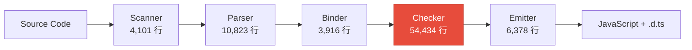
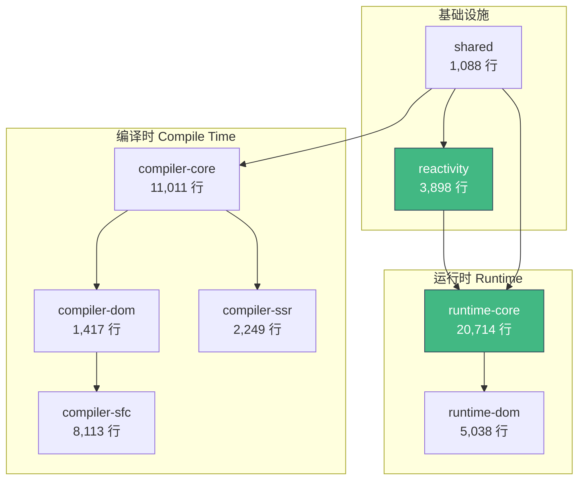
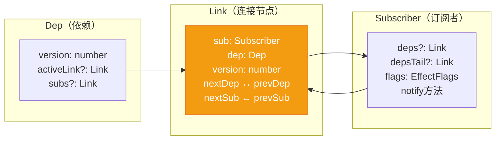
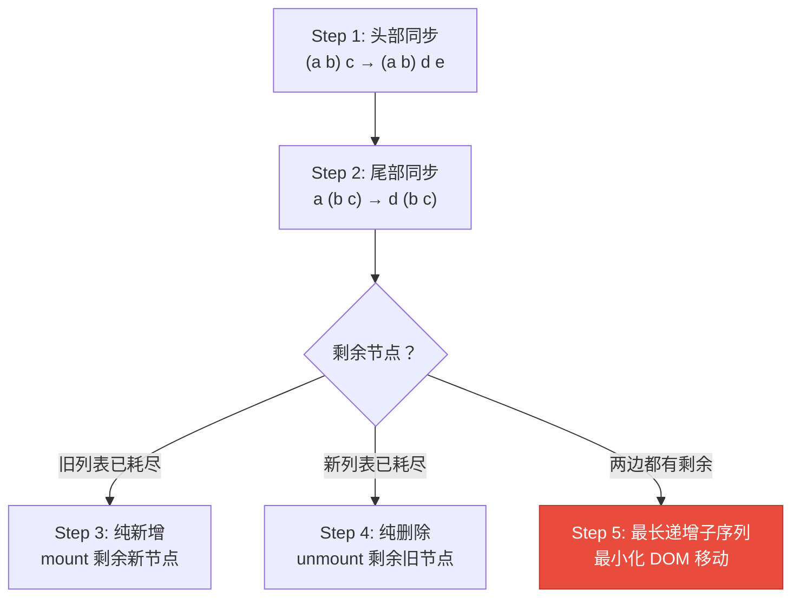

> 如果让你从零开始设计一门编程语言或一个前端框架，你需要什么知识？最好的答案藏在已有的优秀开源项目中。本文通过逐行阅读 TypeScript 编译器（45万行）和 Vue 3（5.5万行）的源码，提炼出关于编译器设计、类型系统、响应式系统、渲染引擎的深层设计智慧。

---

## 一、全景对比：两个项目的定位与规模

在深入细节之前，先看一组数据：

| 维度 | TypeScript | Vue 3 |
|------|-----------|-------|
| 定位 | 完整编程语言编译器 | UI 框架（含模板编译器） |
| 核心源码 | ~450,000 行 | ~55,000 行 |
| 架构风格 | 巨型单体闭包 | Monorepo 微内核 |
| 编译目标 | TypeScript → JavaScript | Template → Render Function |
| 类型系统 | 结构化类型 + 完整推断 | 运行时 + 编译时混合 |
| 核心文件 | checker.ts（54,434行） | renderer.ts（2,618行） |

一个有趣的对比：TypeScript 的类型检查器 **单个文件** 就比 Vue 3 **整个框架** 的代码还多。这不是因为 Vue 写得更好或 TypeScript 写得更差——而是因为类型系统的固有复杂性远超想象。

---

## 二、TypeScript 编译器：一门语言的诞生

### 2.1 五阶段管线：编译器的经典架构

TypeScript 编译器遵循教科书式的编译管线，但每个阶段都有独特的工程取舍：



各阶段代码量的比例揭示了一个深刻规律：**类型检查是整个编译器中最复杂的部分**，占据了总代码量的 28%。这与直觉相反——大多数人以为"解析"才是最难的。

#### Scanner（词法分析器）—— 4,101 行

```
Source Text → Token Stream
```

`createScanner()` 是一个工厂函数，返回的 scanner 对象维护内部状态（pos、token、tokenValue）。核心设计决策：

- **有状态、可重入**：scanner 不是一次性消费的迭代器，而是可以被 parser 反复调用的工具。parser 通过 `scanner.scan()` 推进，但也能通过 `scanner.lookAhead()` 预读而不消费 token
- **处理 JavaScript 的诡异边界**：正则表达式 `/regex/` 和除法 `a / b` 的歧义、模板字符串的嵌套、JSX 标签与泛型 `<T>` 的冲突——每一个都需要上下文感知

**设计启示**：词法分析看似简单，但处理好边界情况的代码量可能是核心逻辑的数倍。

#### Parser（语法分析器）—— 10,823 行

TypeScript 的 parser 采用 **递归下降** 策略，不用 yacc/bison 等 parser generator。关键设计：

- **手写而非生成**：手写 parser 虽然代码量大，但支持更好的错误恢复和增量解析。这是所有主流工业级语言编译器（GCC、Clang、Rust、Go）的共同选择
- **就地语法错误恢复**：遇到语法错误不会直接放弃，而是尝试跳过错误 token 继续解析，为 IDE 场景提供更好的体验
- **AST 节点用 `SyntaxKind` 枚举标识**：400+ 种节点类型，每种用数字常量表示，而不是用类继承体系。这避免了"表达式问题"（Expression Problem），也让序列化更高效

```typescript
// TypeScript 的 SyntaxKind 枚举（部分）
export const enum SyntaxKind {
    Unknown,
    EndOfFileToken,
    NumericLiteral,
    StringLiteral,
    // ... 400+ 种类型
    Identifier,
    // token > SyntaxKind.Identifier => token is a keyword
}
```

**为什么用 `const enum`？** 编译后直接内联为数字常量，避免了运行时对象查找的开销。当你有几百万个 AST 节点时，这种微优化累积起来非常可观。

#### Binder（符号绑定器）—— 3,916 行

Binder 是连接"语法世界"和"语义世界"的桥梁：

- 遍历 AST，为每个声明创建 `Symbol` 对象
- 建立作用域树（scope tree）
- 构建控制流图（control flow graph），用于后续的类型窄化分析
- 标记 `var`/`let`/`const` 的作用域差异

这一步最精妙的设计是 **控制流图的构建**。TypeScript 的类型窄化（type narrowing）——例如 `if (x !== null)` 后的块中 x 不为 null——完全依赖 binder 阶段建立的流图。

#### Checker（类型检查器）—— 54,434 行

这是 TypeScript 的灵魂，也是世界上最复杂的类型检查器之一。

**巨型闭包模式**：整个 checker 是一个 `createTypeChecker()` 函数，内部用 `var` 声明所有状态变量，然后定义数百个内部函数。这不是代码质量问题，而是深思熟虑的工程决策：

```typescript
export function createTypeChecker(host: TypeCheckerHost): TypeChecker {
    // 为什么用 var？避免 TDZ（暂时性死区）运行时检查的性能开销
    // See: https://github.com/microsoft/TypeScript/issues/52924
    var cancellationToken: CancellationToken | undefined;
    var typeCount = 0;
    var symbolCount = 0;
    var instantiationCount = 0;
    var instantiationDepth = 0;
    // ... 数百个状态变量

    function checkExpression(node: Expression): Type { /* ... */ }
    function isTypeAssignableTo(source: Type, target: Type): boolean { /* ... */ }
    function resolveSymbol(symbol: Symbol): Symbol { /* ... */ }
    // ... 数百个内部函数，总计 54,000+ 行
    
    return checkerObject; // 返回公共 API 对象
}
```

**为什么不拆分成多个类/模块？**

1. **数百个函数共享同一套状态**：typeCount、instantiationDepth 等变量被几乎所有函数访问。用类的话需要 `this.` 前缀，闭包直接访问更快
2. **避免模块间循环依赖**：类型检查的各个子系统（赋值兼容性检查、泛型推断、条件类型展开）深度互相依赖
3. **V8 引擎对闭包的优化**：现代 JS 引擎对闭包变量的访问已经高度优化

**结构化类型系统**的实现：TypeScript 使用结构化类型（structural typing），而非 Java/C# 的名义类型（nominal typing）。类型兼容性检查不看类型的名字或声明位置，只看结构——这让 `isTypeAssignableTo()` 的实现异常复杂，需要递归比较类型的每个属性、方法签名、泛型约束等。

**条件类型与分布式条件类型**：`T extends U ? X : Y` 看似简单，但当 T 是联合类型时会发生"分布"（distribute）——这要求 checker 对联合类型的每个成员分别求值再合并，涉及到复杂的递归和缓存逻辑。

**防止无限递归**：类型实例化有深度限制（`instantiationDepth`），用于防止递归类型定义导致的无限展开。这是一个务实的工程决策——类型完备性让步于实际可用性。

#### Transformer + Emitter —— 降级与输出

这里体现了 TypeScript 的另一个核心设计理念：**类型擦除**。

TypeScript 在 emit 阶段做的核心工作就是：
1. 删除所有类型注解
2. 将高版本 ES 语法降级为目标版本（如 ES2015 → ES5）

这通过一个 **transformer 链** 实现：

```
transformTypeScript → transformESDecorators → transformClassFields 
→ transformES2021 → transformES2020 → ... → transformES2015 
→ transformGenerators → transformModule
```

每个 transformer 只负责一个 ES 版本的降级，形成可插拔的管道。这种设计让新增一个 ES 版本的支持成本很低——只需加一个新的 transformer。

### 2.2 Language Service：让编译器为 IDE 服务

TypeScript 的 `services/` 目录（65,478 行）几乎和编译器核心一样大，包含了所有 IDE 功能的实现：

| 功能 | 文件 | 行数 |
|------|------|------|
| 代码补全 | completions.ts | ~5,000 |
| 查找定义 | goToDefinition.ts | ~500 |
| 查找引用 | findAllReferences.ts | ~2,000 |
| 重构 | refactors/ | ~3,000 |
| 代码格式化 | formatting/ | ~4,000 |
| 自动 import | organizeImports.ts | ~800 |

**设计启示**：如果你在设计一门新语言，**从第一天起就把 IDE 支持作为一等公民**。TypeScript 的成功很大程度上归功于它出色的 IDE 体验——这需要编译器从架构上就支持增量解析、按需类型检查、错误容忍等特性。

### 2.3 TypeScript 的核心设计哲学

从源码中，我提炼出 TypeScript 团队的几个核心设计原则：

1. **渐进式类型（Gradual Typing）**：`any` 类型的存在不是缺陷，是深思熟虑的逃生舱口。一门语言的采用度取决于迁移成本
2. **类型擦除**：类型信息不存在于运行时。这看似限制，实则是正确的边界——它保证 TypeScript 永远是 JavaScript 的超集
3. **结构化类型 > 名义类型**：与 JavaScript 的鸭子类型哲学一脉相承
4. **性能是特性**：用 `const enum` 内联、`var` 避免 TDZ、巨型闭包避免属性查找——在编译器这种 CPU 密集型程序中，每个微优化都有意义
5. **错误容忍**：编译器必须能处理不完整、有错误的代码——因为 IDE 用户 90% 的时间都在编写尚未完成的代码

---

## 三、Vue 3 源码：一个框架的骨架

### 3.1 Monorepo 微内核：优雅的包结构

Vue 3 采用 monorepo 组织，每个包职责清晰：



**为什么拆分成这么多包？**

1. **Tree-shaking**：用户只用了 `reactive` 就不需要打包整个框架。`@vue/reactivity` 可以独立使用（React 社区有人直接用它做状态管理）
2. **平台无关性**：`runtime-core` 不依赖任何 DOM API，理论上可以渲染到任何目标（Canvas、Native、Terminal）
3. **编译时/运行时分离**：模板编译可以在构建时完成（Vite/webpack loader），运行时不需要包含编译器

### 3.2 响应式系统：Proxy 与双向链表的精密机械

Vue 3 的响应式系统是整个框架的地基，只有 3,898 行代码，却实现了精妙的依赖追踪机制。

#### 核心数据结构



这里最值得注意的是 **Link 数据结构**——它同时存在于两个双向链表中：

- **Dep 的订阅者链表**：一个 Dep 有哪些 Subscriber（Effect/Computed）在监听它
- **Subscriber 的依赖链表**：一个 Subscriber 依赖哪些 Dep

这种双向链表设计的好处：
- O(1) 的依赖添加和移除
- 无需 `Set` 或 `Map` 的哈希开销
- `version` 字段实现了高效的脏检查——如果 Link 的 version 和 Dep 的 version 一致，说明依赖没变，无需重新计算

#### Proxy 拦截层

```typescript
// reactive.ts — 核心只有这几行
export function reactive(target: object) {
  if (isReadonly(target)) return target;
  return createReactiveObject(
    target, false, mutableHandlers, 
    mutableCollectionHandlers, reactiveMap
  );
}
```

`createReactiveObject` 根据目标类型选择不同的 Proxy handler：
- **普通对象/数组** → `BaseReactiveHandler`（拦截 get/set/has/deleteProperty）
- **Map/Set/WeakMap/WeakSet** → `CollectionHandler`（拦截 get，因为集合操作都通过方法调用）

`BaseReactiveHandler.get()` 中最精妙的部分：

```typescript
get(target, key, receiver) {
    // 元数据标记的快速路径
    if (key === ReactiveFlags.IS_REACTIVE) return !isReadonly;
    if (key === ReactiveFlags.RAW) return target;
    
    // 数组方法的特殊处理
    if (targetIsArray && (fn = arrayInstrumentations[key])) return fn;
    
    const res = Reflect.get(target, key, receiver);
    
    // 触发依赖收集
    if (!isReadonly) track(target, TrackOpTypes.GET, key);
    
    // 深度响应式：惰性转换
    if (isObject(res)) return isReadonly ? readonly(res) : reactive(res);
    
    return res;
}
```

**"惰性深度响应式"** 是一个关键优化：不在创建 `reactive(obj)` 时递归转换所有嵌套对象，而是在 **访问时按需转换**。这意味着如果你有一个巨大的对象但只访问了其中几个属性，大部分转换根本不会发生。

#### globalVersion 快速路径

```typescript
export let globalVersion = 0;
```

每次触发响应式变更时 `globalVersion++`。Computed 属性可以通过对比自己记录的 version 和 globalVersion 快速判断是否需要重新计算——如果全局都没有变更发生，所有 computed 都可以跳过检查。

### 3.3 Virtual DOM Diff：五步算法

Vue 3 的 `patchKeyedChildren` 实现了一个优化的 diff 算法，分为 5 步：



前 4 步处理的是常见的简单场景（头尾追加/删除），O(n) 复杂度。只有真正的"乱序"才会进入第 5 步。

**Step 5 的精髓——最长递增子序列（LIS）**：

```typescript
// 建立 key → 新索引 的映射
const keyToNewIndexMap = new Map();
for (i = s2; i <= e2; i++) {
    keyToNewIndexMap.set(c2[i].key, i);
}

// 遍历旧节点，找到在新列表中的对应位置
// newIndexToOldIndexMap[i] = 旧索引+1（0表示新增节点）
const newIndexToOldIndexMap = new Array(toBePatched).fill(0);

// 如果新索引不是单调递增的，说明有节点移动
if (newIndex >= maxNewIndexSoFar) {
    maxNewIndexSoFar = newIndex;
} else {
    moved = true;
}

// 只在有移动时才计算 LIS
const increasingNewIndexSequence = moved
    ? getSequence(newIndexToOldIndexMap)  // 最长递增子序列
    : EMPTY_ARR;
```

**为什么用 LIS？** LIS 中的节点不需要移动（它们的相对顺序已经正确），只需要移动不在 LIS 中的节点。这保证了 **最少的 DOM 操作次数**。

**对比 React 的 Diff**：React 使用的是 O(n) 的单向遍历 + key 匹配，比 Vue 的 LIS 算法简单但在某些场景（如列表反转）下产生更多 DOM 操作。Vue 选择了更复杂的算法以换取更少的 DOM 操作——因为 DOM 操作的成本远高于 JS 计算。

### 3.4 模板编译器：编译时优化的艺术

Vue 3 的模板编译器是框架中最具创新性的部分。编译管线：

```
Template String → Tokenizer → Parser → AST → Transform → CodeGen → Render Function
```

#### PatchFlags：编译时信息传递到运行时

这是 Vue 3 最巧妙的设计之一。编译器在生成 VNode 创建代码时，会分析模板中的动态部分，用位标记（bit flags）标记每个节点：

```typescript
export enum PatchFlags {
    TEXT = 1,        // 动态文本
    CLASS = 1 << 1,  // 动态 class
    STYLE = 1 << 2,  // 动态 style
    PROPS = 1 << 3,  // 动态非 class/style 属性
    FULL_PROPS = 1 << 4,  // 有动态 key 的属性
    // ...
}
```

模板：
```html
<div class="static" :id="dynamic">{{ text }}</div>
```

编译为：
```javascript
createElementVNode("div", { 
    class: "static", 
    id: _ctx.dynamic 
}, toDisplayString(_ctx.text), 
PatchFlags.TEXT | PatchFlags.PROPS, ["id"])
// 告诉运行时：只需要比较 text 和 id，class 是静态的
```

**这种编译时→运行时的信息传递**意味着 diff 算法可以跳过已知的静态部分，只比较动态部分。在大型应用中，这可以减少 50-70% 的不必要比较。

#### Transform 插件系统

编译器的 transform 阶段采用插件架构：

```typescript
export function getBaseTransformPreset(): TransformPreset {
    return [
        [
            transformVBindShorthand,
            transformOnce,      // v-once
            transformIf,        // v-if/v-else
            transformMemo,      // v-memo
            transformFor,       // v-for
            transformExpression,
            transformSlotOutlet,
            transformElement,
            trackSlotScopes,
            transformText,
        ],
        {
            on: transformOn,      // v-on / @click
            bind: transformBind,  // v-bind / :prop
            model: transformModel, // v-model
        },
    ];
}
```

**NodeTransform** 处理节点级转换（v-if、v-for），**DirectiveTransform** 处理指令级转换（v-on、v-bind）。这种分离让添加新指令或新语法非常简单——只需注册一个新的 transform 函数。

### 3.5 Vue 的核心设计哲学

1. **编译时能做的不留到运行时**：PatchFlags、静态提升（hoistStatic）、事件处理器缓存都是这一理念的体现
2. **惰性计算**：响应式系统的惰性深度转换、computed 的脏检查快速路径
3. **渐进式架构**：每个包可以独立使用，`@vue/reactivity` 甚至可以在 React 项目中使用
4. **向后兼容但不被绑架**：`vue-compat` 包提供 Vue 2 兼容层，但核心架构完全重新设计
5. **开发者体验优先**：Composition API 的设计、SFC 编译器的 `<script setup>` 语法糖、开发模式下的详细警告信息

---

## 四、跨项目的深层设计模式

### 4.1 编译器管线模式

两个项目都采用了 **多阶段管线（Multi-Phase Pipeline）** 架构：

| 阶段 | TypeScript | Vue |
|------|-----------|-----|
| 词法分析 | Scanner | Tokenizer |
| 语法分析 | Parser | Parser |
| 语义分析 | Binder + Checker | Transform |
| 代码生成 | Transformer + Emitter | CodeGen |

但 TypeScript 的管线是 **单体的**（所有阶段在同一个进程中顺序执行），而 Vue 的编译可以 **外置到构建工具** 中（Vite 插件在编译时完成，运行时只需要执行生成的代码）。

**设计启示**：如果你的编译结果可以缓存或预编译，将编译器设计为可外置的工具链组件比嵌入运行时更好。

### 4.2 "巨型函数"与"微型模块"的取舍

- **TypeScript**：checker.ts 54,434 行单文件，`createTypeChecker` 是一个巨型闭包
- **Vue**：最大文件 renderer.ts 也只有 2,618 行，清晰的模块边界

这不是代码风格的问题，而是 **问题域固有复杂度** 的反映。类型检查各子系统间的耦合度极高（类型推断需要赋值检查，赋值检查需要类型窄化，类型窄化需要控制流分析...），强行拆分只会增加间接层的开销。而 Vue 的各子系统（响应式、渲染、编译）天然边界清晰。

**设计启示**：不要为了"单文件不超过 300 行"这种机械规则而强行拆分紧耦合的逻辑。代码的组织应该反映问题域的结构，而非开发者的审美偏好。

### 4.3 位运算优化模式

两个项目都大量使用位运算进行状态标记和快速检查：

**Vue 的 PatchFlags 和 ShapeFlags**：
```typescript
if (patchFlag & PatchFlags.TEXT) { /* 只更新文本 */ }
if (shapeFlag & ShapeFlags.COMPONENT) { /* 组件节点 */ }
```

**TypeScript 的 NodeFlags 和 SymbolFlags**：
```typescript
if (node.flags & NodeFlags.ThisNodeHasError) { /* 跳过类型检查 */ }
if (symbol.flags & SymbolFlags.Function) { /* 函数符号 */ }
```

**Vue 的 EffectFlags**：
```typescript
export enum EffectFlags {
    ACTIVE   = 1 << 0,
    RUNNING  = 1 << 1,
    TRACKING = 1 << 2,
    NOTIFIED = 1 << 3,
    DIRTY    = 1 << 4,
    PAUSED   = 1 << 6,
}
```

位运算比布尔属性更紧凑（一个 number 能存储 32 个标志），比较操作（`&`、`|`）也比多个 `if` 条件更快。在热路径代码（如 diff 算法、类型检查）中，这种微优化的累积效果显著。

### 4.4 可取消/可暂停的执行

TypeScript 的 checker 支持 **CancellationToken**——IDE 用户开始新的编辑后，正在进行的类型检查可以被取消。Vue 的 ReactiveEffect 也支持 `PAUSED` 状态。

这揭示了一个重要的设计模式：**长时间运行的计算需要内建中断机制**。不仅限于编译器——任何可能长时间运行的纯计算都应该提供取消接口。

### 4.5 Factory 模式 vs Proxy 模式

- **TypeScript** 用 Factory 模式创建 AST 节点（nodeFactory.ts，7,542 行），提供了 `createFunctionDeclaration()`、`createClassDeclaration()` 等工厂方法
- **Vue** 用 Proxy 模式拦截对象操作（reactive.ts + baseHandlers.ts）

两种模式本质上都是 **元编程**——在"普通代码"和"真正的操作"之间插入一层控制。但它们的适用场景不同：
- **Factory**：你需要控制创建过程（设置默认值、验证参数、注册到全局表）
- **Proxy**：你需要拦截已存在对象的操作（读取、赋值、删除）

---

## 五、如果你要从零开始造一门语言

基于对这两个项目的深度分析，如果你想从零开始设计一门编程语言或框架，需要的知识体系：

### 必备知识

1. **编译原理**：词法分析、语法分析（特别是递归下降）、AST 设计、语义分析、代码生成
2. **类型理论**：至少理解结构化类型 vs 名义类型、类型推断（Hindley-Milner）、子类型关系、泛型/参数多态
3. **数据结构**：双向链表（Vue 依赖追踪）、图（TypeScript 控制流）、树（AST）、哈希表（符号表）
4. **设计模式**：Visitor、Factory、Observer/Pub-Sub、Pipeline、Proxy
5. **性能工程**：位运算优化、内存池、惰性求值、增量计算

### 推荐的学习路径

1. **先实现一个计算器语言**：Scanner → Parser → AST → Interpreter（约 500 行）
2. **加上变量和函数**：引入符号表、作用域（约 1,500 行）
3. **加上类型检查**：实现基本的类型推断和检查（约 3,000 行）
4. **加上代码生成**：输出到 JavaScript 或 WASM（约 2,000 行）
5. **加上 Language Server**：提供 IDE 支持（约 2,000 行）

### 最佳参考项目

| 项目 | 值得学的方面 | 难度 |
|------|------------|------|
| **TypeScript** | 工业级编译器架构、类型系统实现、IDE 集成 | ★★★★★ |
| **Vue 3** | 响应式系统设计、编译时优化、模块化架构 | ★★★☆☆ |
| **Svelte** | 编译时框架、无虚拟DOM 的实现 | ★★★☆☆ |
| **Lua** | 极简语言设计、高效的字节码 VM | ★★☆☆☆ |
| **Crafting Interpreters** | Robert Nystrom 的在线书籍，手把手教你实现两个解释器 | ★★☆☆☆ |
| **tsc-mini** | TypeScript 编译器的简化教学版 | ★★★☆☆ |

---

## 六、结语：代码即文档

读源码最大的收获，不是学会某个 API 或某个数据结构，而是 **理解优秀工程师面对复杂问题时的思考方式**：

- TypeScript 团队选择 54,000 行的单文件，是因为他们理解问题域的耦合度比代码整洁规则更重要
- Vue 团队选择编译时 PatchFlags，是因为他们理解"信息应该在最早知道的时刻被捕获"
- 两个团队都选择 `var`/位运算/闭包 这些"不够现代"的技术，是因为在热路径上性能永远优先于风格

这些取舍的智慧，是任何设计文档都无法替代的。如果你也对编程语言设计感兴趣，最好的起点就是：打开源码，从第一行开始读。

---

### 参考来源

- [TypeScript 源码](https://github.com/microsoft/TypeScript) — Microsoft，MIT 协议
- [Vue 3 核心源码](https://github.com/vuejs/core) — Evan You & Vue 团队，MIT 协议
- [TypeScript 编译器架构（官方 Wiki）](https://github.com/microsoft/TypeScript/wiki/Architectural-Overview)
- [Vue 3 设计与实现（HcySunYang）](https://github.com/HcySunYang/vue-design)
- [Crafting Interpreters（Robert Nystrom）](https://craftinginterpreters.com/)
